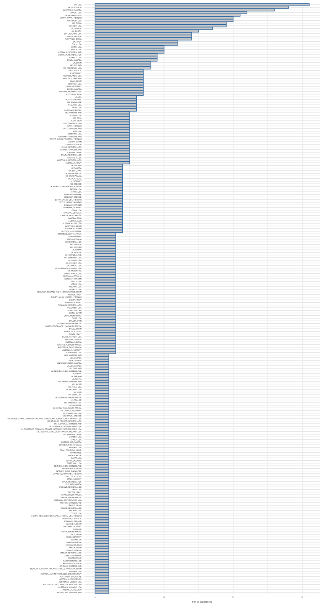

This is an [R Markdown](http://rmarkdown.rstudio.com) Notebook. When you execute code within the notebook, the results appear beneath the code. 

Try executing this chunk by clicking the *Run* button within the chunk or by placing your cursor inside it and pressing *Cmd+Shift+Enter*. 


```r
library(RISmed)
library(readr)
library(tidyverse)
```

```
## ── Attaching packages ──────────────────────────────────────────────────────── tidyverse 1.2.1 ──
```

```
## ✔ ggplot2 3.0.0     ✔ purrr   0.2.5
## ✔ tibble  1.4.2     ✔ dplyr   0.7.6
## ✔ tidyr   0.8.0     ✔ stringr 1.3.1
## ✔ ggplot2 3.0.0     ✔ forcats 0.3.0
```

```
## ── Conflicts ─────────────────────────────────────────────────────────── tidyverse_conflicts() ──
## ✖ dplyr::filter() masks stats::filter()
## ✖ dplyr::lag()    masks stats::lag()
```

```r
<<<<<<< HEAD
=======
<<<<<<< HEAD
>>>>>>> d93aab4d2b4fd282319096ec60104bba231a59c9
library(rworldmap)
```

```
## Loading required package: sp
```

```
## ### Welcome to rworldmap ###
```

```
## For a short introduction type : 	 vignette('rworldmap')
```

```r
<<<<<<< HEAD
library(tm)
```

```
## Loading required package: NLP
```

```
## 
## Attaching package: 'NLP'
```

```
## The following object is masked from 'package:ggplot2':
## 
##     annotate
```

```r
library(wordcloud)
```

```
## Loading required package: RColorBrewer
```

```r
library(RColorBrewer)

=======
=======
>>>>>>> bc2fdee9c21d63f4192d1bb511f6b6bacc731e68
>>>>>>> d93aab4d2b4fd282319096ec60104bba231a59c9
pubmed2df<-function(D){
  
  records=D
  rm(D)
  ## Author 
  AU=unlist(lapply(Author(records),function(a){
    paste(paste(a$LastName,a$Initials,sep=" "),collapse =";")}))
  
  ## Total citations
  cat("\nDownloading updated citations from PubMed/MedLine...\n\n")
  TC=Cited(records)
  
  
  ## Country
  AU_CO=Country(records)
  
  ##
  CO=
  
  ## DOI
  DI=ELocationID(records)
  
  ## Source ISO
  JI=ISOAbbreviation(records)
  
  ## ISSN
  ISSN=ISSN(records)
  
  ## Volume
  VOL=Volume(records)
  
  ## Issue
  ISSUE=Issue(records)
  
  ## Language
  LT=Language(records)
  
  ## Affiliation
  AFF=unlist(lapply(Affiliation(records),function(a){
    paste(a,collapse =";")}))
  
  ## Title
  TI=ArticleTitle(records)
  
  ## Abstract
  AB=AbstractText(records)
  
  ## Pub year
  PY=YearPubmed(records)
  
  ## Pub type
  DT=unlist(lapply(PublicationType(records),function(a){
    paste(a,collapse =";")}))
  
  ## Article ID
  UT=ArticleId(records)
  
  ## Mesh
  MESH=unlist(lapply(Mesh(records),function(a){
    if (is.data.frame(a)){
      a=paste(a$Heading,collapse =";")}else{a='NA'}
  }))
  
  
  DATA <- data.frame('AU'=AU, 'TI'=TI,'AB'=AB,'PY'=PY, 'DT'=DT, 
                            'MESH'=MESH, 'TC'=TC, 'SO'=JI, 'J9'=JI, 'JI'=JI, 'DI'=DI,'ISSN'=ISSN, 
                            'VOL'=VOL, 'ISSUE'=ISSUE, 'LT'=LT, 'C1'=AFF, 'RP'=AFF, 'ID'=MESH,'DE'=MESH,
                            'UT'=UT, 'AU_CO'=AU_CO, stringsAsFactors = FALSE)
  DATA <- data.frame(lapply(DATA,toupper),stringsAsFactors = FALSE)
  DATA$DB = "PUBMED"
  
  
  return(DATA)
}
```

```r
search          <- '["Systematic review"[Title] AND "protocol"[Title]]'
search_query    <-  EUtilsSummary(search, retmax=3000)
QueryId(search_query)
```

```
##    [1] "30075811" "30075562" "30075561" "30075541" "30074908" "30074907"
##    [7] "30071559" "30070621" "30068625" "30068611" "30061922" "30061448"
##   [13] "30061436" "30056379" "30053912" "30050397" "30045772" "30045752"
##   [19] "30045305" "30041695" "30041690" "30031216" "30030314" "30024567"
##   [25] "30024553" "30024436" "30024435" "30021647" "30021636" "30021622"
##   [31] "30021618" "30016996" "30012796" "30012795" "30003061" "30002008"
##   [37] "30002005" "29997140" "29997139" "29995827" "29995799" "29995712"
##   [43] "29995710" "29995709" "29995708" "29995707" "29991634" "29991355"
##   [49] "29979452" "29979447" "29979377" "29973335" "29961042" "29961024"
##   [55] "29961014" "29961013" "29950476" "29950455" "29948471" "29945682"
##   [61] "29945664" "29945652" "29942637" "29935530" "29934396" "29924057"
##   [67] "29924042" "29921675" "29912720" "29903795" "29903029" "29901620"
##   [73] "29901611" "29901609" "29901590" "29901582" "29894406" "29894405"
##   [79] "29894404" "29894402" "29894401" "29885659" "29884697" "29884696"
##   [85] "29884693" "29866720" "29858408" "29851827" "29804058" "29797714"
##   [91] "29794102" "29794095" "29794094" "29793522" "29788987" "29780031"
##   [97] "29778092" "29777106" "29773704" "29764887" "29762310" "29762309"
##  [103] "29762308" "29762307" "29762306" "29762304" "29762303" "29762302"
##  [109] "29762301" "29762300" "29762299" "29743331" "29743329" "29743319"
##  [115] "29743153" "29732589" "29730631" "29730625" "29729666" "29724743"
##  [121] "29724739" "29720280" "29720257" "29720045" "29718853" "29718842"
##  [127] "29712561" "29708586" "29703858" "29703848" "29703068" "29703064"
##  [133] "29703059" "29703008" "29702990" "29702987" "29702986" "29702985"
##  [139] "29702984" "29702973" "29695299" "29695295" "29685175" "29680814"
##  [145] "29678991" "29678990" "29674372" "29669583" "29669408" "29668603"
##  [151] "29668601" "29668593" "29668575" "29666134" "29666133" "29664117"
##  [157] "29661217" "29655520" "29654036" "29643164" "29642227" "29642202"
##  [163] "29642200" "29642140" "29636088" "29634512" "29634511" "29634510"
##  [169] "29634508" "29634507" "29634506" "29634505" "29634503" "29632082"
##  [175] "29632079" "29627811" "29627809" "29626050" "29625623" "29622575"
##  [181] "29620640" "29620626" "29609652" "29609651" "29606128" "29605820"
##  [187] "29602854" "29602838" "29600960" "29595688" "29595670" "29595669"
##  [193] "29595668" "29595644" "29595643" "29595634" "29593839" "29593019"
##  [199] "29587829" "29587826" "29581211" "29581208" "29581201" "29580293"
##  [205] "29577238" "29573768" "29573737" "29567852" "29561425" "29561418"
##  [211] "29549213" "29549206" "29549199" "29549198" "29544537" "29544530"
##  [217] "29540418" "29540409" "29538206" "29538203" "29530911" "29530081"
##  [223] "29525767" "29523572" "29523180" "29521867" "29521866" "29521865"
##  [229] "29521862" "29521861" "29521859" "29521858" "29521856" "29520759"
##  [235] "29517703" "29517665" "29511820" "29511012" "29506568" "29505513"
##  [241] "29505506" "29504976" "29499749" "29490962" "29490960" "29489645"
##  [247] "29486798" "29478019" "29472268" "29472267" "29472260" "29467137"
##  [253] "29467135" "29467037" "29467030" "29465598" "29465597" "29465596"
##  [259] "29465586" "29465572" "29465538" "29463592" "29463590" "29458416"
##  [265] "29458415" "29458402" "29455163" "29452606" "29444786" "29444700"
##  [271] "29441518" "29440164" "29440162" "29440153" "29437752" "29422451"
##  [277] "29422449" "29419686" "29419682" "29419673" "29419664" "29419620"
##  [283] "29419619" "29419618" "29419617" "29419616" "29419615" "29419613"
##  [289] "29419612" "29419611" "29419610" "29398746" "29391371" "29391361"
##  [295] "29391343" "29390505" "29390504" "29390369" "29390351" "29384901"
##  [301] "29382681" "29382677" "29382627" "29382025" "29381981" "29381922"
##  [307] "29374677" "29374671" "29374657" "29374488" "29374003" "29373983"
##  [313] "29370853" "29370832" "29370831" "29369217" "29369215" "29369214"
##  [319] "29369196" "29368662" "29362595" "29362274" "29362267" "29362265"
##  [325] "29362261" "29362257" "29361975" "29358443" "29357931" "29357929"
##  [331] "29357926" "29357925" "29348112" "29347967" "29339546" "29332231"
##  [337] "29331970" "29331966" "29329579" "29329578" "29326188" "29326186"
##  [343] "29324558" "29324556" "29324555" "29324553" "29324551" "29324550"
##  [349] "29316979" "29310330" "29288191" "29288188" "29284915" "29284543"
##  [355] "29284523" "29282270" "29282268" "29282114" "29275348" "29273667"
##  [361] "29273660" "29273656" "29273090" "29269341" "29259066" "29259064"
##  [367] "29258599" "29258583" "29247578" "29247096" "29246253" "29245345"
##  [373] "29245344" "29245253" "29241907" "29237578" "29237496" "29233831"
##  [379] "29233168" "29233167" "29228985" "29219873" "29219872" "29219870"
##  [385] "29219869" "29219868" "29219865" "29217728" "29208047" "29208040"
##  [391] "29208035" "29203508" "29202836" "29197411" "29196481" "29175892"
##  [397] "29175884" "29170292" "29170290" "29170283" "29166926" "29162558"
##  [403] "29150479" "29150418" "29149908" "29146656" "29141664" "29135749"
##  [409] "29135747" "29135743" "29135742" "29135741" "29135740" "29133332"
##  [415] "29133324" "29116020" "29105071" "29101151" "29100533" "29100499"
##  [421] "29096721" "29096708" "29095271" "29092902" "29080067" "29070642"
##  [427] "29070063" "29070060" "29065911" "29062534" "29061614" "29061611"
##  [433] "29061190" "29058641" "29058637" "29054830" "29042393" "29041982"
##  [439] "29041964" "29038188" "29037257" "29035963" "29035962" "29035959"
##  [445] "29035957" "29035955" "29035954" "29035952" "29030415" "29025838"
##  [451] "29025833" "29020989" "29018068" "29018065" "29017563" "29017552"
##  [457] "29017518" "28993392" "28993384" "28985765" "28982838" "28982807"
##  [463] "28978358" "28977091" "28965102" "28963311" "28963307" "28963305"
##  [469] "28963283" "28951416" "28946920" "28939565" "28934981" "28932386"
##  [475] "28932385" "28932384" "28932383" "28928202" "28928193" "28915839"
##  [481] "28902697" "28902696" "28902695" "28902694" "28902692" "28902690"
##  [487] "28902689" "28902688" "28901549" "28899888" "28882924" "28882907"
##  [493] "28882175" "28882166" "28882156" "28879178" "28877950" "28871023"
##  [499] "28871019" "28865491" "28864709" "28864428" "28859683" "28856064"
##  [505] "28855202" "28854958" "28851783" "28851449" "28851433" "28847683"
##  [511] "28841910" "28841908" "28837004" "28827273" "28827265" "28827259"
##  [517] "28827252" "28821527" "28821522" "28821509" "28818090" "28810901"
##  [523] "28807047" "28807009" "28801447" "28801434" "28801433" "28801432"
##  [529] "28801417" "28801390" "28800055" "28800054" "28800051" "28800050"
##  [535] "28800049" "28800048" "28800047" "28800046" "28800045" "28800044"
##  [541] "28793926" "28789708" "28789697" "28789671" "28789665" "28784186"
##  [547] "28784163" "28782112" "28780561" "28780548" "28780546" "28775847"
##  [553] "28775196" "28768550" "28768525" "28765101" "28764734" "28756387"
##  [559] "28754149" "28751485" "28729317" "28729304" "28720611" "28720128"
##  [565] "28708750" "28708749" "28708748" "28708747" "28708746" "28708745"
##  [571] "28708744" "28708743" "28708742" "28708741" "28708740" "28708739"
##  [577] "28706107" "28706087" "28702945" "28701412" "28701207" "28701180"
##  [583] "28698353" "28698336" "28697779" "28697739" "28694350" "28693568"
##  [589] "28693555" "28683787" "28683777" "28679491" "28679412" "28679407"
##  [595] "28674123" "28673365" "28667229" "28667221" "28667214" "28663165"
##  [601] "28659183" "28659163" "28658130" "28652294" "28651620" "28647718"
##  [607] "28646925" "28646644" "28645981" "28645980" "28645972" "28645966"
##  [613] "28645963" "28645962" "28637728" "28629445" "28628520" "28628519"
##  [619] "28628518" "28628517" "28628516" "28628515" "28628514" "28628512"
##  [625] "28628508" "28625076" "28624760" "28624758" "28623943" "28619783"
##  [631] "28619773" "28619098" "28619078" "28615278" "28611111" "28601837"
##  [637] "28601834" "28601832" "28600379" "28600374" "28595954" "28592585"
##  [643] "28592583" "28592576" "28587666" "28587663" "28566366" "28558847"
##  [649] "28558846" "28554940" "28554937" "28554932" "28554924" "28554919"
##  [655] "28554882" "28526062" "28521817" "28521801" "28515197" "28515187"
##  [661] "28506248" "28499416" "28498172" "28498171" "28498170" "28498168"
##  [667] "28498167" "28498166" "28498165" "28498162" "28490376" "28490370"
##  [673] "28487460" "28487456" "28487455" "28473517" "28465827" "28450465"
##  [679] "28447333" "28446776" "28446526" "28445263" "28438226" "28438187"
##  [685] "28437434" "28427477" "28427475" "28416020" "28416011" "28407793"
##  [691] "28407781" "28405408" "28403830" "28403149" "28400179" "28399951"
##  [697] "28399900" "28399899" "28398982" "28398981" "28398980" "28398979"
##  [703] "28398978" "28398977" "28398976" "28398975" "28398974" "28398973"
##  [709] "28398972" "28398971" "28390435" "28389488" "28388960" "28381269"
##  [715] "28377366" "28370260" "28363928" "28360256" "28360251" "28356123"
##  [721] "28351424" "28350805" "28348192" "28348187" "28348186" "28347351"
##  [727] "28340600" "28336737" "28335806" "28328839" "28327186" "28321327"
##  [733] "28321321" "28320464" "28320459" "28284227" "28283492" "28279998"
##  [739] "28279997" "28279195" "28270383" "28270230" "28270199" "28267030"
##  [745] "28267029" "28267028" "28267027" "28267026" "28267025" "28267024"
##  [751] "28267023" "28267022" "28267021" "28267020" "28267019" "28264834"
##  [757] "28264831" "28264715" "28264711" "28253914" "28253910" "28253909"
##  [763] "28249850" "28246141" "28246138" "28241863" "28237963" "28237960"
##  [769] "28231810" "28228373" "28222812" "28222798" "28219446" "28219422"
##  [775] "28212660" "28207548" "28202499" "28196953" "28196512" "28193848"
##  [781] "28186946" "28184046" "28179012" "28178019" "28178018" "28178017"
##  [787] "28178015" "28178014" "28178013" "28155803" "28148294" "29770063"
##  [793] "28137928" "28132017" "28132003" "28125138" "28122832" "28122613"
##  [799] "28121941" "28119388" "28118847" "28118846" "28109320" "28109306"
##  [805] "28103918" "28096067" "28095901" "28095899" "28093444" "28093435"
##  [811] "28088593" "28088237" "28088214" "28087553" "28086992" "28086971"
##  [817] "28086958" "28085729" "28085728" "28085727" "28085725" "28085724"
##  [823] "28085723" "28085722" "28085720" "28077411" "28073796" "28057656"
##  [829] "28057651" "28057608" "28055001" "28029334" "28028914" "28009674"
##  [835] "28009673" "28009672" "28009671" "28009670" "28009669" "28009668"
##  [841] "28009667" "28009666" "28009665" "28009664" "28009663" "28005551"
##  [847] "28003298" "28002345" "27978859" "27965249" "27964739" "27941515"
##  [853] "27941514" "27941513" "27941512" "27941511" "27941510" "27941509"
##  [859] "27941508" "27941507" "27941506" "27941505" "27927666" "27909040"
##  [865] "27906117" "27906071" "27903285" "27899397" "27899138" "27895065"
##  [871] "27894331" "27889823" "27887634" "27884855" "27884842" "27884180"
##  [877] "27881522" "27881185" "27878598" "27872122" "27871332" "27871314"
##  [883] "27867522" "27856478" "27855720" "27855082" "27846122" "27846121"
##  [889] "27846119" "27846117" "27846116" "27846115" "27846113" "27846112"
##  [895] "27846111" "27846110" "27832816" "27821184" "27810971" "27810335"
##  [901] "27807090" "27807088" "27798028" "27798018" "27798001" "27793836"
##  [907] "27789514" "27784334" "27784233" "27756442" "27756440" "27756437"
##  [913] "27756435" "27755320" "27755318" "27755317" "27755316" "27755315"
##  [919] "27755313" "27755312" "27755311" "27733411" "27729350" "27717394"
##  [925] "27716433" "27716357" "27716354" "27712027" "27697881" "27683514"
##  [931] "27683510" "27678542" "27660323" "27660319" "27659511" "27655265"
##  [937] "27655262" "27653783" "27650765" "27646881" "27646712" "27645555"
##  [943] "27635750" "27635749" "27635748" "27635747" "27635746" "27635745"
##  [949] "27635744" "27635743" "27635742" "27635741" "27635740" "27635739"
##  [955] "27633645" "27633638" "27633635" "27633634" "27628051" "27619829"
##  [961] "27612537" "27609187" "27609108" "27609018" "27601488" "27600291"
##  [967] "27600153" "27591026" "27591017" "27591015" "27589863" "27585627"
##  [973] "27582042" "27580826" "27580586" "27577586" "27577553" "27577246"
##  [979] "27566641" "27563450" "27563383" "27558903" "27558171" "27555227"
##  [985] "27536796" "27536795" "27536793" "27536792" "27536791" "27536790"
##  [991] "27536789" "27535547" "27532794" "27532793" "27532792" "27532791"
##  [997] "27532790" "27532789" "27532788" "27532787" "27532786" "27532785"
## [1003] "27532784" "27532783" "27532782" "27532781" "27532655" "27532654"
## [1009] "27532652" "27532651" "27532650" "27532649" "27532648" "27532647"
## [1015] "27532646" "27532645" "27532644" "27532468" "27532467" "27532466"
## [1021] "27532465" "27532464" "27532463" "27532462" "27532461" "27532459"
## [1027] "27532458" "27532457" "27532313" "27532312" "27532311" "27532309"
## [1033] "27532308" "27532307" "27532306" "27532305" "27532304" "27532140"
## [1039] "27532139" "27532138" "27532137" "27532136" "27532135" "27532134"
## [1045] "27532133" "27531737" "27530914" "27526851" "27516179" "27516072"
## [1051] "27515938" "27514374" "27496236" "27485111" "27484905" "29497557"
## [1057] "27468249" "27465807" "27460907" "27460647" "27460569" "27460473"
## [1063] "27456962" "27456327" "27431915" "27431798" "27427189" "27427188"
## [1069] "27421298" "27412448" "27412361" "27412255" "27412135" "27401499"
## [1075] "27401368" "27401366" "27391963" "27390844" "27382460" "27382230"
## [1081] "27381332" "27377639" "27372391" "27371555" "27354073" "27338886"
## [1087] "27334984" "27332428" "27324510" "27311908" "27311906" "27311904"
## [1093] "27311303" "27301957" "27301869" "27297011" "27288379" "27288370"
## [1099] "27270920" "27267901" "27267881" "27267600" "27267468" "27259528"
## [1105] "27255480" "27255327" "27251687" "27235303" "27231003" "27231002"
## [1111] "27230780" "27225668" "27217279" "27216584" "27209428" "27209320"
## [1117] "27207627" "27207622" "27196620" "27195355" "27194318" "27194315"
## [1123] "27178973" "27171509" "27169742" "27160239" "27150187" "27146261"
## [1129] "27146132" "27146038" "27142967" "27142846" "27142791" "27138009"
## [1135] "27127606" "27126975" "27118288" "27116915" "27113929" "27112335"
## [1141] "27105715" "27105714" "27101733" "27098823" "27098125" "27098011"
## [1147] "27084681" "27084509" "27084338" "27084289" "27080993" "27075844"
## [1153] "27072140" "27061940" "27056180" "27056041" "27048637" "27048500"
## [1159] "27044583" "27039290" "27037015" "27033956" "27030210" "27026658"
## [1165] "27022675" "27016245" "27016244" "27013601" "27013600" "27013598"
## [1171] "27012940" "27006751" "27006674" "26993624" "26984189" "26983945"
## [1177] "26979845" "26976375" "26976374" "26976373" "26969641" "26969340"
## [1183] "26969199" "26968701" "26962036" "26960677" "26955466" "26934831"
## [1189] "26932140" "26931106" "26928029" "26926289" "26925694" "26925693"
## [1195] "26915734" "26911585" "26911581" "26908531" "26908516" "26908510"
## [1201] "26892789" "26892743" "26888194" "26885362" "26880167" "26878924"
## [1207] "26878923" "26878922" "26878921" "26878920" "26878919" "26878918"
## [1213] "26878917" "26878916" "26877093" "26872918" "26862389" "26861987"
## [1219] "26860189" "26860082" "26857705" "26852224" "26846440" "26842069"
## [1225] "26841924" "26831897" "26831725" "26831503" "26826156" "26820644"
## [1231] "26818403" "26817638" "26817633" "26816413" "26791956" "26791573"
## [1237] "26790142" "26786509" "26781844" "26769792" "26767817" "26767816"
## [1243] "26767814" "26767813" "26767811" "26739743" "26739728" "26733567"
## [1249] "26733562" "26732773" "26729387" "26729382" "26729302" "26729230"
## [1255] "26719325" "26719082" "26715359" "26700289" "26693940" "26693826"
## [1261] "26684760" "26660074" "26657465" "26657464" "26657462" "26657461"
## [1267] "26657460" "26653146" "26653104" "26652922" "26637465" "26637333"
## [1273] "26631759" "26627591" "26621520" "26621512" "26610763" "26607658"
## [1279] "26603254" "26597992" "26596269" "26589728" "26589619" "26585506"
## [1285] "26582406" "26577666" "26571289" "26571288" "26571287" "26571286"
## [1291] "26571285" "26571284" "26571283" "26571282" "26571281" "26571280"
## [1297] "26571279" "26571278" "26571277" "26564175" "26563763" "26563730"
## [1303] "26563100" "26560061" "26560056" "26546139" "26546134" "26542363"
## [1309] "26542240" "26538163" "26538082" "26534734" "26531083" "26527534"
## [1315] "26527282" "26525141" "26525044" "26512315" "26507504" "26503391"
## [1321] "26497494" "26493456" "26486977" "26474937" "26470670" "26470669"
## [1327] "26470668" "26470667" "26470666" "26470665" "26470664" "26470663"
## [1333] "26470662" "26470661" "26470660" "26470659" "26470658" "26470657"
## [1339] "26470656" "26470655" "26463223" "26455942" "26455941" "26455940"
## [1345] "26455939" "26455937" "26455935" "26455934" "26455933" "26455932"
## [1351] "26455931" "26455930" "26455853" "26455852" "26455851" "26455850"
## [1357] "26455849" "26455848" "26455847" "26455846" "26455845" "26455844"
## [1363] "26455843" "26455842" "26455750" "26455749" "26455748" "26455747"
## [1369] "26455746" "26455745" "26455744" "26455743" "26455742" "26455741"
## [1375] "26455740" "26455608" "26455607" "26455606" "26455605" "26455604"
## [1381] "26455603" "26455602" "26455601" "26455600" "26455599" "26447078"
## [1387] "26447077" "26447076" "26447075" "26447074" "26447073" "26447072"
## [1393] "26447070" "26447069" "26447054" "26447053" "26447052" "26447051"
## [1399] "26447050" "26447049" "26447048" "26447047" "26447046" "26447045"
## [1405] "26447038" "26447037" "26447036" "26447034" "26447033" "26447032"
## [1411] "26447031" "26447030" "26447029" "26447014" "26447013" "26447012"
## [1417] "26447011" "26447010" "26447009" "26447008" "26447007" "26447006"
## [1423] "26447005" "26447004" "26447003" "26438134" "26437713" "26424296"
## [1429] "26420776" "26420636" "26420571" "26419360" "26411423" "26407847"
## [1435] "26399572" "26399232" "26394931" "26394833" "26391631" "26386912"
## [1441] "26373403" "26353868" "26351187" "26345233" "26338683" "26316653"
## [1447] "26307105" "26303967" "26303822" "26297369" "26286506" "26286398"
## [1453] "26279388" "26272593" "26260629" "26260518" "26260475" "26253532"
## [1459] "26246078" "26245242" "26227309" "26224139" "26223228" "26222343"
## [1465] "26222297" "26220803" "26206142" "26198425" "26188773" "26188650"
## [1471] "26187633" "26179385" "26173718" "26170128" "26169807" "26163457"
## [1477] "26141077" "26130104" "26105030" "26105017" "26088808" "26088608"
## [1483] "26088597" "26081256" "26071172" "26070793" "26066646" "26066487"
## [1489] "26054636" "26048208" "26025467" "26007218" "26001384" "25995239"
## [1495] "25991446" "25987162" "25986638" "25982751" "25979870" "25971707"
## [1501] "25963745" "25957870" "25951820" "25948410" "25947009" "25941180"
## [1507] "25930111" "25927914" "25927828" "25927506" "25927348" "25926149"
## [1513] "25925768" "25924094" "25922105" "25921274" "25920340" "25908678"
## [1519] "25908676" "25908105" "25907969" "25903277" "25900462" "25900461"
## [1525] "25900086" "25896394" "25892707" "25887437" "25877276" "25876025"
## [1531] "25875916" "25875810" "25875770" "25875767" "25875658" "25875655"
## [1537] "25875610" "25875487" "25875380" "25875307" "25875206" "25875199"
## [1543] "25875125" "25874904" "25874896" "25874808" "25874724" "25874460"
## [1549] "25869688" "25869685" "25854293" "25838507" "25829369" "25827308"
## [1555] "25810221" "25805531" "25783427" "25762234" "25757948" "25711148"
## [1561] "25685596" "25681311" "25649215" "25634135" "25628049" "25623074"
## [1567] "25616512" "25589330" "25588516" "25573525" "25565651" "25564147"
## [1573] "25537788" "25534345" "25526769" "25516265" "25510820" "25480487"
## [1579] "25433520" "25431307" "25420965" "25416175" "25394425" "25392023"
## [1585] "25387478" "25382375" "25373601" "25370736" "27203059" "25352075"
## [1591] "25351999" "25348422" "25344301" "25336300" "25336249" "25336161"
## [1597] "25336085" "25333995" "25332805" "25312992" "25312976" "25281283"
## [1603] "25281061" "25248499" "25239378" "25239213" "25238974" "25232561"
## [1609] "25227571" "25227119" "25216031" "25212760" "25208851" "25200608"
## [1615] "25200560" "25200458" "25192945" "25190618" "25178433" "25175546"
## [1621] "25164537" "25148933" "25145710" "25142265" "25128186" "25128005"
## [1627] "25125478" "25115725" "25115243" "25108616" "25091013" "25082423"
## [1633] "25079932" "25060719" "25059970" "25056973" "25055987" "25015232"
## [1639] "25014556" "24998457" "24997590" "24976966" "24973984" "24972453"
## [1645] "24969227" "24964932" "24958212" "24943006" "24939807" "24934212"
## [1651] "24930018" "24920188" "24919640" "24916089" "24915754" "24913155"
## [1657] "24902731" "24893603" "24887511" "24887455" "24887266" "24887208"
## [1663] "24887111" "24887076" "24887028" "24886985" "24886933" "24886862"
## [1669] "24886615" "24886441" "24861548" "24860001" "24834961" "24833685"
## [1675] "24776710" "24760349" "24742977" "24731616" "24731516" "24704678"
## [1681] "24669937" "24669911" "24666556" "24650633" "24643169" "24633529"
## [1687] "24625638" "24622948" "24620783" "24618418" "24602236" "24580806"
## [1693] "24578543" "24578537" "24565102" "24559394" "24549166" "24549165"
## [1699] "24534390" "24522460" "24521166" "24513015" "24512976" "24456013"
## [1705] "24444192" "24433348" "24430882" "24394798" "24393299" "24387141"
## [1711] "24387082" "24383428" "24374018" "24349998" "24349997" "24345899"
## [1717] "24330755" "24324194" "24314335" "24293205" "24262139" "24237689"
## [1723] "24219843" "24219817" "24206625" "24206574" "24154518" "24112441"
## [1729] "24109585" "24109584" "24099135" "24089702" "24088219" "24083519"
## [1735] "24072738" "24066696" "24059279" "24038010" "24020869" "24011357"
## [1741] "23985083" "23977639" "23971513" "23965223" "23965183" "23927040"
## [1747] "23919384" "23885765" "23870623" "23866796" "23853638" "23830501"
## [1753] "23830482" "23826862" "23816279" "23816266" "23810103" "23810058"
## [1759] "23809884" "23809864" "23773340" "23763567" "23759030" "23742215"
## [1765] "23738619" "23738605" "23732639" "23692820" "23692216" "23663955"
## [1771] "23663259" "23635302" "23634657" "23621910" "23575342" "23547766"
## [1777] "23547741" "23537345" "23537280" "23514237" "23509587" "23497540"
## [1783] "23497523" "23497507" "23442317" "23432954" "23414550" "23408079"
## [1789] "23394138" "23344780" "23343187" "23324135" "23317390" "23302739"
## [1795] "23274675" "23272706" "23249730" "23198755" "23190572" "23176742"
## [1801] "23148345" "23131098" "23121841" "23114228" "23083508" "23075379"
## [1807] "23072635" "23020969" "23006870" "22974405" "22916728" "22890909"
## [1813] "22882340" "22877212" "22846340" "22742585" "22699825" "22651573"
## [1819] "22647316" "22626029" "22614173" "22588016" "22588009" "22587989"
## [1825] "22587894" "22587804" "22587775" "22492431" "22396224" "22240646"
## [1831] "27820529" "27820457" "27820456" "27820450" "27820445" "27820155"
## [1837] "23890339" "22085705" "22071020" "21835031" "21834835" "21658232"
## [1843] "21635763" "21599818" "21426573" "27820172" "21084178" "20925916"
## [1849] "20418296" "20409308" "27820570" "27820563" "27820385" "27820372"
## [1855] "27820369" "27820059" "27820057" "27820047" "21396243" "20012073"
## [1861] "19941539" "19900273" "19481475" "19375398" "27820481" "27820323"
## [1867] "18835532" "18056719" "17176280" "16254001" "27819894" "27819891"
## [1873] "15361261" "14712983" "14606734" "12107361" "9709385"
```


# 1. FIGURE 2.
<<<<<<< HEAD
This panel represent the main features of included protocols.  (b) Venn diagram of number protocols published 'only in a journal' (coral), 'only at PROSPERO' (green), and their intersection, both 'journal and PROSPERO' (blue). (g), (h), and (i) represent  column plots of 'unique countries' (g), 'collaborative countries' (h), and journals (i) ranked by total number of protocols.
=======
<<<<<<< HEAD
This panel represent the main features of included protocols.  (b) Venn diagram of number protocols published 'only in a journal' (coral), 'only at PROSPERO' (green), and their intersection, both 'journal and PROSPERO' (blue). (c) Map representation of number of protocols produced by country (as proxy of reviewer's affiliation country). Colours represent levels of productivity defined by quartiles of a new recoded variable [abs(log2(country.count/all.countries.count))] (red, very high; yellow, high; green, medium; blue, low). (d),(e), and (f) represent world clouds of 'unique countries' (d), 'collaborative countries' (e), and journals (f). Text size and centering is proportional to the associated number of protocols. Colours have been randomly assigned. (g), (h), and (i) represent  column plots of 'unique countries' (g), 'collaborative countries' (h), and journals (i) ranked by total number of protocols.
=======
This panel represent the main features of included protocols. (a) Frequency of protocols published from 2011 to 2017 comparing those protocols published 'only in a journal', 'only at PROSPERO', and in both 'journal and PROSPERO'. (b) Venn diagram of number protocols published 'only in a journal' (coral), 'only at PROSPERO' (green), and their intersection, both 'journal and PROSPERO' (blue). (c) Map representation of number of protocols produced by country (as proxy of reviewer's affiliation country). Colours represent levels of productivity defined by quartiles of a new recoded variable [abs(log2(country.count/all.countries.count))] (red, very high; yellow, high; green, medium; blue, low). (d),(e), and (f) represent world clouds of 'unique countries' (d), 'collaborative countries' (e), and journals (f). Text size and centering is proportional to the associated number of protocols. Colours have been randomly assigned. (g), (h), and (i) represent  column plots of 'unique countries' (g), 'collaborative countries' (h), and journals (i) ranked by total number of protocols.
>>>>>>> bc2fdee9c21d63f4192d1bb511f6b6bacc731e68
>>>>>>> d93aab4d2b4fd282319096ec60104bba231a59c9

```r
##### 0: read and tidy dataset ---------------
new_data<-read.csv("protocol_dataset_curated_17JUN2018.csv", sep=";")
names(new_data)
```

```
##  [1] "orden"                      "group"                     
##  [3] "CDR_PROSPERO_records"       "publication_ID"            
##  [5] "PROSPERO_year"              "publication_year"          
##  [7] "ALL_year"                   "publication_authors"       
##  [9] "publication_title"          "publication_abstract"      
## [11] "publication_journal"        "publication_institutions"  
## [13] "PROSPERO_country"           "publication_all_countries" 
## [15] "publication_contry_1"       "ALL_country_curated"       
## [17] "Unique_top_countries"       "Collaborative_UK"          
## [19] "Collaborative_CANADA"       "Collaborative_AUSTRALIA"   
## [21] "Collaborative_CHINA"        "Collaborative_USA"         
## [23] "Collaborative_GERMANY"      "Collaborative_SOUTH_AFRICA"
## [25] "Collaborative_BRAZIL"       "Collaborative_CAMEROON"    
## [27] "Collaborative_DENMARK"      "publication_contry_2"      
## [29] "publication_contry_3"       "publication_contry_4"      
## [31] "publication_contry_5"       "publication_contry_6"      
## [33] "publication_contry_7"       "publication_contry_8"      
## [35] "publication_contry_9"       "publication_contry_10"     
## [37] "publication_contry_11"      "publication_contry_12"     
## [39] "publication_contry_13"      "publication_contry_14"
```

```r
##### corregir a <2018 para hacer los cáculos antiguos
new_data<-subset(new_data, ALL_year>2010 & ALL_year<2018)
new_data$ALL_year<-factor(new_data$ALL_year)

### 1: plot protocols BY year x  group
ggplot(new_data,aes(x=ALL_year, group=group, fill=group, color=group)) + 
geom_bar () +
xlab("Year") +
ylab("nº protocols")+
ggtitle(" ")
```

<!-- -->
<<<<<<< HEAD
=======
<<<<<<< HEAD
>>>>>>> d93aab4d2b4fd282319096ec60104bba231a59c9
(a) Frequency of protocols published from 2011 to 2017 comparing those protocols published 'only in a journal', 'only at PROSPERO', and in both 'journal and PROSPERO'.


```r
library(rworldmap)
data_map                            <- as.data.frame(read.csv2(file="unique_countries_count_resumed.csv", sep=" "))
cutVector                           <- quantile(data_map$count,na.rm=TRUE)
data_map$country_categories         <- cut(data_map$count, cutVector, include.lowest=TRUE )
levels(data_map$country_categories) <- c("low", "med", "high", "vhigh")
n                                   <- joinCountryData2Map(data_map, joinCode="NAME", nameJoinColumn="country")
```

```
## 121 codes from your data successfully matched countries in the map
## 3 codes from your data failed to match with a country code in the map
## 122 codes from the map weren't represented in your data
```

```r
mapCountryData(n, nameColumnToPlot="country_categories", mapTitle="World",addLegend = TRUE, oceanCol="lightblue", colourPalette="diverging", missingCountryCol="white")
```

```
## using catMethod='categorical' for non numeric data in mapCountryData
```

<!-- -->
<<<<<<< HEAD
(c) Map representation of number of protocols produced by country (as proxy of reviewer's affiliation country). Colours represent levels of productivity defined by quartiles of a new recoded variable [abs(log2(country.count/all.countries.count))] (red, very high; yellow, high; green, medium; blue, low). 


```r
unique_countries                     <- new_data %>%
  filter(!str_detect(ALL_country_curated, ','))
unique_countries_all                 <- unique_countries %>%
  filter(!str_detect(ALL_country_curated, '\t'))

table_all_unique_countries           <- as.data.frame(table(unique_countries_all[,c(16)]))
table_country                        <- subset(table_all_unique_countries, Freq>1)
wordcloud(table_country$Var1, table_country$Freq/min(table_country$Freq)+1, max.words = 300, min.freq = 1, 
          random.order=FALSE, colors=brewer.pal(8,"Dark2"), random.color=TRUE)
```

<!-- -->

(d) World cloud of 'unique countries'.


```r
collaborative_countries              <-new_data %>%
  filter(str_detect(ALL_country_curated, ','))
table_all_collaborative_countries <- as.data.frame(table(collaborative_countries[,c(16)]))

table_all_collaborative_countries_uk <-table_all_collaborative_countries %>%
  filter(!str_detect(Var1, "UK, UK|UK, UK, UK|UK, UK, UK, UK|POLAND"))

table_country                        <- subset(table_all_collaborative_countries_uk, Freq>1)
set.seed(1234)
wordcloud(table_country$Var1, table_country$Freq/min(table_country$Freq), max.words = 300, min.freq = 1, scale = c(3, 0.2),
          random.order=FALSE, colors=brewer.pal(8,"Dark2"), random.color=TRUE)
```

```
## Warning in wordcloud(table_country$Var1, table_country$Freq/
## min(table_country$Freq), : AUSTRALIA, NETHERLANDS could not be fit on page.
## It will not be plotted.
```

```
## Warning in wordcloud(table_country$Var1, table_country$Freq/
## min(table_country$Freq), : BRAZIL, NETHERLANDS could not be fit on page. It
## will not be plotted.
```

```
## Warning in wordcloud(table_country$Var1, table_country$Freq/
## min(table_country$Freq), : CHINA, NETHERLANDS could not be fit on page. It
## will not be plotted.
```

```
## Warning in wordcloud(table_country$Var1, table_country$Freq/
## min(table_country$Freq), : EGYPT, JAPAN, PAKISTAN, VIETNAM could not be fit
## on page. It will not be plotted.
```

```
## Warning in wordcloud(table_country$Var1, table_country$Freq/
## min(table_country$Freq), : GERMANY, SWITZERLAND could not be fit on page.
## It will not be plotted.
```

```
## Warning in wordcloud(table_country$Var1, table_country$Freq/
## min(table_country$Freq), : JAPAN, VIETNAM could not be fit on page. It will
## not be plotted.
```

```
## Warning in wordcloud(table_country$Var1, table_country$Freq/
## min(table_country$Freq), : SOUTH AFRICA, USA could not be fit on page. It
## will not be plotted.
```

```
## Warning in wordcloud(table_country$Var1, table_country$Freq/
## min(table_country$Freq), : UK, SWITZERLAND could not be fit on page. It
## will not be plotted.
```

```
## Warning in wordcloud(table_country$Var1, table_country$Freq/
## min(table_country$Freq), : EGYPT, JAPAN, PAKISTAN could not be fit on page.
## It will not be plotted.
```

```
## Warning in wordcloud(table_country$Var1, table_country$Freq/
## min(table_country$Freq), : EGYPT, JAPAN, USA, VIETNAM could not be fit on
## page. It will not be plotted.
```

```
## Warning in wordcloud(table_country$Var1, table_country$Freq/
## min(table_country$Freq), : GERMANY, GREECE could not be fit on page. It
## will not be plotted.
```

```
## Warning in wordcloud(table_country$Var1, table_country$Freq/
## min(table_country$Freq), : NORWAY,DENMARK could not be fit on page. It will
## not be plotted.
```

```
## Warning in wordcloud(table_country$Var1, table_country$Freq/
## min(table_country$Freq), : UK, FRANCE, NETHERLANDS, SPAIN could not be fit
## on page. It will not be plotted.
```

```
## Warning in wordcloud(table_country$Var1, table_country$Freq/
## min(table_country$Freq), : UK, SAUDI ARABIA could not be fit on page. It
## will not be plotted.
```

```
## Warning in wordcloud(table_country$Var1, table_country$Freq/
## min(table_country$Freq), : AUSTRALIA, SAUDI ARABIA could not be fit on
## page. It will not be plotted.
```

```
## Warning in wordcloud(table_country$Var1, table_country$Freq/
## min(table_country$Freq), : AUSTRALIA, SOUTH AFRICA could not be fit on
## page. It will not be plotted.
```

```
## Warning in wordcloud(table_country$Var1, table_country$Freq/
## min(table_country$Freq), : BRAZIL, CANADA, USA could not be fit on page. It
## will not be plotted.
```

```
## Warning in wordcloud(table_country$Var1, table_country$Freq/
## min(table_country$Freq), : CAMEROON,FRANCE,USA,SOUTH AFRICA could not be
## fit on page. It will not be plotted.
```

```
## Warning in wordcloud(table_country$Var1, table_country$Freq/
## min(table_country$Freq), : CAMEROON,SOUTH AFRICA could not be fit on page.
## It will not be plotted.
```

```
## Warning in wordcloud(table_country$Var1, table_country$Freq/
## min(table_country$Freq), : DENMARK, NETHERLANDS could not be fit on page.
## It will not be plotted.
```

```
## Warning in wordcloud(table_country$Var1, table_country$Freq/
## min(table_country$Freq), : DENMARK,NORWAY could not be fit on page. It will
## not be plotted.
```

```
## Warning in wordcloud(table_country$Var1, table_country$Freq/
## min(table_country$Freq), : GERMANY, IRELAND, ITALY, NETHERLANDS, SPAIN
## could not be fit on page. It will not be plotted.
```

```
## Warning in wordcloud(table_country$Var1, table_country$Freq/
## min(table_country$Freq), : NORWAY, SWEDEN could not be fit on page. It will
## not be plotted.
```

```
## Warning in wordcloud(table_country$Var1, table_country$Freq/
## min(table_country$Freq), : NORWAY,AUSTRALIA could not be fit on page. It
## will not be plotted.
```

```
## Warning in wordcloud(table_country$Var1, table_country$Freq/
## min(table_country$Freq), : UK, CANADA, USA could not be fit on page. It
## will not be plotted.
```

```
## Warning in wordcloud(table_country$Var1, table_country$Freq/
## min(table_country$Freq), : UK, GERMANY, USA could not be fit on page. It
## will not be plotted.
```

```
## Warning in wordcloud(table_country$Var1, table_country$Freq/
## min(table_country$Freq), : UK, SWEDEN could not be fit on page. It will not
## be plotted.
```

```
## Warning in wordcloud(table_country$Var1, table_country$Freq/
## min(table_country$Freq), : USA,AUSTRALIA could not be fit on page. It will
## not be plotted.
```

```
## Warning in wordcloud(table_country$Var1, table_country$Freq/
## min(table_country$Freq), : USA,GERMANY could not be fit on page. It will
## not be plotted.
```

```
## Warning in wordcloud(table_country$Var1, table_country$Freq/
## min(table_country$Freq), : ZIMBABWE,SOUTH AFRICA, could not be fit on page.
## It will not be plotted.
```

```
## Warning in wordcloud(table_country$Var1, table_country$Freq/
## min(table_country$Freq), : AUSTRALIA, BELGIUM could not be fit on page. It
## will not be plotted.
```

```
## Warning in wordcloud(table_country$Var1, table_country$Freq/
## min(table_country$Freq), : AUSTRALIA, CANADA, USA could not be fit on page.
## It will not be plotted.
```

```
## Warning in wordcloud(table_country$Var1, table_country$Freq/
## min(table_country$Freq), : AUSTRALIA, ITALY, NEW ZEALAND, SWEDEN could not
## be fit on page. It will not be plotted.
```

```
## Warning in wordcloud(table_country$Var1, table_country$Freq/
## min(table_country$Freq), : AUSTRALIA, MEXICO, USA could not be fit on page.
## It will not be plotted.
```

```
## Warning in wordcloud(table_country$Var1, table_country$Freq/
## min(table_country$Freq), : AUSTRALIA, PHILIPPINES could not be fit on page.
## It will not be plotted.
```

```
## Warning in wordcloud(table_country$Var1, table_country$Freq/
## min(table_country$Freq), : AUSTRALIA, SINGAPORE could not be fit on page.
## It will not be plotted.
```

```
## Warning in wordcloud(table_country$Var1, table_country$Freq/
## min(table_country$Freq), : AUSTRALIA,UK,NETHERLANDS,BELGIUM,ITALY could not
## be fit on page. It will not be plotted.
```

```
## Warning in wordcloud(table_country$Var1, table_country$Freq/
## min(table_country$Freq), : BELGIUM, SWITZERLAND could not be fit on page.
## It will not be plotted.
```

```
## Warning in wordcloud(table_country$Var1, table_country$Freq/
## min(table_country$Freq), : BELGIUM,AUSTRALIA could not be fit on page. It
## will not be plotted.
```

```
## Warning in wordcloud(table_country$Var1, table_country$Freq/
## min(table_country$Freq), : CAMEROON,UK could not be fit on page. It will
## not be plotted.
```

```
## Warning in wordcloud(table_country$Var1, table_country$Freq/
## min(table_country$Freq), : CANADA, NETHERLANDS could not be fit on page. It
## will not be plotted.
```

```
## Warning in wordcloud(table_country$Var1, table_country$Freq/
## min(table_country$Freq), : CHILE, GERMANY could not be fit on page. It will
## not be plotted.
```

```
## Warning in wordcloud(table_country$Var1, table_country$Freq/
## min(table_country$Freq), : CHINA, SOUTH AFRICA could not be fit on page. It
## will not be plotted.
```

```
## Warning in wordcloud(table_country$Var1, table_country$Freq/
## min(table_country$Freq), : COLOMBIA, NORWAY could not be fit on page. It
## will not be plotted.
```

```
## Warning in wordcloud(table_country$Var1, table_country$Freq/
## min(table_country$Freq), : DENMARK, FRANCE could not be fit on page. It
## will not be plotted.
```

```
## Warning in wordcloud(table_country$Var1, table_country$Freq/
## min(table_country$Freq), : EGYPT, INDIA, INDONESIA, JAPAN, NEPAL, USA,
## VIETNAM could not be fit on page. It will not be plotted.
```

```
## Warning in wordcloud(table_country$Var1, table_country$Freq/
## min(table_country$Freq), : FRANCE, SWITZERLAND could not be fit on page. It
## will not be plotted.
```

```
## Warning in wordcloud(table_country$Var1, table_country$Freq/
## min(table_country$Freq), : GERMANY, SWITZERLAND, USA could not be fit on
## page. It will not be plotted.
```

```
## Warning in wordcloud(table_country$Var1, table_country$Freq/
## min(table_country$Freq), : GHANA, SOUTH AFRICA could not be fit on page. It
## will not be plotted.
```

```
## Warning in wordcloud(table_country$Var1, table_country$Freq/
## min(table_country$Freq), : GHANA,SOUTH AFRICA could not be fit on page. It
## will not be plotted.
```

```
## Warning in wordcloud(table_country$Var1, table_country$Freq/
## min(table_country$Freq), : IRELAND, NETHERLANDS could not be fit on page.
## It will not be plotted.
```

```
## Warning in wordcloud(table_country$Var1, table_country$Freq/
## min(table_country$Freq), : ITALY, NETHERLANDS could not be fit on page. It
## will not be plotted.
```

```
## Warning in wordcloud(table_country$Var1, table_country$Freq/
## min(table_country$Freq), : ITALY, PORTUGAL could not be fit on page. It
## will not be plotted.
```

```
## Warning in wordcloud(table_country$Var1, table_country$Freq/
## min(table_country$Freq), : JAPAN, SOUTH KOREA, VIETNAM could not be fit on
## page. It will not be plotted.
```

```
## Warning in wordcloud(table_country$Var1, table_country$Freq/
## min(table_country$Freq), : NETHERLANDS, SINGAPORE could not be fit on page.
## It will not be plotted.
```

```
## Warning in wordcloud(table_country$Var1, table_country$Freq/
## min(table_country$Freq), : NETHERLANDS, SPAIN could not be fit on page. It
## will not be plotted.
```

```
## Warning in wordcloud(table_country$Var1, table_country$Freq/
## min(table_country$Freq), : NETHERLANDS, SWITZERLAND could not be fit on
## page. It will not be plotted.
```

```
## Warning in wordcloud(table_country$Var1, table_country$Freq/
## min(table_country$Freq), : PORTUGAL, USA could not be fit on page. It will
## not be plotted.
```

```
## Warning in wordcloud(table_country$Var1, table_country$Freq/
## min(table_country$Freq), : SPAIN,PORTUGAL,CHILE could not be fit on page.
## It will not be plotted.
```

```
## Warning in wordcloud(table_country$Var1, table_country$Freq/
## min(table_country$Freq), : SWEDEN, USA could not be fit on page. It will
## not be plotted.
```

```
## Warning in wordcloud(table_country$Var1, table_country$Freq/
## min(table_country$Freq), : SWITZERLAND,CANADA could not be fit on page. It
## will not be plotted.
```

```
## Warning in wordcloud(table_country$Var1, table_country$Freq/
## min(table_country$Freq), : UK, AUSTRALIA, BELGIUM, CANADA, IRELAND, USA
## could not be fit on page. It will not be plotted.
```

```
## Warning in wordcloud(table_country$Var1, table_country$Freq/
## min(table_country$Freq), : UK, AUSTRALIA, DENMARK, FRANCE, GERMANY,
## NETHERLANDS, USA could not be fit on page. It will not be plotted.
```

```
## Warning in wordcloud(table_country$Var1, table_country$Freq/
## min(table_country$Freq), : UK, AUSTRALIA, NETHERLANDS, USA could not be fit
## on page. It will not be plotted.
```

```
## Warning in wordcloud(table_country$Var1, table_country$Freq/
## min(table_country$Freq), : UK, AUSTRALIA, SWITZERLAND could not be fit on
## page. It will not be plotted.
```

```
## Warning in wordcloud(table_country$Var1, table_country$Freq/
## min(table_country$Freq), : UK, BELGIUM, FRANCE, NETHERLANDS could not be
## fit on page. It will not be plotted.
```

```
## Warning in wordcloud(table_country$Var1, table_country$Freq/
## min(table_country$Freq), : UK, BRAZIL, CHINA, DENMARK, FINLAND, HONG KONG,
## SOUTH KOREA, TAIWAN, USA could not be fit on page. It will not be plotted.
```

```
## Warning in wordcloud(table_country$Var1, table_country$Freq/
## min(table_country$Freq), : UK, BRAZIL, GREECE could not be fit on page. It
## will not be plotted.
```

```
## Warning in wordcloud(table_country$Var1, table_country$Freq/
## min(table_country$Freq), : UK, CHINA, IRAN, SOUTH AFRICA could not be fit
## on page. It will not be plotted.
```

```
## Warning in wordcloud(table_country$Var1, table_country$Freq/
## min(table_country$Freq), : UK, DENMARK, USA could not be fit on page. It
## will not be plotted.
```

```
## Warning in wordcloud(table_country$Var1, table_country$Freq/
## min(table_country$Freq), : UK, GERMANY, SOUTH AFRICA could not be fit on
## page. It will not be plotted.
```

```
## Warning in wordcloud(table_country$Var1, table_country$Freq/
## min(table_country$Freq), : UK, INDIA, USA could not be fit on page. It will
## not be plotted.
```

```
## Warning in wordcloud(table_country$Var1, table_country$Freq/
## min(table_country$Freq), : UK, JAPAN, SWITZERLAND could not be fit on page.
## It will not be plotted.
```

```
## Warning in wordcloud(table_country$Var1, table_country$Freq/
## min(table_country$Freq), : UK, NETHERLANDS, SWITZERLAND could not be fit on
## page. It will not be plotted.
```

```
## Warning in wordcloud(table_country$Var1, table_country$Freq/
## min(table_country$Freq), : UK,USA,CANADA could not be fit on page. It will
## not be plotted.
```

```
## Warning in wordcloud(table_country$Var1, table_country$Freq/
## min(table_country$Freq), : UNITED KINGDOM, CANADA could not be fit on page.
## It will not be plotted.
```

```
## Warning in wordcloud(table_country$Var1, table_country$Freq/
## min(table_country$Freq), : USA, CANADA could not be fit on page. It will
## not be plotted.
```

```
## Warning in wordcloud(table_country$Var1, table_country$Freq/
## min(table_country$Freq), : USA,CANADA could not be fit on page. It will not
## be plotted.
```

```
## Warning in wordcloud(table_country$Var1, table_country$Freq/
## min(table_country$Freq), : USA,SWITZERLAND could not be fit on page. It
## will not be plotted.
```

<!-- -->
(e) World cloud of 'collaborative countries'.


```r
new_data<-read.csv("protocol_dataset_curated_17JUN2018.csv", sep=";")
new_data<-subset(new_data, ALL_year>2010 & ALL_year<2019)
new_data$ALL_year<-factor(new_data$ALL_year)
new_data_journal<-subset(new_data, group=="Only_Journal" | group=="PROSPERO_and_Journal")
table_journal <- as.data.frame(table(new_data_journal[,c(11)]))

table_journal<-subset(table_journal, Freq>0)
wordcloud(table_journal$Var1, table_journal$Freq/min(table_journal$Freq)+1, max.words = 120, min.freq = 0, 
          random.order=FALSE, colors=brewer.pal(6,"Dark2"), random.color=TRUE)
```

<!-- -->

(f) World cloud of 'scientific journals'.
=======
=======
>>>>>>> bc2fdee9c21d63f4192d1bb511f6b6bacc731e68
>>>>>>> d93aab4d2b4fd282319096ec60104bba231a59c9


,(e), and (f) represent world clouds of 'unique countries' (d), 'collaborative countries' (e), and journals (f). Text size and centering is proportional to the associated number of protocols. Colours have been randomly assigned. 

Add a new chunk by clicking the *Insert Chunk* button on the toolbar or by pressing *Cmd+Option+I*.

When you save the notebook, an HTML file containing the code and output will be saved alongside it (click the *Preview* button or press *Cmd+Shift+K* to preview the HTML file). 

The preview shows you a rendered HTML copy of the contents of the editor. Consequently, unlike *Knit*, *Preview* does not run any R code chunks. Instead, the output of the chunk when it was last run in the editor is displayed.

