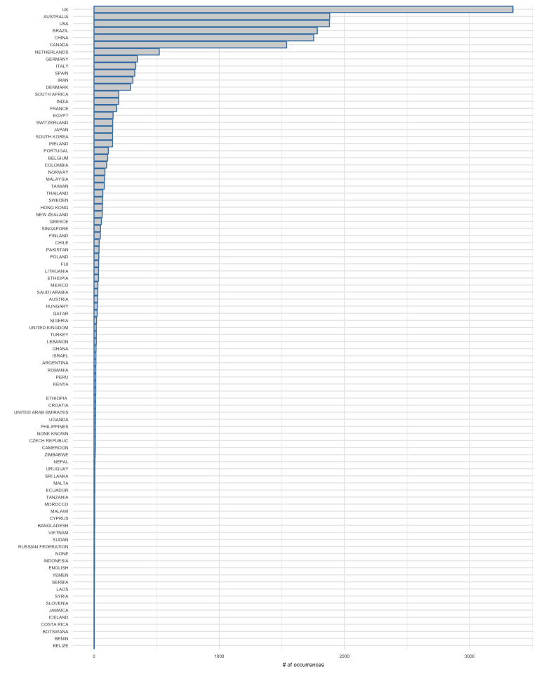

Datasets and scripts were used for PROSPERO records and SR's protocols analyses
are integrated in this [R Markdown](http://rmarkdown.rstudio.com) Notebook. When you execute code within the notebook, the results appear beneath the code. 

These dataset and R scripts WERE created by Juan Ruano and co-authored by I. Viguera-Guerra(a,1), J. Ruano(b,c,1,∗), M. Aguilar-Luque(b), J. Gay-Mimbrera(b), A. Montilla(b,e), J. L.Fernández-Rueda(b), J. Fernández-Chaichio(b), J.L. Sanz-Cabanillas(b,c), P. Gómez-Arias(b,c), A. Vélez García-Nieto(b,c), F. Gómez-García(b,c), B. Isla-Tejera(b,d). a Agencia de Evaluación de Tecnologías Sanitarias de Andalucía (AETSA), 14004 Sevilla, Spain b IMIBIC/Reina Sofía University Hospital/University of Cordoba, 14004 Córdoba, Spain c Department of Dermatology, Reina Sofía University Hospital, 14004 Córdoba, Spain d Department of Pharmacy, Reina Sofía University Hospital, 14004 Córdoba, Spain e School of Medicine, University of Cordoba, 14004 Córdoba, Spain. 

They are of freely use (MIT License).

1 Equal contributors

Corresponding author: juanruanoruiz@mac.com

# 0. Packages, functions, and datasets.


```r
####  R packages  ---------------
library(RISmed)
library(readr)
library(tidyverse)
```

```
## ── Attaching packages ──────────────────────────────────────────────────────── tidyverse 1.2.1 ──
```

```
## ✔ ggplot2 3.0.0     ✔ purrr   0.2.5
## ✔ tibble  1.4.2     ✔ dplyr   0.7.6
## ✔ tidyr   0.8.0     ✔ stringr 1.3.1
## ✔ ggplot2 3.0.0     ✔ forcats 0.3.0
```

```
## ── Conflicts ─────────────────────────────────────────────────────────── tidyverse_conflicts() ──
## ✖ dplyr::filter() masks stats::filter()
## ✖ dplyr::lag()    masks stats::lag()
```

```r
library(rworldmap)
```

```
## Loading required package: sp
```

```
## ### Welcome to rworldmap ###
```

```
## For a short introduction type : 	 vignette('rworldmap')
```

```r
library(tm)
```

```
## Loading required package: NLP
```

```
## 
## Attaching package: 'NLP'
```

```
## The following object is masked from 'package:ggplot2':
## 
##     annotate
```

```r
library(wordcloud)
```

```
## Loading required package: RColorBrewer
```

```r
library(RColorBrewer)

####  R functions  ---------------
pubmed2df<-function(D){
  
  records=D
  rm(D)
  ## Author 
  AU=unlist(lapply(Author(records),function(a){
    paste(paste(a$LastName,a$Initials,sep=" "),collapse =";")}))
  
  ## Total citations
  cat("\nDownloading updated citations from PubMed/MedLine...\n\n")
  TC=Cited(records)
  
  
  ## Country
  AU_CO=Country(records)
  
  ##
  CO=
  
  ## DOI
  DI=ELocationID(records)
  
  ## Source ISO
  JI=ISOAbbreviation(records)
  
  ## ISSN
  ISSN=ISSN(records)
  
  ## Volume
  VOL=Volume(records)
  
  ## Issue
  ISSUE=Issue(records)
  
  ## Language
  LT=Language(records)
  
  ## Affiliation
  AFF=unlist(lapply(Affiliation(records),function(a){
    paste(a,collapse =";")}))
  
  ## Title
  TI=ArticleTitle(records)
  
  ## Abstract
  AB=AbstractText(records)
  
  ## Pub year
  PY=YearPubmed(records)
  
  ## Pub type
  DT=unlist(lapply(PublicationType(records),function(a){
    paste(a,collapse =";")}))
  
  ## Article ID
  UT=ArticleId(records)
  
  ## Mesh
  MESH=unlist(lapply(Mesh(records),function(a){
    if (is.data.frame(a)){
      a=paste(a$Heading,collapse =";")}else{a='NA'}
  }))
  
  
  DATA <- data.frame('AU'=AU, 'TI'=TI,'AB'=AB,'PY'=PY, 'DT'=DT, 
                            'MESH'=MESH, 'TC'=TC, 'SO'=JI, 'J9'=JI, 'JI'=JI, 'DI'=DI,'ISSN'=ISSN, 
                            'VOL'=VOL, 'ISSUE'=ISSUE, 'LT'=LT, 'C1'=AFF, 'RP'=AFF, 'ID'=MESH,'DE'=MESH,
                            'UT'=UT, 'AU_CO'=AU_CO, stringsAsFactors = FALSE)
  DATA <- data.frame(lapply(DATA,toupper),stringsAsFactors = FALSE)
  DATA$DB = "PUBMED"
  
  
  return(DATA)
}
```


```r
##### 0: read and tidy dataset ---------------
new_data          <-  read.csv("protocol_dataset_curated_17JUN2018.csv", sep=";")
new_data          <-  subset(new_data, ALL_year>2010 & ALL_year<2018)
new_data$ALL_year <- factor(new_data$ALL_year)
```

# Figure 1.

This panel represent the main features of included protocols.  Only Venn diagram of number protocols published 'only in a journal' (coral), 'only at PROSPERO' (green), and their intersection, both 'journal and PROSPERO' (blue) was obtained using the eulerr R package also available as a 'Area-Proportional Euler and Venn Diagrams with Circles or Ellipses' shiny app hosted at http://eulerr.co/.

(a) Frequency of protocols published from 2011 to 2017 comparing those protocols published 'only in a journal', 'only at PROSPERO', and in both 'journal and PROSPERO'.


```r
### 1: plot protocols BY year x  group
ggplot(new_data,aes(x=ALL_year, group=group, fill=group, color=group)) + 
geom_bar () +
xlab("Year") +
ylab("nº protocols")+
ggtitle(" ")
```

<!-- -->

(c) Map representation of number of protocols produced by country (as proxy of reviewer's affiliation country). Colours represent levels of productivity defined by quartiles of a new recoded variable [abs(log2(country.count/all.countries.count))] (red, very high; yellow, high; green, medium; blue, low). 


```r
library(rworldmap)
data_map                            <- as.data.frame(read.csv2(file="unique_countries_count_resumed.csv", sep=" "))
cutVector                           <- quantile(data_map$count,na.rm=TRUE)
data_map$country_categories         <- cut(data_map$count, cutVector, include.lowest=TRUE )
levels(data_map$country_categories) <- c("low", "med", "high", "vhigh")
n                                   <- joinCountryData2Map(data_map, joinCode="NAME", nameJoinColumn="country")
```

```
## 121 codes from your data successfully matched countries in the map
## 3 codes from your data failed to match with a country code in the map
## 122 codes from the map weren't represented in your data
```

```r
mapCountryData(n, nameColumnToPlot="country_categories", mapTitle="World",addLegend = TRUE, oceanCol="lightblue", colourPalette="diverging", missingCountryCol="white")
```

```
## using catMethod='categorical' for non numeric data in mapCountryData
```

<!-- -->


(d) World cloud of 'unique countries'. Text size and centering is proportional to the associated number of protocols. Colours have been randomly assigned.


```r
set.seed(1234)
unique_countries                     <- new_data %>%
  filter(!str_detect(ALL_country_curated, ','))
unique_countries_all                 <- unique_countries %>%
  filter(!str_detect(ALL_country_curated, '\t'))

table_all_unique_countries           <- as.data.frame(table(unique_countries_all[,c(16)]))
table_country                        <- subset(table_all_unique_countries, Freq>1)
wordcloud(table_country$Var1, table_country$Freq/min(table_country$Freq)+1, max.words = 300, min.freq = 1, 
          random.order=FALSE, scale = c(4, 0.5), colors=brewer.pal(8,"Dark2"), random.color=TRUE)
```

<!-- -->


(e) World cloud of 'collaborative countries'. Text size and centering is proportional to the associated number of protocols. Colours have been randomly assigned.


```r
set.seed(1234)
collaborative_countries              <-new_data %>%
  filter(str_detect(ALL_country_curated, ','))
table_all_collaborative_countries <- as.data.frame(table(collaborative_countries[,c(16)]))

table_all_collaborative_countries_uk <-table_all_collaborative_countries %>%
  filter(!str_detect(Var1, "UK, UK|UK, UK, UK|UK, UK, UK, UK|POLAND"))

table_country                        <- subset(table_all_collaborative_countries_uk, Freq>1)
set.seed(1234)
wordcloud(table_country$Var1, table_country$Freq/min(table_country$Freq), max.words = 300, min.freq = 1, scale = c(3, 0.2),
          random.order=FALSE, colors=brewer.pal(8,"Dark2"), random.color=TRUE)
```

<!-- -->

(f) World cloud of 'scientific journals'. Text size and centering is proportional to the associated number of protocols. Colours have been randomly assigned.


```r
set.seed(1234)
new_data<-read.csv("protocol_dataset_curated_17JUN2018.csv", sep=";")
new_data<-subset(new_data, ALL_year>2010 & ALL_year<2019)
new_data$ALL_year<-factor(new_data$ALL_year)
new_data_journal<-subset(new_data, group=="Only_Journal" | group=="PROSPERO_and_Journal")
table_journal <- as.data.frame(table(new_data_journal[,c(11)]))

table_journal<-subset(table_journal, Freq>0)
wordcloud(table_journal$Var1, table_journal$Freq/min(table_journal$Freq)+1, max.words = 120, min.freq = 0, 
          random.order=FALSE, colors=brewer.pal(6,"Dark2"), random.color=TRUE)
```

<!-- -->


(g) Column plots of ocurrences of 'unique countries' ranked by total number of protocols.


# Figure 3.


```r
unique_countries<-new_data %>%
  filter(!str_detect(ALL_country_curated, ','))
unique_countries_all<-unique_countries %>%
  filter(!str_detect(ALL_country_curated, '\t'))

table_all_unique_countries <- as.data.frame(table(unique_countries_all[,c(16)]))
table_unique_country<-subset(table_all_unique_countries, Freq>1)

ggplot(table_unique_country, aes(reorder(Var1, Freq), Freq))+
  coord_flip()+
  geom_bar(stat="identity",color="steelblue", fill="lightgray")+
  theme_minimal()+
  theme(text = element_text(size=6))+
  xlab(" ")+
  ylab("# of occurrences")
```

<!-- -->

(h) Column plots of co-ocurrences of 'collaborative countries' ranked by total number of protocols.


```r
table_collaborative_country<-subset(table_all_collaborative_countries_uk, Freq>1)
ggplot(table_collaborative_country, aes(reorder(Var1, Freq), Freq))+
  coord_flip()+
  geom_bar(stat="identity",color="steelblue", fill="lightgray")+
  theme_minimal()+
  theme(text = element_text(size=4))+
  xlab(" ")+
  ylab("# of co-occurrences")
```

<!-- -->
 

(i) Column plots of 'unique countries' (g), 'collaborative countries' (h), and journals (i) ranked by total number of protocols.


```r
table_journal <- as.data.frame(table(new_data[,c(11)]))

ggplot(table_journal, aes(reorder(Var1, Freq), Freq))+
  coord_flip()+
  geom_bar(stat="identity",color="steelblue", fill="lightgray")+
  theme_minimal()+
  theme(text = element_text(size=5))+
  xlab(" ")+
  ylab("# protocols")
```

<!-- -->


# FIGURE 3
This panel represent frequency and time-course changes of SR protocol publication by journals.  


```r
new_data_journal<-subset(new_data, group=="Only_Journal" | group=="PROSPERO_and_Journal")
table_journal <- as.data.frame(table(new_data_journal[,c(11)]))
new_data_journal_2<-merge(new_data_journal, table_journal, by.x="publication_journal", by.y = "Var1", all.x = TRUE)

ggplot(new_data_journal_2,aes(x=(reorder(publication_journal, Freq)), group=group, fill=group, color=group)) + 
facet_grid(~group)+
geom_bar () +
coord_flip()+
theme(axis.text.y=element_text(size=4))+
xlab("Journal") +
ylab("nº protocols")+
ggtitle("SRs protocols by journal")+
  theme(legend.position="none")
```

<!-- -->

(a) Frequency of protocols published from 2011 to 2017 by journal comparing those protocols published 'only in a journal' with those protocols published in both 'journal and PROSPERO'.


```r
new_data_journal_top<-subset(new_data_journal,  publication_journal=="SYST REV"
                               | publication_journal=="BMJ OPEN" 
                               | publication_journal=="JBI DATABASE SYSTEM REV IMPLEMENT REP" 
                               | publication_journal=="JMIR RES PROTOC" 
                               | publication_journal=="MEDICINE (BALTIMORE)" 
                               | publication_journal=="CLIN TRANSL ALLERGY" 
                               | publication_journal=="TRIALS" 
                               | publication_journal=="J ADV NURS" 
                               | publication_journal=="JBI LIBR SYST REV" 
                               | publication_journal=="NPJ PRIM CARE RESPIR MED" )

table_journal_2 <- as.data.frame(table(new_data_journal_top[,c(11)]))
new_data_journal_3<-merge(new_data_journal_top, table_journal_2, by.x="publication_journal", by.y = "Var1", all.x = TRUE)

ggplot(new_data_journal_3,aes(x=(reorder(publication_journal, Freq)), group=group, fill=group, color=group)) + 
facet_grid(~group)+
geom_bar () +
coord_flip()+
theme(axis.text.y=element_text(size=4))+
xlab("Journal") +
ylab("nº protocols")+
ggtitle("SRs protocols by journal")+
  theme(legend.position="none")
```

<!-- -->

(b) Magnified vision of plot (a) centered on TOP10 most publisher journals. 


```r
new_data_journal_top_2<-subset(new_data_journal,  publication_journal=="SYST REV"
                               | publication_journal=="BMJ OPEN")


ggplot(new_data_journal_top_2,aes(x=ALL_year, group=group, fill=group, color=group,linetype=group)) + 
facet_grid(~publication_journal)+
geom_point(stat = "count") +
geom_line(stat = 'count', aes(group = group, colour = group, linetype=group))+
#coord_flip()+
theme(axis.text.y=element_text(size=4))+
xlab("Year") +
ylab("nº protocols")+
ggtitle("SRs protocols by journal")+
  theme_bw()+
  theme(legend.position="top")
```

<!-- -->


(c) Evolution of 'only journal' vs 'journal and PROSPERO' protocols publications from 2011 to 2017 comparing 'BMJ open' and 'Systematic Reviews' journals.


