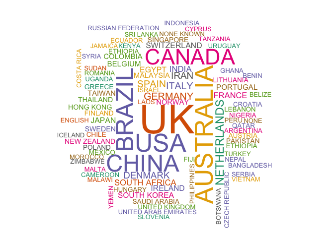

Datasets and scripts were used for PROSPERO records and SR's protocols analyses
are integrated in this [R Markdown](http://rmarkdown.rstudio.com) Notebook. When you execute code within the notebook, the results appear beneath the code. 

These dataset and R scripts WERE created by Juan Ruano and co-authored by I. Viguera-Guerra(a,1), J. Ruano(b,c,1,∗), M. Aguilar-Luque(b), J. Gay-Mimbrera(b), A. Montilla(b,e), J. L.Fernández-Rueda(b), J. Fernández-Chaichio(b), J.L. Sanz-Cabanillas(b,c), P. Gómez-Arias(b,c), A. Vélez García-Nieto(b,c), F. Gómez-García(b,c), B. Isla-Tejera(b,d). a Agencia de Evaluación de Tecnologías Sanitarias de Andalucía (AETSA), 14004 Sevilla, Spain b IMIBIC/Reina Sofía University Hospital/University of Cordoba, 14004 Córdoba, Spain c Department of Dermatology, Reina Sofía University Hospital, 14004 Córdoba, Spain d Department of Pharmacy, Reina Sofía University Hospital, 14004 Córdoba, Spain e School of Medicine, University of Cordoba, 14004 Córdoba, Spain. 

They are of freely use (MIT License).

1 Equal contributors

Corresponding author: juanruanoruiz@mac.com

# 0. Packages, functions, and datasets.


# Basic statistics.


```r
#### 2': number or reviewers->total and per protocol 
####
new_data$number_of_authors_PC <- stringr::str_count(new_data$publication_authors, ";")+1
new_data %>% 
  group_by(group) %>%
  summarise(
    median=median(number_of_authors_PC),
    min=min(number_of_authors_PC),
    max=max(number_of_authors_PC)
  )
```

```
## # A tibble: 3 x 4
##   group                median   min   max
##   <fct>                 <dbl> <dbl> <dbl>
## 1 Only_Journal              5     1    57
## 2 Only_PROSPERO            NA    NA    NA
## 3 PROSPERO_and_Journal      5     2    41
```


```r
###### number of countries: total and per protocol 
new_data$publication_countries_count <- str_count(new_data$ALL_country_curated, ",")+1
sum(na.omit(new_data$publication_countries_count))
```

```
## [1] 25095
```

```r
new_data %>% group_by(group) %>%
  summarise(
    median=median(publication_countries_count, na.rm=TRUE),
    min=min(publication_countries_count, na.rm=TRUE),
    max=max(publication_countries_count, na.rm=TRUE)
  )
```

```
## # A tibble: 3 x 4
##   group                median   min   max
##   <fct>                 <dbl> <dbl> <dbl>
## 1 Only_Journal              1     1    14
## 2 Only_PROSPERO             1     1   159
## 3 PROSPERO_and_Journal      1     1     7
```

```r
more<-subset(new_data, publication_countries_count>1)
unique<-subset(new_data, publication_countries_count<2)

dim(more)
```

```
## [1] 1896   42
```

```r
dim(unique)
```

```
## [1] 17277    42
```


# Figure 1.

This panel represent the main features of included protocols.  Only Venn diagram of number protocols published 'only in a journal' (coral), 'only at PROSPERO' (green), and their intersection, both 'journal and PROSPERO' (blue) was obtained using the eulerr R package also available as a 'Area-Proportional Euler and Venn Diagrams with Circles or Ellipses' shiny app hosted at http://eulerr.co/.

(a) Frequency of protocols published from 2011 to 2017 comparing those protocols published 'only in a journal', 'only at PROSPERO', and in both 'journal and PROSPERO'.


```r
### 1: plot protocols BY year x  group
ggplot(new_data,aes(x=ALL_year, group=group, fill=group, color=group)) + 
geom_bar () +
xlab("Year") +
ylab("nº protocols")+
ggtitle(" ")
```

<!-- -->

(c) Map representation of number of protocols produced by country (as proxy of reviewer's affiliation country). Colours represent levels of productivity defined by quartiles of a new recoded variable [abs(log2(country.count/all.countries.count))] (red, very high; yellow, high; green, medium; blue, low). 


```r
library(rworldmap)
data_map                            <- as.data.frame(read.csv2(file="unique_countries_count_resumed.csv", sep=" "))
cutVector                           <- quantile(data_map$count,na.rm=TRUE)
data_map$country_categories         <- cut(data_map$count, cutVector, include.lowest=TRUE )
levels(data_map$country_categories) <- c("low", "med", "high", "vhigh")
n                                   <- joinCountryData2Map(data_map, joinCode="NAME", nameJoinColumn="country")
```

```
## 121 codes from your data successfully matched countries in the map
## 3 codes from your data failed to match with a country code in the map
## 122 codes from the map weren't represented in your data
```

```r
mapCountryData(n, nameColumnToPlot="country_categories", mapTitle="World",addLegend = TRUE, oceanCol="lightblue", colourPalette="diverging", missingCountryCol="white")
```

```
## using catMethod='categorical' for non numeric data in mapCountryData
```

<!-- -->


(d) World cloud of 'unique countries'. Text size and centering is proportional to the associated number of protocols. Colours have been randomly assigned.


```r
set.seed(1234)
unique_countries                     <- new_data %>%
  filter(!str_detect(ALL_country_curated, ','))
unique_countries_all                 <- unique_countries %>%
  filter(!str_detect(ALL_country_curated, '\t'))

table_all_unique_countries           <- as.data.frame(table(unique_countries_all[,c(16)]))
table_country                        <- subset(table_all_unique_countries, Freq>1)
wordcloud(table_country$Var1, table_country$Freq/min(table_country$Freq)+1, max.words = 300, min.freq = 1, 
          random.order=FALSE, scale = c(5, 0.8), colors=brewer.pal(8,"Dark2"), random.color=TRUE)
```

<!-- -->


(e) World cloud of 'collaborative countries'. Text size and centering is proportional to the associated number of protocols. Colours have been randomly assigned.


```r
set.seed(1234)
collaborative_countries              <-new_data %>%
  filter(str_detect(ALL_country_curated, ','))
table_all_collaborative_countries <- as.data.frame(table(collaborative_countries[,c(16)]))

table_all_collaborative_countries_uk <-table_all_collaborative_countries %>%
  filter(!str_detect(Var1, "UK, UK|UK, UK, UK|UK, UK, UK, UK|POLAND"))

table_country                        <- subset(table_all_collaborative_countries_uk, Freq>1)
set.seed(1234)
wordcloud(table_country$Var1, table_country$Freq/min(table_country$Freq), max.words = 300, min.freq = 1, scale = c(3, 0.2),
          random.order=FALSE, colors=brewer.pal(8,"Dark2"), random.color=TRUE)
```

<!-- -->

(f) World cloud of 'scientific journals'. Text size and centering is proportional to the associated number of protocols. Colours have been randomly assigned.


```r
set.seed(1234)
new_data<-read.csv("protocol_dataset_curated_17JUN2018.csv", sep=";")
new_data<-subset(new_data, ALL_year>2010 & ALL_year<2019)
new_data$ALL_year<-factor(new_data$ALL_year)
new_data_journal<-subset(new_data, group=="Only_Journal" | group=="PROSPERO_and_Journal")
table_journal <- as.data.frame(table(new_data_journal[,c(11)]))
levels(table_journal$Var1)[levels(table_journal$Var1)=="JBI DATABASE SYSTEM REV IMPLEMENT REP" ] <- "JBI DATABASE S R I R"
table_journal<-subset(table_journal, Freq>0)
wordcloud(table_journal$Var1, table_journal$Freq/min(table_journal$Freq)+1, max.words = 120, min.freq = 0, 
          random.order=FALSE, scale = c(3, 0.4),colors=brewer.pal(6,"Dark2"), random.color=TRUE)
```

<!-- -->


(g) Column plots of ocurrences of 'unique countries' ranked by total number of protocols.


# Figure 3.


```r
unique_countries<-new_data %>%
  filter(!str_detect(ALL_country_curated, ','))
unique_countries_all<-unique_countries %>%
  filter(!str_detect(ALL_country_curated, '\t'))
unique_countries_final<-unique_countries_all %>%
  filter(!str_detect(ALL_country_curated, ' '))

table_all_unique_countries <- as.data.frame(table(unique_countries_final[,c(16)]))
table_unique_country<-subset(table_all_unique_countries, Freq>1)

ggplot(table_unique_country, aes(reorder(Var1, Freq), Freq))+
  coord_flip()+
  geom_bar(stat="identity",color="steelblue", fill="lightgray")+
  theme_minimal()+
  theme(text = element_text(size=6))+
  xlab(" ")+
  ylab("# of occurrences")
```

<!-- -->

(h) Column plots of co-ocurrences of 'collaborative countries' ranked by total number of protocols.


```r
table_collaborative_country<-subset(table_all_collaborative_countries_uk, Freq>1)
ggplot(table_collaborative_country, aes(reorder(Var1, Freq), Freq))+
  coord_flip()+
  geom_bar(stat="identity",color="steelblue", fill="lightgray")+
  theme_minimal()+
  theme(text = element_text(size=4))+
  xlab(" ")+
  ylab("# of co-occurrences")
```

<!-- -->
 

(i) Column plots of 'unique countries' (g), 'collaborative countries' (h), and journals (i) ranked by total number of protocols.


```r
table_journal <- as.data.frame(table(new_data[,c(11)]))

ggplot(table_journal, aes(reorder(Var1, Freq), Freq))+
  coord_flip()+
  geom_bar(stat="identity",color="steelblue", fill="lightgray")+
  theme_minimal()+
  theme(text = element_text(size=5))+
  xlab(" ")+
  ylab("# protocols")
```

<!-- -->


# FIGURE 3
This panel represent frequency and time-course changes of SR protocol publication by journals.  


```r
new_data_journal<-subset(new_data, group=="Only_Journal" | group=="PROSPERO_and_Journal")
table_journal <- as.data.frame(table(new_data_journal[,c(11)]))
new_data_journal_2<-merge(new_data_journal, table_journal, by.x="publication_journal", by.y = "Var1", all.x = TRUE)

ggplot(new_data_journal_2,aes(x=(reorder(publication_journal, Freq)), group=group, fill=group, color=group)) + 
facet_grid(~group)+
geom_bar () +
coord_flip()+
theme(axis.text.y=element_text(size=4))+
xlab("Journal") +
ylab("nº protocols")+
ggtitle("SRs protocols by journal")+
  theme(legend.position="none")
```

<!-- -->

(a) Frequency of protocols published from 2011 to 2017 by journal comparing those protocols published 'only in a journal' with those protocols published in both 'journal and PROSPERO'.


```r
new_data_journal_top<-subset(new_data_journal,  publication_journal=="SYST REV"
                               | publication_journal=="BMJ OPEN" 
                               | publication_journal=="JBI DATABASE SYSTEM REV IMPLEMENT REP" 
                               | publication_journal=="JMIR RES PROTOC" 
                               | publication_journal=="MEDICINE (BALTIMORE)" 
                               | publication_journal=="CLIN TRANSL ALLERGY" 
                               | publication_journal=="TRIALS" 
                               | publication_journal=="J ADV NURS" 
                               | publication_journal=="JBI LIBR SYST REV" 
                               | publication_journal=="NPJ PRIM CARE RESPIR MED" )

table_journal_2 <- as.data.frame(table(new_data_journal_top[,c(11)]))
new_data_journal_3<-merge(new_data_journal_top, table_journal_2, by.x="publication_journal", by.y = "Var1", all.x = TRUE)

ggplot(new_data_journal_3,aes(x=(reorder(publication_journal, Freq)), group=group, fill=group, color=group)) + 
facet_grid(~group)+
geom_bar () +
coord_flip()+
theme(axis.text.y=element_text(size=12))+
xlab("Journal") +
ylab("nº protocols")+
ggtitle("SRs protocols by journal")+
  theme(legend.position="none")
```

<!-- -->

(b) Magnified vision of plot (a) centered on TOP10 most publisher journals. 


```r
new_data_journal_top_2<-subset(new_data_journal,  publication_journal=="SYST REV"
                               | publication_journal=="BMJ OPEN")

new_data_journal_top_2<-subset(new_data_journal_top_2,  ALL_year!="2018")

ggplot(new_data_journal_top_2,aes(x=ALL_year, group=group, fill=group, color=group,linetype=group)) + 
facet_grid(~publication_journal)+
geom_point(stat = "count") +
geom_line(stat = 'count', aes(group = group, colour = group, linetype=group))+
#coord_flip()+
theme(axis.text.y=element_text(size=4))+
xlab("Year") +
ylab("nº protocols")+
ggtitle(" ")+
  theme_bw()+
  theme(legend.position="top")
```

<!-- -->


(c) Evolution of 'only journal' vs 'journal and PROSPERO' protocols publications from 2011 to 2017 comparing 'BMJ open' and 'Systematic Reviews' journals.


# Figure 4.

This panel represent frequency and time-course changes of SR protocol publication by countries.  


```r
new_data_journal_top_2<-subset(new_data_journal,  publication_journal=="SYST REV"
                               | publication_journal=="BMJ OPEN")

table_all_countries <- as.data.frame(table(new_data_journal_top_2[,c(16)]))
all_countries<-merge(new_data_journal_top_2, table_all_countries, by.x="ALL_country_curated", by.y = "Var1", all.x = TRUE)

ggplot(na.omit(all_countries[,c(1,3,41)]),aes(x=(reorder(ALL_country_curated, Freq)), group=group, fill=group, color=group)) + 
facet_grid(~group)+
geom_bar()+
coord_flip()+
theme(axis.text.y=element_text(size=4))+
xlab("countries") +
ylab("nº protocols")+
theme(legend.position=" ")+
ggtitle("SRs protocols published in 'Syst Rev' or 'BMJ Open' by countries")
```

<!-- -->

(a) Frequency of protocols published from 2011 to 2017 by country comparing those protocols published 'only in a journal' with those protocols published in both 'journal and PROSPERO'.


```r
unique_countries<-new_data %>%
  filter(!str_detect(ALL_country_curated, ','))
unique_countries_all<-unique_countries %>%
  filter(!str_detect(ALL_country_curated, '\t'))

table_all_unique_countries <- as.data.frame(table(unique_countries_all[,c(16)]))
table_country              <- subset(table_all_unique_countries, Freq>1)
unique_countries_dataset   <- merge(unique_countries_all, table_all_unique_countries, by.x="ALL_country_curated", by.y = "Var1", all.x = TRUE)
unique_countries_dataset   <- unique_countries_dataset[,c(1,3,41)]

ordered_unique_countries_dataset <- arrange(unique_countries_dataset, desc(ALL_country_curated, Freq))
select<-c("UK", "AUSTRALIA", "USA", "BRAZIL", "CHINA", "CANADA","NETHERLANDS","GERMANY","ITALY","SPAIN")
ordered_unique_countries_dataset<-ordered_unique_countries_dataset[ordered_unique_countries_dataset$ALL_country_curated %in% select, ]

ggplot(na.omit(ordered_unique_countries_dataset),aes(x=reorder(ALL_country_curated, Freq), group=group, fill=group, color=group)) + 
facet_grid(~group)+
geom_bar()+
coord_flip()+
theme(axis.text.y=element_text(size=12))+
xlab("countries") +
ylab("nº protocols")+
  theme(legend.position="none")+
ggtitle("SRs 'unique protocols' published in 'Syst Rev' or 'BMJ Open' by top 10 countries")
```

<!-- -->


(b) Magnified vision of plot (a) centered on top 10 most productive countries comparing those protocols published 'only in a journal', ''only at PROSPERO', and in both 'journal and PROSPERO'.


```r
unique_countries<-new_data %>%
  filter(!str_detect(ALL_country_curated, ','))
unique_countries_all<-unique_countries %>%
  filter(!str_detect(ALL_country_curated, '\t'))

table_all_unique_countries <- as.data.frame(table(unique_countries_all[,c(16)]))
table_country              <- subset(table_all_unique_countries, Freq>1)
unique_countries_dataset   <- merge(unique_countries_all, table_all_unique_countries, by.x="ALL_country_curated", by.y = "Var1", all.x = TRUE)
unique_countries_dataset   <- unique_countries_dataset[,c(1,3,8,12,41)]

ordered_unique_countries_dataset <- arrange(unique_countries_dataset, desc(ALL_country_curated, Freq))
select<-c("UK", "AUSTRALIA", "USA", "BRAZIL", "CHINA", "CANADA","NETHERLANDS","GERMANY","ITALY","SPAIN")
ordered_unique_countries_dataset<-ordered_unique_countries_dataset[ordered_unique_countries_dataset$ALL_country_curated %in% select, ]
ordered_unique_countries_dataset<-subset(ordered_unique_countries_dataset,  publication_journal=="SYST REV"
                                         | publication_journal=="BMJ OPEN")

ordered_unique_countries_dataset$ALL_year<-as.numeric(as.character(ordered_unique_countries_dataset$ALL_year))

ggplot(na.omit(ordered_unique_countries_dataset),aes(x=ALL_year,color=ALL_country_curated,linetype=group)) + 
  geom_point(stat = 'count') +
  geom_line(stat='count',aes(x=ALL_year,color=ALL_country_curated,linetype=group))+
  theme(axis.text.y=element_text(size=4))+
  facet_grid(publication_journal~group)+
  scale_x_continuous(limits=c(2011, 2017), breaks = c(2011,2012,2013,2014,2015,2016,2017))+
  xlab("Year") +
  ylab("nº protocols")+
  ggtitle(" ")
```

<!-- -->

(c) Evolution of 'only journal' vs 'journal and PROSPERO' 'unique protocols' published from 2011 to 2017 comparing top 10 countries.


# Figure 5.


```r
all_rank    <- read.csv(file="both_rank_lists_countries.csv", sep=";")
unique      <- rev(as.vector(all_rank$country_unique))
colaborate  <- rev(as.vector(all_rank$country_col))
plotRanks(unique,colaborate)
```

<!-- -->

Rank discrepancies between two ordered lists of reviewers' affiliation countries. The 'Unique protocols' column displays a descendent list of reviewers' affiliation countries that  produced protocols for which all reviewers' institutions belonged to an unique country. The 'Collaborative protocols' column displays a ranked list of reviewers' affiliation countries that collaborated with other reviewers' affiliation countries to produce protocols for SRs. Arrows connect the same country from first to second list. Countries represented only in one of the lists are not connected to/by any arrow. 

The final plot appearing in the manuscript was edited using Keynote to get countries sub-grouped (Q1:Q4) by cutting through 25\%, 50\%, and 75\% of total number of countries in each list. When comparing 'Unique protocols' and 'Collaborative protocols' lists, country position is considered being modified if the edge connects two different subgroups (i.e., Q1\rightarrow\text{Q3}).\hspace{0.1cm} Direction\hspace{0.1cm} of\hspace{0.1cm} the\hspace{0.1cm} change\hspace{0.1cm} defines\hspace{0.1cm} 'upgrading'\hspace{0.1cm} (Q2\rightarrow Q1,Q3\rightarrow Q1,Q4\rightarrow Q1, Q3\rightarrow Q2,Q4\rightarrow Q3)\hspace{0.1cm} or\hspace{0.1cm} 'downgrading' \hspace{0.1cm}the \hspace{0.1cm}rank \hspace{0.1cm}position\hspace{0.1cm}of\hspace{0.1cm}any\hspace{0.1cm}country \hspace{0.1cm}(Q1\rightarrow Q2,Q1\rightarrow Q3,Q1\rightarrow Q4,Q2\rightarrow Q3,Q2\rightarrow Q4,Q3\rightarrow Q4).


# Figure 6.

Analysis of protocol publication patterns by most productive countries. 


```r
db_3<-read.csv(file="db_2.csv", sep=";")
db_3$FINAL_ORDEN<-as.factor(db_3$FINAL_ORDEN)

a <- db_3$continente_color

ggplot(na.omit(db_3[,c("min_year", "ALL_country_curated", "group", "FINAL_ORDEN", "continente_color")]), aes(x=min_year, y=forcats::fct_reorder(ALL_country_curated,desc(FINAL_ORDEN)), color=group, shape=group, group=interaction(ALL_country_curated, group)))+
  geom_point(aes(colour=group, group=interaction(y=forcats::fct_reorder(ALL_country_curated,desc(FINAL_ORDEN)), group)), size=3)+  
  #geom_jitter()+
  geom_line(aes(group=interaction(y=forcats::fct_reorder(ALL_country_curated,desc(FINAL_ORDEN)), group)),color="grey")+
  scale_x_discrete(limits=c(2011,2012,2013,2014,2015,2016,2017,2018))+
  theme(axis.text.y=element_text(colour="continente_color"))+
  theme_linedraw(base_size = 7)+
  xlab("Year of first protocol")+
  ylab(" ")
```

```
## geom_path: Each group consists of only one observation. Do you need to
## adjust the group aesthetic?
```

<!-- -->

Countries are listed in a descendent order based on their 'Unique protocol' productivity. Points represent a hallmark in every country's history of protocol publication: first time to publish a protocol in 'only a journal' (red dot), 'only at PROSPERO' (green triangle), and in both 'journal and PROSPERO' (blue square). 

The final plot appearing in the manuscript was edited using Keynote to get arrows connecting two (by a dotted line) or more (by a full line) hallmarks to emphasize how much time is taken for a country to adopt a new way of publication.
