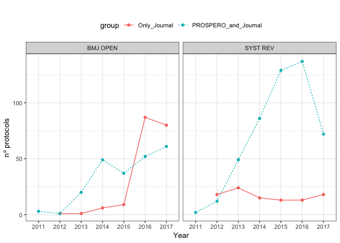

Datasets and scripts were used for PROSPERO records and SR's protocols analyses
are integrated in this [R Markdown](http://rmarkdown.rstudio.com) Notebook. When you execute code within the notebook, the results appear beneath the code. 

These dataset and R scripts WERE created by Juan Ruano and co-authored by I. Viguera-Guerra(a,1), J. Ruano(b,c,1,∗), M. Aguilar-Luque(b), J. Gay-Mimbrera(b), A. Montilla(b,e), J. L.Fernández-Rueda(b), J. Fernández-Chaichio(b), J.L. Sanz-Cabanillas(b,c), P. Gómez-Arias(b,c), A. Vélez García-Nieto(b,c), F. Gómez-García(b,c), B. Isla-Tejera(b,d). a Agencia de Evaluación de Tecnologías Sanitarias de Andalucía (AETSA), 14004 Sevilla, Spain b IMIBIC/Reina Sofía University Hospital/University of Cordoba, 14004 Córdoba, Spain c Department of Dermatology, Reina Sofía University Hospital, 14004 Córdoba, Spain d Department of Pharmacy, Reina Sofía University Hospital, 14004 Córdoba, Spain e School of Medicine, University of Cordoba, 14004 Córdoba, Spain. 

They are of freely use (MIT License).

1 Equal contributors

Corresponding author: juanruanoruiz@mac.com

# 0. Packages, functions, and datasets.


```r
####  R packages  ---------------
library(RISmed)
library(readr)
library(tidyverse)
```

```
## ── Attaching packages ──────────────────────────────────────────────────────── tidyverse 1.2.1 ──
```

```
## ✔ ggplot2 3.0.0     ✔ purrr   0.2.5
## ✔ tibble  1.4.2     ✔ dplyr   0.7.6
## ✔ tidyr   0.8.0     ✔ stringr 1.3.1
## ✔ ggplot2 3.0.0     ✔ forcats 0.3.0
```

```
## ── Conflicts ─────────────────────────────────────────────────────────── tidyverse_conflicts() ──
## ✖ dplyr::filter() masks stats::filter()
## ✖ dplyr::lag()    masks stats::lag()
```

```r
library(rworldmap)
```

```
## Loading required package: sp
```

```
## ### Welcome to rworldmap ###
```

```
## For a short introduction type : 	 vignette('rworldmap')
```

```r
library(tm)
```

```
## Loading required package: NLP
```

```
## 
## Attaching package: 'NLP'
```

```
## The following object is masked from 'package:ggplot2':
## 
##     annotate
```

```r
library(wordcloud)
```

```
## Loading required package: RColorBrewer
```

```r
library(RColorBrewer)

####  R functions  ---------------

####  pubmed2df function converts a PubMed/MedLine collection (obtained through a query performed with RISmed package) and create a data frame from it, with cases corresponding to articles and variables to Field Tags as proposed by Clarivate Analytics WoS. -----------------
pubmed2df<-function(D){
  
  records=D
  rm(D)
  ## Author 
  AU=unlist(lapply(Author(records),function(a){
    paste(paste(a$LastName,a$Initials,sep=" "),collapse =";")}))
  
  ## Total citations
  cat("\nDownloading updated citations from PubMed/MedLine...\n\n")
  TC=Cited(records)
  
  
  ## Country
  AU_CO=Country(records)
  
  ##
  CO=
  
  ## DOI
  DI=ELocationID(records)
  
  ## Source ISO
  JI=ISOAbbreviation(records)
  
  ## ISSN
  ISSN=ISSN(records)
  
  ## Volume
  VOL=Volume(records)
  
  ## Issue
  ISSUE=Issue(records)
  
  ## Language
  LT=Language(records)
  
  ## Affiliation
  AFF=unlist(lapply(Affiliation(records),function(a){
    paste(a,collapse =";")}))
  
  ## Title
  TI=ArticleTitle(records)
  
  ## Abstract
  AB=AbstractText(records)
  
  ## Pub year
  PY=YearPubmed(records)
  
  ## Pub type
  DT=unlist(lapply(PublicationType(records),function(a){
    paste(a,collapse =";")}))
  
  ## Article ID
  UT=ArticleId(records)
  
  ## Mesh
  MESH=unlist(lapply(Mesh(records),function(a){
    if (is.data.frame(a)){
      a=paste(a$Heading,collapse =";")}else{a='NA'}
  }))
  
  
  DATA <- data.frame('AU'=AU, 'TI'=TI,'AB'=AB,'PY'=PY, 'DT'=DT, 
                            'MESH'=MESH, 'TC'=TC, 'SO'=JI, 'J9'=JI, 'JI'=JI, 'DI'=DI,'ISSN'=ISSN, 
                            'VOL'=VOL, 'ISSUE'=ISSUE, 'LT'=LT, 'C1'=AFF, 'RP'=AFF, 'ID'=MESH,'DE'=MESH,
                            'UT'=UT, 'AU_CO'=AU_CO, stringsAsFactors = FALSE)
  DATA <- data.frame(lapply(DATA,toupper),stringsAsFactors = FALSE)
  DATA$DB = "PUBMED"
  
  
  return(DATA)
}


####  plotRanks function creates a plot similar to the critical difference plot, but applicable to any pair of ranked lists. In our case, for 'Unique vs Collaborative' country ranks comparison. -----------------

plotRanks <- function(a, b, labels.offset=0.005, arrow.len=0.1)
{
  old.par <- par(mar=c(1,1,1,1))
  
  # Find the length of the vectors
  len.1 <- length(a)
  len.2 <- length(b)
  
  # Plot two columns of equidistant points
  plot(rep(1, len.1), 1:len.1, pch=19, cex=0.3, tck=-.01,
       xlim=c(0, 3), ylim=c(0, max(len.1, len.2)),
       axes=F, xlab="", ylab="") # Remove axes and labels
  points(rep(2, len.2), 1:len.2, pch=19, cex=0.3, tck=-.01)
  
  # Put labels next to each observation
  text(rep(1-labels.offset, len.1), 1:len.1, a,col="darkblue",cex=0.5, adj=0, pos = 2)
  text(rep(2+labels.offset, len.2), 1:len.2,  b,col="coral",cex=0.5, adj=0, pos = 4)
  
  # Now we need to map where the elements of a are in b
  # We use the match function for this job
  a.to.b <- match(a, b)
  
  # Now we can draw arrows from the first column to the second
  arrows(rep(1.02, len.1), 1:len.1, rep(1.98, len.2), a.to.b, 
         length=arrow.len, angle=20)
  par(old.par)
}
```


```r
##### 0: read and tidy dataset ---------------
new_data          <-  read.csv("protocol_dataset_curated_17JUN2018.csv", sep=";")
new_data          <-  subset(new_data, ALL_year>2010 & ALL_year<2018)
new_data$ALL_year <- factor(new_data$ALL_year)
```

# Basic statistics.


```r
#### 2': number or reviewers->total and per protocol 
####
library("stringr")
new_data$number_of_authors_PC <- str_count(new_data$publication_authors, ";")+1
sum(na.omit(new_data$number_of_authors_PC))
```

```
## [1] 9795
```

```r
summary(na.omit(new_data$number_of_authors_PC))
```

```
##    Min. 1st Qu.  Median    Mean 3rd Qu.    Max. 
##   1.000   4.000   5.000   6.192   7.000  57.000
```

```r
new_data%>%
  group_by(., group)%>%
  summary(na.omit(new_data$number_of_authors_PC))
```

```
## Warning in if (length(ll) > maxsum) {: la condición tiene longitud > 1 y
## sólo el primer elemento será usado

## Warning in if (length(ll) > maxsum) {: la condición tiene longitud > 1 y
## sólo el primer elemento será usado
```

```
## Warning in maxsum:length(ll): numerical expression has 1582 elements: only
## the first used
```

```
## Warning in if (length(ll) > maxsum) {: la condición tiene longitud > 1 y
## sólo el primer elemento será usado

## Warning in if (length(ll) > maxsum) {: la condición tiene longitud > 1 y
## sólo el primer elemento será usado
```

```
## Warning in maxsum:length(ll): numerical expression has 1582 elements: only
## the first used
```

```
## Warning in if (length(ll) > maxsum) {: la condición tiene longitud > 1 y
## sólo el primer elemento será usado
```

```
## Warning in maxsum:length(ll): numerical expression has 1582 elements: only
## the first used
```

```
## Warning in if (length(ll) > maxsum) {: la condición tiene longitud > 1 y
## sólo el primer elemento será usado
```

```
## Warning in maxsum:length(ll): numerical expression has 1582 elements: only
## the first used
```

```
## Warning in if (length(ll) > maxsum) {: la condición tiene longitud > 1 y
## sólo el primer elemento será usado
```

```
## Warning in maxsum:length(ll): numerical expression has 1582 elements: only
## the first used
```

```
## Warning in if (length(ll) > maxsum) {: la condición tiene longitud > 1 y
## sólo el primer elemento será usado
```

```
## Warning in maxsum:length(ll): numerical expression has 1582 elements: only
## the first used
```

```
## Warning in if (length(ll) > maxsum) {: la condición tiene longitud > 1 y
## sólo el primer elemento será usado
```

```
## Warning in maxsum:length(ll): numerical expression has 1582 elements: only
## the first used
```

```
## Warning in if (length(ll) > maxsum) {: la condición tiene longitud > 1 y
## sólo el primer elemento será usado
```

```
## Warning in maxsum:length(ll): numerical expression has 1582 elements: only
## the first used
```

```
## Warning in if (length(ll) > maxsum) {: la condición tiene longitud > 1 y
## sólo el primer elemento será usado
```

```
## Warning in maxsum:length(ll): numerical expression has 1582 elements: only
## the first used
```

```
## Warning in if (length(ll) > maxsum) {: la condición tiene longitud > 1 y
## sólo el primer elemento será usado
```

```
## Warning in maxsum:length(ll): numerical expression has 1582 elements: only
## the first used
```

```
## Warning in if (length(ll) > maxsum) {: la condición tiene longitud > 1 y
## sólo el primer elemento será usado

## Warning in if (length(ll) > maxsum) {: la condición tiene longitud > 1 y
## sólo el primer elemento será usado

## Warning in if (length(ll) > maxsum) {: la condición tiene longitud > 1 y
## sólo el primer elemento será usado

## Warning in if (length(ll) > maxsum) {: la condición tiene longitud > 1 y
## sólo el primer elemento será usado

## Warning in if (length(ll) > maxsum) {: la condición tiene longitud > 1 y
## sólo el primer elemento será usado

## Warning in if (length(ll) > maxsum) {: la condición tiene longitud > 1 y
## sólo el primer elemento será usado

## Warning in if (length(ll) > maxsum) {: la condición tiene longitud > 1 y
## sólo el primer elemento será usado

## Warning in if (length(ll) > maxsum) {: la condición tiene longitud > 1 y
## sólo el primer elemento será usado

## Warning in if (length(ll) > maxsum) {: la condición tiene longitud > 1 y
## sólo el primer elemento será usado

## Warning in if (length(ll) > maxsum) {: la condición tiene longitud > 1 y
## sólo el primer elemento será usado

## Warning in if (length(ll) > maxsum) {: la condición tiene longitud > 1 y
## sólo el primer elemento será usado

## Warning in if (length(ll) > maxsum) {: la condición tiene longitud > 1 y
## sólo el primer elemento será usado
```

```
## Warning in maxsum:length(ll): numerical expression has 1582 elements: only
## the first used
```

```
## Warning in if (length(ll) > maxsum) {: la condición tiene longitud > 1 y
## sólo el primer elemento será usado
```

```
## Warning in maxsum:length(ll): numerical expression has 1582 elements: only
## the first used
```

```
## Warning in if (length(ll) > maxsum) {: la condición tiene longitud > 1 y
## sólo el primer elemento será usado
```

```
## Warning in maxsum:length(ll): numerical expression has 1582 elements: only
## the first used
```

```
## Warning in if (length(ll) > maxsum) {: la condición tiene longitud > 1 y
## sólo el primer elemento será usado
```

```
## Warning in maxsum:length(ll): numerical expression has 1582 elements: only
## the first used
```

```
## Warning in if (length(ll) > maxsum) {: la condición tiene longitud > 1 y
## sólo el primer elemento será usado

## Warning in if (length(ll) > maxsum) {: la condición tiene longitud > 1 y
## sólo el primer elemento será usado

## Warning in if (length(ll) > maxsum) {: la condición tiene longitud > 1 y
## sólo el primer elemento será usado

## Warning in if (length(ll) > maxsum) {: la condición tiene longitud > 1 y
## sólo el primer elemento será usado

## Warning in if (length(ll) > maxsum) {: la condición tiene longitud > 1 y
## sólo el primer elemento será usado

## Warning in if (length(ll) > maxsum) {: la condición tiene longitud > 1 y
## sólo el primer elemento será usado

## Warning in if (length(ll) > maxsum) {: la condición tiene longitud > 1 y
## sólo el primer elemento será usado

## Warning in if (length(ll) > maxsum) {: la condición tiene longitud > 1 y
## sólo el primer elemento será usado

## Warning in if (length(ll) > maxsum) {: la condición tiene longitud > 1 y
## sólo el primer elemento será usado
```

```
##      orden                        group      
##  Min.   :    1   Only_Journal        :  809  
##  1st Qu.: 5371   Only_PROSPERO       :19898  
##  Median :10740   PROSPERO_and_Journal:  773  
##  Mean   :10747                               
##  3rd Qu.:16110                               
##  Max.   :21688                               
##                                              
##                                              
##                                              
##                                              
##                                              
##                                              
##                                              
##                                              
##                                                                                                     CDR_PROSPERO_records
##  CRD42013005100                                                                                               :    2    
##  CRD42015020166                                                                                               :    2    
##  THIS PROTOCOL HAS BEEN REGISTERED WITH THE PROSPERO INTERNATIONAL PROSPECTIVE REGISTER OF SYSTEMATIC REVIEWS.:    2    
##  THIS PROTOCOL WILL BE REGISTERED WITH PROSPERO                                                               :    2    
##  THIS PROTOCOL WILL BE REGISTERED WITH PROSPERO.                                                              :    2    
##  CRD42011001104                                                                                               :    1    
##  CRD42011001117                                                                                               :    1    
##  CRD42011001122                                                                                               :    1    
##  CRD42011001133                                                                                               :    1    
##  CRD42011001170                                                                                               :    1    
##  CRD42011001174                                                                                               :    1    
##  CRD42011001244                                                                                               :    1    
##  (Other)                                                                                                      :20666    
##  NA's                                                                                                         :  797    
##  publication_ID     PROSPERO_year  publication_year ALL_year    
##  Min.   :21426573   Min.   :2011   Min.   :2011     2011:   86  
##  1st Qu.:26351857   1st Qu.:2015   1st Qu.:2015     2012:  391  
##  Median :27531935   Median :2017   Median :2016     2013:  940  
##  Mean   :27160097   Mean   :2016   Mean   :2016     2014: 1680  
##  3rd Qu.:28525001   3rd Qu.:2017   3rd Qu.:2017     2015: 2817  
##  Max.   :29858408   Max.   :2017   Max.   :2018     2016: 3574  
##  NA's   :19898      NA's   :809    NA's   :19898    2017:11992  
##                                                                 
##                                                                 
##                                                                 
##                                                                 
##                                                                 
##                                                                 
##                                                                 
##                                                                                                                                                                                                                                                                                                  publication_authors
##  NA NA                                                                                                                                                                                                                                                                                                     :    5   
##  ADOM T;PUOANE T;DE VILLIERS A;KENGNE AP                                                                                                                                                                                                                                                                   :    2   
##  AKPATA R;NEUMAYR A;HOLTFRETER MC;KRANTZ I;SINGH DD;MOTA R;WALTER S;HATZ C;RICHTER J                                                                                                                                                                                                                       :    2   
##  CURTIS E;FERNANDEZ R;LEE A                                                                                                                                                                                                                                                                                :    2   
##  DHAMI S;NURMATOV U;AGACHE I;LAU S;MURARO A;JUTEL M;ROBERTS G;AKDIS C;BONINI M;CALDERON M;CASALE T;CAVKAYTAR O;COX L;DEMOLY P;FLOOD B;HAMELMANN E;IZUHARA K;KALAYCI NA;KLEINE-TEBBE J;NIETO A;PAPADOPOULOS N;PFAAR O;ROSENWASSER L;RYAN D;SCHMIDT-WEBER C;SZEFLER S;WAHN U;VAN WIJK RG;WILKINSON J;SHEIKH A:    2   
##  DHAMI S;NURMATOV U;PAJNO GB;FERNANDEZ-RIVAS M;MURARO A;ROBERTS G;AKDIS C;ALVARO-LOZANO M;BEYER K;BINDSLEV-JENSEN C;BURKS W;DU TOIT G;EBISAWA M;EIGENMANN P;KNOL E;MAKELA M;NADEAU KC;O'MAHONY L;PAPADOPOULOS N;POULSEN L;SACKESEN C;SAMPSON H;SANTOS A;VAN REE R;TIMMERMANS F;SHEIKH A                    :    2   
##  DILLON MP;FATONE S;QUIGLEY M                                                                                                                                                                                                                                                                              :    2   
##  GOLDSTEIN KM;MCDUFFIE JR;SHEPHERD-BANIGAN M;BEFUS D;COEYTAUX RR;VAN NOORD MG;GOODE AP;MASILAMANI V;ADAM S;NAGI A;WILLIAMS JW                                                                                                                                                                              :    2   
##  JÄRBRINK K;NI G;SÖNNERGREN H;SCHMIDTCHEN A;PANG C;BAJPAI R;CAR J                                                                                                                                                                                                                                        :    2   
##  MEHROTRA A;LEUNG WY;JOSON T                                                                                                                                                                                                                                                                               :    2   
##  MORRISSEY EC;DURAND H;NIEUWLAAT R;NAVARRO T;HAYNES RB;WALSH JC;MOLLOY GJ                                                                                                                                                                                                                                  :    2   
##  O'BRIEN KK;TYNAN AM;NIXON SA;GLAZIER RH                                                                                                                                                                                                                                                                   :    2   
##  (Other)                                                                                                                                                                                                                                                                                                   : 1555   
##  NA's                                                                                                                                                                                                                                                                                                      :19898   
##                                                                                                                                                                                                                                      publication_title
##  25 YEARS OF EYE MOVEMENT DESENSITIZATION AND REPROCESSING (EMDR): THE EMDR THERAPY PROTOCOL, HYPOTHESES OF ITS MECHANISM OF ACTION AND A SYSTEMATIC REVIEW OF ITS EFFICACY IN THE TREATMENT OF POST-TRAUMATIC STRESS DISORDER.               :    1  
##  A COMPARISON BETWEEN DEXMEDETOMIDINE AND PROPOFOL ON EXTUBATION TIMES IN POSTOPERATIVE ADULT CARDIAC SURGERY PATIENTS: A SYSTEMATIC REVIEW PROTOCOL.                                                                                         :    1  
##  A COMPARISON OF THE IMPACT OF CUFFED VERSUS UNCUFFED ENDOTRACHEAL TUBES ON THE INCIDENCE OF TRACHEAL TUBE EXCHANGE AND ON POST-EXTUBATION AIRWAY MORBIDITY IN PEDIATRIC PATIENTS UNDERGOING GENERAL ANESTHESIA: A SYSTEMATIC REVIEW PROTOCOL.:    1  
##  A CORE OUTCOME SET FOR EVALUATING SELF-MANAGEMENT INTERVENTIONS IN PEOPLE WITH COMORBID DIABETES AND SEVERE MENTAL ILLNESS: STUDY PROTOCOL FOR A MODIFIED DELPHI STUDY AND SYSTEMATIC REVIEW.                                                :    1  
##  A CORE OUTCOME SET FOR LOCALISED PROSTATE CANCER EFFECTIVENESS TRIALS: PROTOCOL FOR A SYSTEMATIC REVIEW OF THE LITERATURE AND STAKEHOLDER INVOLVEMENT THROUGH INTERVIEWS AND A DELPHI SURVEY.                                                :    1  
##  A CORE OUTCOME SET FOR NEONATAL ABSTINENCE SYNDROME: STUDY PROTOCOL FOR A SYSTEMATIC REVIEW, PARENT INTERVIEWS AND A DELPHI SURVEY.                                                                                                          :    1  
##  A CRITICAL EVALUATION OF THE EFFECTIVENESS OF INTERVENTIONS FOR IMPROVING THE WELL-BEING OF CAREGIVERS OF CHILDREN WITH CEREBRAL PALSY: A SYSTEMATIC REVIEW PROTOCOL.                                                                        :    1  
##  A GUIDE TO WRITING A QUALITATIVE SYSTEMATIC REVIEW PROTOCOL TO ENHANCE EVIDENCE-BASED PRACTICE IN NURSING AND HEALTH CARE.                                                                                                                   :    1  
##  A MIXED STUDY SYSTEMATIC REVIEW OF SOCIAL MEDIA IN NURSING AND MIDWIFERY EDUCATION: PROTOCOL.                                                                                                                                                :    1  
##  A MIXED-METHODS SYSTEMATIC REVIEW PROTOCOL TO EXAMINE THE USE OF PHYSICAL RESTRAINT WITH CRITICALLY ILL ADULTS AND STRATEGIES FOR MINIMIZING THEIR USE.                                                                                      :    1  
##  A PROTOCOL FOR A SYSTEMATIC REVIEW FOR PERIOPERATIVE PREGABALIN USE.                                                                                                                                                                         :    1  
##  A PROTOCOL FOR A SYSTEMATIC REVIEW OF BIRTH PREPAREDNESS AND COMPLICATION READINESS PROGRAMS.                                                                                                                                                :    1  
##  (Other)                                                                                                                                                                                                                                      : 1561  
##  NA's                                                                                                                                                                                                                                         :19907  
##                                                                                                                                                                                                                                                                                                                                                                                                                                                                                                                                                                                                                                                                                                                                                                                                                                                                                                                                                                                                                                                                                                                                                                                                                                                                                                                                                                                                                                                                                                                                                                                                                                                                                                                                                                                                                                                                                                                                                                                                                                                                                                                                                                                                                                                                                                                                                                                                                                                                                                                                                                                                                                                                                                                                                                                                                                                                                                                                                                                                                                                                                                                                                                                                                                                                                                                                                                                                                                                                                                                                                                                                                                                                                                                                                                                                                                                                                                                                                                                                                                                                                                                                                                                                                                                                                                                                                                                                                                                                                                                                                                                                                                                                                                                                                                                                                                                                                                                                                                                                                                                                                                                                                                                                                                                                                                                                                                                                                                                                                                                                                                                                                                                                                                                                                                                                                                                                                                                                                                                                                                                                                                                                                                                                                                                                                                                                                                                                                                                                                                                                                                                                                                                                                                                                                                                                                                                                                                                                                                                                                                                                                                                                                                                                                                                                                                                                                                                                  publication_abstract
##                                                                                                                                                                                                                                                                                                                                                                                                                                                                                                                                                                                                                                                                                                                                                                                                                                                                                                                                                                                                                                                                                                                                                                                                                                                                                                                                                                                                                                                                                                                                                                                                                                                                                                                                                                                                                                                                                                                                                                                                                                                                                                                                                                                                                                                                                                                                                                                                                                                                                                                                                                                                                                                                                                                                                                                                                                                                                                                                                                                                                                                                                                                                                                                                                                                                                                                                                                                                                                                                                                                                                                                                                                                                                                                                                                                                                                                                                                                                                                                                                                                                                                                                                                                                                                                                                                                                                                                                                                                                                                                                                                                                                                                                                                                                                                                                                                                                                                                                                                                                                                                                                                                                                                                                                                                                                                                                                                                                                                                                                                                                                                                                                                                                                                                                                                                                                                                                                                                                                                                                                                                                                                                                                                                                                                                                                                                                                                                                                                                                                                                                                                                                                                                                                                                                                                                                                                                                                                                                                                                                                                                                                                                                                                                                                                                                                                                                                                                                            :  144    
##  [THIS CORRECTS THE ARTICLE DOI: 10.1186/S13601-016-0094-Y.].                                                                                                                                                                                                                                                                                                                                                                                                                                                                                                                                                                                                                                                                                                                                                                                                                                                                                                                                                                                                                                                                                                                                                                                                                                                                                                                                                                                                                                                                                                                                                                                                                                                                                                                                                                                                                                                                                                                                                                                                                                                                                                                                                                                                                                                                                                                                                                                                                                                                                                                                                                                                                                                                                                                                                                                                                                                                                                                                                                                                                                                                                                                                                                                                                                                                                                                                                                                                                                                                                                                                                                                                                                                                                                                                                                                                                                                                                                                                                                                                                                                                                                                                                                                                                                                                                                                                                                                                                                                                                                                                                                                                                                                                                                                                                                                                                                                                                                                                                                                                                                                                                                                                                                                                                                                                                                                                                                                                                                                                                                                                                                                                                                                                                                                                                                                                                                                                                                                                                                                                                                                                                                                                                                                                                                                                                                                                                                                                                                                                                                                                                                                                                                                                                                                                                                                                                                                                                                                                                                                                                                                                                                                                                                                                                                                                                                                                              :    1    
##  [THIS CORRECTS THE ARTICLE DOI: 10.1186/S13601-016-0095-X.].                                                                                                                                                                                                                                                                                                                                                                                                                                                                                                                                                                                                                                                                                                                                                                                                                                                                                                                                                                                                                                                                                                                                                                                                                                                                                                                                                                                                                                                                                                                                                                                                                                                                                                                                                                                                                                                                                                                                                                                                                                                                                                                                                                                                                                                                                                                                                                                                                                                                                                                                                                                                                                                                                                                                                                                                                                                                                                                                                                                                                                                                                                                                                                                                                                                                                                                                                                                                                                                                                                                                                                                                                                                                                                                                                                                                                                                                                                                                                                                                                                                                                                                                                                                                                                                                                                                                                                                                                                                                                                                                                                                                                                                                                                                                                                                                                                                                                                                                                                                                                                                                                                                                                                                                                                                                                                                                                                                                                                                                                                                                                                                                                                                                                                                                                                                                                                                                                                                                                                                                                                                                                                                                                                                                                                                                                                                                                                                                                                                                                                                                                                                                                                                                                                                                                                                                                                                                                                                                                                                                                                                                                                                                                                                                                                                                                                                                              :    1    
##  [THIS CORRECTS THE ARTICLE DOI: 10.1186/S13601-016-0099-6.].                                                                                                                                                                                                                                                                                                                                                                                                                                                                                                                                                                                                                                                                                                                                                                                                                                                                                                                                                                                                                                                                                                                                                                                                                                                                                                                                                                                                                                                                                                                                                                                                                                                                                                                                                                                                                                                                                                                                                                                                                                                                                                                                                                                                                                                                                                                                                                                                                                                                                                                                                                                                                                                                                                                                                                                                                                                                                                                                                                                                                                                                                                                                                                                                                                                                                                                                                                                                                                                                                                                                                                                                                                                                                                                                                                                                                                                                                                                                                                                                                                                                                                                                                                                                                                                                                                                                                                                                                                                                                                                                                                                                                                                                                                                                                                                                                                                                                                                                                                                                                                                                                                                                                                                                                                                                                                                                                                                                                                                                                                                                                                                                                                                                                                                                                                                                                                                                                                                                                                                                                                                                                                                                                                                                                                                                                                                                                                                                                                                                                                                                                                                                                                                                                                                                                                                                                                                                                                                                                                                                                                                                                                                                                                                                                                                                                                                                              :    1    
##  [THIS CORRECTS THE ARTICLE DOI: 10.1186/S13601-016-0113-Z.].                                                                                                                                                                                                                                                                                                                                                                                                                                                                                                                                                                                                                                                                                                                                                                                                                                                                                                                                                                                                                                                                                                                                                                                                                                                                                                                                                                                                                                                                                                                                                                                                                                                                                                                                                                                                                                                                                                                                                                                                                                                                                                                                                                                                                                                                                                                                                                                                                                                                                                                                                                                                                                                                                                                                                                                                                                                                                                                                                                                                                                                                                                                                                                                                                                                                                                                                                                                                                                                                                                                                                                                                                                                                                                                                                                                                                                                                                                                                                                                                                                                                                                                                                                                                                                                                                                                                                                                                                                                                                                                                                                                                                                                                                                                                                                                                                                                                                                                                                                                                                                                                                                                                                                                                                                                                                                                                                                                                                                                                                                                                                                                                                                                                                                                                                                                                                                                                                                                                                                                                                                                                                                                                                                                                                                                                                                                                                                                                                                                                                                                                                                                                                                                                                                                                                                                                                                                                                                                                                                                                                                                                                                                                                                                                                                                                                                                                              :    1    
##  A GLOBAL DEMENTIA EPIDEMIC IS PROJECTED FOR THE YEAR 2050 WITH AN EVER-RISING NUMBER OF INDIVIDUALS LIVING WITH THE SYNDROME WORLDWIDE. HOWEVER, INCREASINGLY, STUDIES ARE EMERGING FROM HIGH-INCOME COUNTRIES (HIC) THAT SHOW A POSITIVE TREND TOWARDS A POSSIBLE DECREASE IN DEMENTIA OCCURRENCE. THEREFORE, WE AIM TO SYSTEMATICALLY SUMMARISE EVIDENCE REGARDING SECULAR TRENDS IN THE INCIDENCE OF DEMENTIA IN HIC.</ABSTRACTTEXT>: A GLOBAL DEMENTIA EPIDEMIC IS PROJECTED FOR THE YEAR 2050 WITH AN EVER-RISING NUMBER OF INDIVIDUALS LIVING WITH THE SYNDROME WORLDWIDE. HOWEVER, INCREASINGLY, STUDIES ARE EMERGING FROM HIGH-INCOME COUNTRIES (HIC) THAT SHOW A POSITIVE TREND TOWARDS A POSSIBLE DECREASE IN DEMENTIA OCCURRENCE. THEREFORE, WE AIM TO SYSTEMATICALLY SUMMARISE EVIDENCE REGARDING SECULAR TRENDS IN THE INCIDENCE OF DEMENTIA IN HIC.WE WILL CONDUCT A SYSTEMATIC REVIEW OF THE LITERATURE ON SECULAR TRENDS IN DEMENTIA INCIDENCE IN HIC ACCORDING TO THE RECOMMENDATIONS OF THE PREFERRED REPORTING ITEMS FOR SYSTEMATIC REVIEWS AND META-ANALYSIS (PRISMA) AND THE META-ANALYSIS OF OBSERVATIONAL STUDIES IN EPIDEMIOLOGY (MOOSE) STATEMENTS. TO DO SO, WE WILL SEARCH THE DATABASES MEDLINE (PUBMED INTERFACE), EMBASE (OVID INTERFACE) AND WEB OF SCIENCE (WEB OF SCIENCE INTERFACE), AS WELL AS THE GREY LITERATURE ON UNPUBLISHED STUDIES. TO BE ELIGIBLE, STUDIES MUST HAVE BEEN PUBLISHED IN ENGLISH OR GERMAN SINCE 1990 AND PROVIDE SUFFICIENT INFORMATION ON PRESPECIFIED ELIGIBILITY CRITERIA REGARDING OUTCOME MEASUREMENT AND METHODOLOGICAL APPROACH. STUDY SELECTION, DATA EXTRACTION AND RISK OF BIAS ASSESSMENT WILL BE PERFORMED INDEPENDENTLY BY 2 REVIEWERS. DISAGREEMENT WILL BE RESOLVED BY DISCUSSION AND/OR THE INVOLVEMENT OF A THIRD RESEARCHER. DATA ABSTRACTION WILL INCLUDE STUDY AND PARTICIPANT CHARACTERISTICS, OUTCOMES AND METHODOLOGICAL ASPECTS. RESULTS WILL BE DESCRIBED AND DISCUSSED REGARDING METHODOLOGY. DEPENDING ON THE NUMBER OF STUDIES FOUND AND THE HETEROGENEITY BETWEEN THE STUDIES, WE PLAN TO COMBINE OUTCOME DATA THROUGH META-ANALYSIS IN ORDER TO GET POOLED INCIDENCE MEASURES.</ABSTRACTTEXT>: WE WILL CONDUCT A SYSTEMATIC REVIEW OF THE LITERATURE ON SECULAR TRENDS IN DEMENTIA INCIDENCE IN HIC ACCORDING TO THE RECOMMENDATIONS OF THE PREFERRED REPORTING ITEMS FOR SYSTEMATIC REVIEWS AND META-ANALYSIS (PRISMA) AND THE META-ANALYSIS OF OBSERVATIONAL STUDIES IN EPIDEMIOLOGY (MOOSE) STATEMENTS. TO DO SO, WE WILL SEARCH THE DATABASES MEDLINE (PUBMED INTERFACE), EMBASE (OVID INTERFACE) AND WEB OF SCIENCE (WEB OF SCIENCE INTERFACE), AS WELL AS THE GREY LITERATURE ON UNPUBLISHED STUDIES. TO BE ELIGIBLE, STUDIES MUST HAVE BEEN PUBLISHED IN ENGLISH OR GERMAN SINCE 1990 AND PROVIDE SUFFICIENT INFORMATION ON PRESPECIFIED ELIGIBILITY CRITERIA REGARDING OUTCOME MEASUREMENT AND METHODOLOGICAL APPROACH. STUDY SELECTION, DATA EXTRACTION AND RISK OF BIAS ASSESSMENT WILL BE PERFORMED INDEPENDENTLY BY 2 REVIEWERS. DISAGREEMENT WILL BE RESOLVED BY DISCUSSION AND/OR THE INVOLVEMENT OF A THIRD RESEARCHER. DATA ABSTRACTION WILL INCLUDE STUDY AND PARTICIPANT CHARACTERISTICS, OUTCOMES AND METHODOLOGICAL ASPECTS. RESULTS WILL BE DESCRIBED AND DISCUSSED REGARDING METHODOLOGY. DEPENDING ON THE NUMBER OF STUDIES FOUND AND THE HETEROGENEITY BETWEEN THE STUDIES, WE PLAN TO COMBINE OUTCOME DATA THROUGH META-ANALYSIS IN ORDER TO GET POOLED INCIDENCE MEASURES.NO PRIMARY DATA WILL BE COLLECTED; THUS, ETHICAL APPROVAL IS NOT REQUIRED. THE RESULTS WILL BE DISSEMINATED THROUGH A PEER-REVIEWED PUBLICATION AND CONFERENCE PRESENTATIONS.</ABSTRACTTEXT>: NO PRIMARY DATA WILL BE COLLECTED; THUS, ETHICAL APPROVAL IS NOT REQUIRED. THE RESULTS WILL BE DISSEMINATED THROUGH A PEER-REVIEWED PUBLICATION AND CONFERENCE PRESENTATIONS.CRD42016043232.</ABSTRACTTEXT>: CRD42016043232.                                                                                                                                                                                                                                                                                                                                                                                                                                                                                                                                                                                                                                                                                                                                                                                                                                                                                                                                                                                                                                                                                                                                                                                                                                                                                                                                                                                                                                                                                                                                                                                                                                                                                                                                                                                                                                                                                                                                                                                                                                                                                                                                                                                                                                                                                                                                                                                                                                                                                                                                                                                                                                                                                                                                                                                                                                                                                                                                                                                                                                                                                                                                                                                                                                                                                                                                                                                                                                                                                    :    1    
##  A QUARTER OF ALL BIRTHS IN THE UK ARE TO MOTHERS BORN OUTSIDE THE UK. THERE IS ALSO EVIDENCE THAT IMMIGRANT WOMEN HAVE HIGHER MATERNAL AND INFANT DEATH RATES AND OF INEQUALITIES IN THE PROVISION AND UPTAKE OF MATERNITY SERVICES/BIRTH CENTRES. THE TOPIC IS OF GREAT SIGNIFICANCE TO THE NATIONAL HEALTH SERVICE BECAUSE OF DIRECTIVES THAT ADDRESS INEQUALITIES AND THE CHANGING PATTERNS OF MIGRATION TO THE UK. OUR MAIN QUESTION FOR THE SYSTEMATIC REVIEW IS 'WHAT INTERVENTIONS EXIST THAT ARE SPECIFICALLY FOCUSED ON IMPROVING MATERNITY CARE FOR IMMIGRANT WOMEN IN THE UK?' THE PRIMARY OBJECTIVE OF THIS SYNTHESIS IS TO GENERATE NEW INTERPRETATIONS OF RESEARCH EVIDENCE. SECOND, THE SYNTHESIS WILL PROVIDE SUBSTANTIVE BASE TO GUIDE DEVELOPMENTS AND IMPLEMENTATION OF MATERNITY SERVICES/BIRTH CENTRES WHICH ARE ACCEPTABLE AND EFFECTIVE FOR IMMIGRANT WOMEN IN THE UK.</ABSTRACTTEXT>: A QUARTER OF ALL BIRTHS IN THE UK ARE TO MOTHERS BORN OUTSIDE THE UK. THERE IS ALSO EVIDENCE THAT IMMIGRANT WOMEN HAVE HIGHER MATERNAL AND INFANT DEATH RATES AND OF INEQUALITIES IN THE PROVISION AND UPTAKE OF MATERNITY SERVICES/BIRTH CENTRES. THE TOPIC IS OF GREAT SIGNIFICANCE TO THE NATIONAL HEALTH SERVICE BECAUSE OF DIRECTIVES THAT ADDRESS INEQUALITIES AND THE CHANGING PATTERNS OF MIGRATION TO THE UK. OUR MAIN QUESTION FOR THE SYSTEMATIC REVIEW IS 'WHAT INTERVENTIONS EXIST THAT ARE SPECIFICALLY FOCUSED ON IMPROVING MATERNITY CARE FOR IMMIGRANT WOMEN IN THE UK?' THE PRIMARY OBJECTIVE OF THIS SYNTHESIS IS TO GENERATE NEW INTERPRETATIONS OF RESEARCH EVIDENCE. SECOND, THE SYNTHESIS WILL PROVIDE SUBSTANTIVE BASE TO GUIDE DEVELOPMENTS AND IMPLEMENTATION OF MATERNITY SERVICES/BIRTH CENTRES WHICH ARE ACCEPTABLE AND EFFECTIVE FOR IMMIGRANT WOMEN IN THE UK.WE ARE USING A NARRATIVE SYNTHESIS (NS) APPROACH TO IDENTIFY, ASSESS SCIENTIFIC QUALITY AND RIGOUR, AND SYNTHESISE EMPIRICAL DATA FOCUSED ON ACCESS AND INTERVENTIONS THAT ENHANCE QUALITY OF MATERNITY CARE/BIRTH CENTRES FOR THE UK IMMIGRANT WOMEN. THE INCLUSION CRITERIA INCLUDE: PUBLICATION DATE 1990 TO PRESENT, ENGLISH LANGUAGE, EMPIRICAL RESEARCH AND FINDINGS ARE FOCUSED ON WOMEN WHO LIVE IN THE UK, PARTICIPANTS OF THE STUDY ARE IMMIGRANT WOMEN, IS RELATED TO MATERNITY CARE/BIRTH CENTRES ACCESS OR INTERVENTIONS OR EXPERIENCES OF MATERNITY.IN ORDER TO ENSURE THE ROBUSTNESS OF THE NS, THE METHODOLOGICAL QUALITY OF KEY EVIDENCE WILL BE APPRAISED USING THE CENTER FOR EVIDENCE-BASED MANAGEMENT TOOLS AND REVIEW CONFIDENCE WITH CERQUAL (CONFIDENCE IN THE EVIDENCE FROM REVIEWS OF QUALITATIVE RESEARCH). TWO REVIEWERS WILL INDEPENDENTLY SCREEN STUDIES AND EXTRACT RELEVANT EVIDENCE. WE WILL SYNTHESISE EVIDENCE STUDYING RELATIONSHIPS BETWEEN INCLUDED STUDIES USING A RANGE OF TOOLS.</ABSTRACTTEXT>: WE ARE USING A NARRATIVE SYNTHESIS (NS) APPROACH TO IDENTIFY, ASSESS SCIENTIFIC QUALITY AND RIGOUR, AND SYNTHESISE EMPIRICAL DATA FOCUSED ON ACCESS AND INTERVENTIONS THAT ENHANCE QUALITY OF MATERNITY CARE/BIRTH CENTRES FOR THE UK IMMIGRANT WOMEN. THE INCLUSION CRITERIA INCLUDE: PUBLICATION DATE 1990 TO PRESENT, ENGLISH LANGUAGE, EMPIRICAL RESEARCH AND FINDINGS ARE FOCUSED ON WOMEN WHO LIVE IN THE UK, PARTICIPANTS OF THE STUDY ARE IMMIGRANT WOMEN, IS RELATED TO MATERNITY CARE/BIRTH CENTRES ACCESS OR INTERVENTIONS OR EXPERIENCES OF MATERNITY.IN ORDER TO ENSURE THE ROBUSTNESS OF THE NS, THE METHODOLOGICAL QUALITY OF KEY EVIDENCE WILL BE APPRAISED USING THE CENTER FOR EVIDENCE-BASED MANAGEMENT TOOLS AND REVIEW CONFIDENCE WITH CERQUAL (CONFIDENCE IN THE EVIDENCE FROM REVIEWS OF QUALITATIVE RESEARCH). TWO REVIEWERS WILL INDEPENDENTLY SCREEN STUDIES AND EXTRACT RELEVANT EVIDENCE. WE WILL SYNTHESISE EVIDENCE STUDYING RELATIONSHIPS BETWEEN INCLUDED STUDIES USING A RANGE OF TOOLS.DISSEMINATION PLAN INCLUDES: AN E-WORKSHOP FOR POLICYMAKERS, COLLABORATIVE PRACTITIONER WORKSHOPS, YOUTUBE VIDEO AND APP, SCIENTIFIC PAPERS AND CONFERENCE PRESENTATIONS.</ABSTRACTTEXT>: DISSEMINATION PLAN INCLUDES: AN E-WORKSHOP FOR POLICYMAKERS, COLLABORATIVE PRACTITIONER WORKSHOPS, YOUTUBE VIDEO AND APP, SCIENTIFIC PAPERS AND CONFERENCE PRESENTATIONS.                                                                                                                                                                                                                                                                                                                                                                                                                                                                                                                                                                                                                                                                                                                                                                                                                                                                                                                                                                                                                                                                                                                                                                                                                                                                                                                                                                                                                                                                                                                                                                                                                                                                                                                                                                                                                                                                                                                                                                                                                                                                                                                                                                                                                                                                                                                                                                                                                                                                                                                                                                                                                                                                                                                                                                                                                                                                                                                                                                                                                                                                                                                                                         :    1    
##  A SYSTEMATIC REVIEW ADDRESSING EXPERIMENTS WITH HEALING OF SKIN WOUNDS IN RATS USING LLDLT WITH DIFFERENT ACTIVE MEANS SEEKING TO IDENTIFY A PATTERN IN ADJUSTMENTS SUCH AS LASER WAVELENGTH, POWER AND FLUENCY AND ANALYSING WOUND HEALING PARAMETERS, SUCH AS WOUND AREA, PRESENCE OF FIBROBLASTS, ANGIOGENESIS, LEUKOCYTE INFILTRATION, EPITHELIAL COVERAGE AND ANTIBACTERIAL EFFECT. IT WAS PERCEIVED THAT A PROTOCOL DOES NOT EXIST IN VIEW OF THE WIDE VARIATION IN THE USE OF POWER (9 TO 500 MW) AND FLUENCY (1 TO 60 J/CM2); HOWEVER, BETWEEN THE DIFFERENT WAVELENGTHS, THE HIGHLIGHT WAS THE COMBINED USE OF RED AND INFRARED WAVELENGTHS SHOWING BETTER RESULTS THAN WHEN USED ALONE.                                                                                                                                                                                                                                                                                                                                                                                                                                                                                                                                                                                                                                                                                                                                                                                                                                                                                                                                                                                                                                                                                                                                                                                                                                                                                                                                                                                                                                                                                                                                                                                                                                                                                                                                                                                                                                                                                                                                                                                                                                                                                                                                                                                                                                                                                                                                                                                                                                                                                                                                                                                                                                                                                                                                                                                                                                                                                                                                                                                                                                                                                                                                                                                                                                                                                                                                                                                                                                                                                                                                                                                                                                                                                                                                                                                                                                                                                                                                                                                                                                                                                                                                                                                                                                                                                                                                                                                                                                                                                                                                                                                                                                                                                                                                                                                                                                                                                                                                                                                                                                                                                                                                                                                                                                                                                                                                                                                                                                                                                                                                                                                                                                                                                                                                                                                                                                                                                                                                                                                                                                                                                                                                                                                                                                                                                                                                                                                                                                                                                                                                                                                                                                                                                                         :    1    
##  ACUTE KIDNEY INJURY (AKI) IS A COMMON COMPLICATION IN HOSPITALISED PATIENTS. IT IMPOSES SIGNIFICANT RISK FOR MAJOR MORBIDITY AND MORTALITY. MOREOVER, PATIENTS SUFFERING AN EPISODE OF AKI CONSUME CONSIDERABLE HEALTH RESOURCES. RECENTLY, A NUMBER OF STUDIES HAVE EVALUATED THE IMPLEMENTATION OF AUTOMATED ELECTRONIC ALERTS (E-ALERTS) CONFIGURED FROM ELECTRONIC MEDICAL RECORDS (EMR) AND CLINICAL INFORMATION SYSTEMS (CIS) TO WARN HEALTHCARE PROVIDERS OF EARLY OR IMPENDING AKI IN HOSPITALISED PATIENTS. THE IMPACT OF E-ALERTS ON CARE PROCESSES, PATIENT OUTCOMES AND HEALTH RESOURCE USE, HOWEVER, REMAINS UNCERTAIN.</ABSTRACTTEXT>: ACUTE KIDNEY INJURY (AKI) IS A COMMON COMPLICATION IN HOSPITALISED PATIENTS. IT IMPOSES SIGNIFICANT RISK FOR MAJOR MORBIDITY AND MORTALITY. MOREOVER, PATIENTS SUFFERING AN EPISODE OF AKI CONSUME CONSIDERABLE HEALTH RESOURCES. RECENTLY, A NUMBER OF STUDIES HAVE EVALUATED THE IMPLEMENTATION OF AUTOMATED ELECTRONIC ALERTS (E-ALERTS) CONFIGURED FROM ELECTRONIC MEDICAL RECORDS (EMR) AND CLINICAL INFORMATION SYSTEMS (CIS) TO WARN HEALTHCARE PROVIDERS OF EARLY OR IMPENDING AKI IN HOSPITALISED PATIENTS. THE IMPACT OF E-ALERTS ON CARE PROCESSES, PATIENT OUTCOMES AND HEALTH RESOURCE USE, HOWEVER, REMAINS UNCERTAIN.WE WILL PERFORM A SYSTEMATIC REVIEW TO DESCRIBE AND APPRAISE E-ALERTS FOR AKI, AND EVALUATE THEIR IMPACT ON PROCESSES OF CARE, CLINICAL OUTCOMES AND HEALTH SERVICES USE. IN CONSULTATION WITH A RESEARCH LIBRARIAN, A SEARCH STRATEGY WILL BE DEVELOPED AND ELECTRONIC DATABASES (IE, MEDLINE, EMBASE, CINAHL, COCHRANE LIBRARY AND INSPEC VIA ENGINEERING VILLAGE) SEARCHED. SELECTED GREY LITERATURE SOURCES WILL ALSO BE SEARCHED. SEARCH THEMES WILL FOCUS ON E-ALERTS AND AKI. CITATION SCREENING, SELECTION, QUALITY ASSESSMENT AND DATA ABSTRACTION WILL BE PERFORMED IN DUPLICATE. THE PRIMARY ANALYSIS WILL BE NARRATIVE; HOWEVER, WHERE FEASIBLE, POOLED ANALYSIS WILL BE PERFORMED. EACH E-ALERT WILL BE DESCRIBED ACCORDING TO TRIGGER, TYPE OF ALERT, TARGET RECIPIENT AND DEGREE OF INTRUSIVENESS. POOLED EFFECT ESTIMATES WILL BE DESCRIBED, WHERE APPLICABLE.</ABSTRACTTEXT>: WE WILL PERFORM A SYSTEMATIC REVIEW TO DESCRIBE AND APPRAISE E-ALERTS FOR AKI, AND EVALUATE THEIR IMPACT ON PROCESSES OF CARE, CLINICAL OUTCOMES AND HEALTH SERVICES USE. IN CONSULTATION WITH A RESEARCH LIBRARIAN, A SEARCH STRATEGY WILL BE DEVELOPED AND ELECTRONIC DATABASES (IE, MEDLINE, EMBASE, CINAHL, COCHRANE LIBRARY AND INSPEC VIA ENGINEERING VILLAGE) SEARCHED. SELECTED GREY LITERATURE SOURCES WILL ALSO BE SEARCHED. SEARCH THEMES WILL FOCUS ON E-ALERTS AND AKI. CITATION SCREENING, SELECTION, QUALITY ASSESSMENT AND DATA ABSTRACTION WILL BE PERFORMED IN DUPLICATE. THE PRIMARY ANALYSIS WILL BE NARRATIVE; HOWEVER, WHERE FEASIBLE, POOLED ANALYSIS WILL BE PERFORMED. EACH E-ALERT WILL BE DESCRIBED ACCORDING TO TRIGGER, TYPE OF ALERT, TARGET RECIPIENT AND DEGREE OF INTRUSIVENESS. POOLED EFFECT ESTIMATES WILL BE DESCRIBED, WHERE APPLICABLE.OUR SYSTEMATIC REVIEW WILL SYNTHESISE THE LITERATURE ON THE VALUE OF E-ALERTS TO DETECT AKI, AND THEIR IMPACT ON PROCESSES, PATIENT-CENTRED OUTCOMES AND RESOURCE USE, AND ALSO IDENTIFY KEY KNOWLEDGE GAPS AND BARRIERS TO IMPLEMENTATION. THIS IS A FUNDAMENTAL STEP IN A BROADER RESEARCH PROGRAMME AIMED TO UNDERSTAND THE IDEAL STRUCTURE OF E-ALERTS, TARGET POPULATION AND METHODS FOR IMPLEMENTATION, TO DERIVE BENEFIT. RESEARCH ETHICS APPROVAL IS NOT REQUIRED FOR THIS REVIEW.</ABSTRACTTEXT>: OUR SYSTEMATIC REVIEW WILL SYNTHESISE THE LITERATURE ON THE VALUE OF E-ALERTS TO DETECT AKI, AND THEIR IMPACT ON PROCESSES, PATIENT-CENTRED OUTCOMES AND RESOURCE USE, AND ALSO IDENTIFY KEY KNOWLEDGE GAPS AND BARRIERS TO IMPLEMENTATION. THIS IS A FUNDAMENTAL STEP IN A BROADER RESEARCH PROGRAMME AIMED TO UNDERSTAND THE IDEAL STRUCTURE OF E-ALERTS, TARGET POPULATION AND METHODS FOR IMPLEMENTATION, TO DERIVE BENEFIT. RESEARCH ETHICS APPROVAL IS NOT REQUIRED FOR THIS REVIEW.CRD42016033033.</ABSTRACTTEXT>: CRD42016033033.                                                                                                                                                                                                                                                                                                                                                                                                                                                                                                                                                                                                                                                                                                                                                                                                                                                                                                                                                                                                                                                                                                                                                                                                                                                                                                                                                                                                                                                                                                                                                                                                                                                                                                                                                                                                                                                                                                                                                                                                                                                                                                                                                                                                                                                                                                                                                                                                                                                                                                                                                                                                                                                                                                                                                                                                                                                                                                                                                                                                                                                                                                                                                                                                                                                                                :    1    
##  ACUTE MYOCARDIAL INFARCTION (AMI) IS A MEDICAL EMERGENCY IN WHICH SUDDEN OCCLUSION OF CORONARY ARTERY(IES) RESULTS IN ISCHEMIA AND NECROSIS OF THE CARDIAC TISSUES. REPERFUSION THERAPIES THAT AIM AT REOPENING THE OCCLUDED ARTERY REMAIN THE MAINSTAY OF TREATMENT FOR AMI. PRIMARY PERCUTANEOUS CORONARY INTERVENTION (PCI), WHICH ENABLES THE RESTORATION OF BLOOD FLOW BY REOPENING THE OCCLUDED ARTERY(IES) VIA A CATHETER WITH AN INFLATABLE BALLOON, IS CURRENTLY THE PREFERRED TREATMENT FOR AMI WITH ST SEGMENT ELEVATION (STEMI). THE DOOR-TO-BALLOON (D2B) DELAY REFERS TO THE TIME INTERVAL COUNTING FROM THE ARRIVAL OF A PATIENT WITH STEMI AT A HOSPITAL TO THE TIME OF THE BALLOON INFLATION (OR STENT DEPLOYMENT) THAT REOPENS THE OCCLUDED ARTERY(IES). REDUCING THIS DELAY IN PRIMARY PCI IS THOUGHT TO BE AN IMPORTANT STRATEGY TOWARD ACHIEVING BETTER PATIENT OUTCOMES. UNFORTUNATELY, SIGNIFICANT REDUCTION OF D2B DELAY IN THE USA OVER THE LAST DECADE HAS NOT BEEN SHOWN TO BE ASSOCIATED WITH IMPROVED STEMI MORTALITY. IT HAS BEEN SUGGESTED THAT THE LACK OF IMPACT COULD BE DUE TO THE EXPANDING USE OF PRIMARY PCI IN STEMI AS WELL AS THE SURVIVAL COHORT EFFECT, LEADING TO A SHIFT TOWARD A HIGHER RISK POPULATION RECEIVING THE PROCEDURE. OTHERS HAVE SUGGESTED THAT REDUCTION IN D2B DELAY MAY NOT BE AS IMPACTFUL AS EXPECTED, GIVEN THAT IT ONLY REPRESENTS A SMALL FRACTION OF THE TOTAL ISCHEMIC TIME. ALTHOUGH MOST EXISTING EVIDENCE HAVE POINTED TO THE PRESENCE OF A BENEFICIAL EFFECT OF SHORTER D2B DELAY, SOME INCONSISTENCIES HOWEVER EXIST. THIS STUDY AIMS TO SYNTHESIZE AVAILABLE EVIDENCE IN ORDER TO ANSWER THE FOLLOWING QUESTIONS: (1) WHAT IS THE OVERALL EFFECT OF D2B DELAY ON CLINICAL OUTCOMES IN PATIENTS WITH STEMI TREATED WITH PRIMARY PCI? (2) WHAT FACTORS EXPLAIN THE DIFFERENCES OF THE EFFECT ESTIMATES AMONG THE STUDIES? (3) WHAT ARE THE IMPORTANT STRENGTH AND LIMITATION OF THE EXISTING BODY OF EVIDENCE?</ABSTRACTTEXT>: ACUTE MYOCARDIAL INFARCTION (AMI) IS A MEDICAL EMERGENCY IN WHICH SUDDEN OCCLUSION OF CORONARY ARTERY(IES) RESULTS IN ISCHEMIA AND NECROSIS OF THE CARDIAC TISSUES. REPERFUSION THERAPIES THAT AIM AT REOPENING THE OCCLUDED ARTERY REMAIN THE MAINSTAY OF TREATMENT FOR AMI. PRIMARY PERCUTANEOUS CORONARY INTERVENTION (PCI), WHICH ENABLES THE RESTORATION OF BLOOD FLOW BY REOPENING THE OCCLUDED ARTERY(IES) VIA A CATHETER WITH AN INFLATABLE BALLOON, IS CURRENTLY THE PREFERRED TREATMENT FOR AMI WITH ST SEGMENT ELEVATION (STEMI). THE DOOR-TO-BALLOON (D2B) DELAY REFERS TO THE TIME INTERVAL COUNTING FROM THE ARRIVAL OF A PATIENT WITH STEMI AT A HOSPITAL TO THE TIME OF THE BALLOON INFLATION (OR STENT DEPLOYMENT) THAT REOPENS THE OCCLUDED ARTERY(IES). REDUCING THIS DELAY IN PRIMARY PCI IS THOUGHT TO BE AN IMPORTANT STRATEGY TOWARD ACHIEVING BETTER PATIENT OUTCOMES. UNFORTUNATELY, SIGNIFICANT REDUCTION OF D2B DELAY IN THE USA OVER THE LAST DECADE HAS NOT BEEN SHOWN TO BE ASSOCIATED WITH IMPROVED STEMI MORTALITY. IT HAS BEEN SUGGESTED THAT THE LACK OF IMPACT COULD BE DUE TO THE EXPANDING USE OF PRIMARY PCI IN STEMI AS WELL AS THE SURVIVAL COHORT EFFECT, LEADING TO A SHIFT TOWARD A HIGHER RISK POPULATION RECEIVING THE PROCEDURE. OTHERS HAVE SUGGESTED THAT REDUCTION IN D2B DELAY MAY NOT BE AS IMPACTFUL AS EXPECTED, GIVEN THAT IT ONLY REPRESENTS A SMALL FRACTION OF THE TOTAL ISCHEMIC TIME. ALTHOUGH MOST EXISTING EVIDENCE HAVE POINTED TO THE PRESENCE OF A BENEFICIAL EFFECT OF SHORTER D2B DELAY, SOME INCONSISTENCIES HOWEVER EXIST. THIS STUDY AIMS TO SYNTHESIZE AVAILABLE EVIDENCE IN ORDER TO ANSWER THE FOLLOWING QUESTIONS: (1) WHAT IS THE OVERALL EFFECT OF D2B DELAY ON CLINICAL OUTCOMES IN PATIENTS WITH STEMI TREATED WITH PRIMARY PCI? (2) WHAT FACTORS EXPLAIN THE DIFFERENCES OF THE EFFECT ESTIMATES AMONG THE STUDIES? (3) WHAT ARE THE IMPORTANT STRENGTH AND LIMITATION OF THE EXISTING BODY OF EVIDENCE?WE WILL SEARCH PUBMED/MEDLINE, EMBASE, CLINICALTRIALS.GOV, WHO INTERNATIONAL CLINICAL TRIALS REGISTRY, CINAHL DATABASE, AND THE COCHRANE LIBRARY USING A PREDEFINED SEARCH STRATEGY. OTHER SOURCES OF LITERATURE WILL INCLUDE PROCEEDINGS FROM THE EUROPEAN SOCIETY OF CARDIOLOGY, THE AMERICAN COLLEGE OF CARDIOLOGY, THE AMERICAN HEART ASSOCIATION, THE EUROPCR, AND THE PROQUEST DISSERTATIONS AND THESES DATABASE. WE WILL INCLUDE DATA FROM OBSERVATIONAL STUDIES (CASE-CONTROL AND COHORT STUDY DESIGN) AND RANDOMIZED CONTROL TRIALS (THAT HAVE INVESTIGATED THE RELATIONSHIP OF D2B TIME AND CLINICAL OUTCOME(S) IN AN ADULT (OLDER THAN 18) STEMI POPULATION). MORTALITY (CARDIAC RELATED AND ALL-CAUSE) AND INCIDENCE HEART FAILURE (HF) HAVE BEEN PRIORITIZED AS THE PRIMARY OUTCOMES. ALL ELIGIBLE STUDIES WILL BE ASSESSED FOR RISK OF BIAS USING THE RISK OF BIAS IN NON-RANDOMIZED STUDIES - OF INTERVENTIONS TOOL. THE GRADING OF RECOMMENDATIONS, ASSESSMENT, AND EVALUATION (GRADE) FRAMEWORK WILL BE USED TO REPORT THE QUALITY OF EVIDENCE AND STRENGTH OF RECOMMENDATIONS. WE WILL PROCEED TO ANALYZE THE DATA QUANTITATIVELY IF THE PRE-SPECIFIED CONDITIONS ARE SATISFIED.</ABSTRACTTEXT>: WE WILL SEARCH PUBMED/MEDLINE, EMBASE, CLINICALTRIALS.GOV, WHO INTERNATIONAL CLINICAL TRIALS REGISTRY, CINAHL DATABASE, AND THE COCHRANE LIBRARY USING A PREDEFINED SEARCH STRATEGY. OTHER SOURCES OF LITERATURE WILL INCLUDE PROCEEDINGS FROM THE EUROPEAN SOCIETY OF CARDIOLOGY, THE AMERICAN COLLEGE OF CARDIOLOGY, THE AMERICAN HEART ASSOCIATION, THE EUROPCR, AND THE PROQUEST DISSERTATIONS AND THESES DATABASE. WE WILL INCLUDE DATA FROM OBSERVATIONAL STUDIES (CASE-CONTROL AND COHORT STUDY DESIGN) AND RANDOMIZED CONTROL TRIALS (THAT HAVE INVESTIGATED THE RELATIONSHIP OF D2B TIME AND CLINICAL OUTCOME(S) IN AN ADULT (OLDER THAN 18) STEMI POPULATION). MORTALITY (CARDIAC RELATED AND ALL-CAUSE) AND INCIDENCE HEART FAILURE (HF) HAVE BEEN PRIORITIZED AS THE PRIMARY OUTCOMES. ALL ELIGIBLE STUDIES WILL BE ASSESSED FOR RISK OF BIAS USING THE RISK OF BIAS IN NON-RANDOMIZED STUDIES - OF INTERVENTIONS TOOL. THE GRADING OF RECOMMENDATIONS, ASSESSMENT, AND EVALUATION (GRADE) FRAMEWORK WILL BE USED TO REPORT THE QUALITY OF EVIDENCE AND STRENGTH OF RECOMMENDATIONS. WE WILL PROCEED TO ANALYZE THE DATA QUANTITATIVELY IF THE PRE-SPECIFIED CONDITIONS ARE SATISFIED.RECENT DISCUSSION ON THE NEGATIVE FINDINGS OF IMPROVED D2B DELAY OVER TIME BEING UNRELATED TO BETTER STEMI OUTCOMES AT THE POPULATION LEVEL HAS REMINDED US OF AN IMPORTANT KNOWLEDGE GAP WE HAVE ON THIS DOMAIN. THIS SYSTEMATIC REVIEW WILL SERVE TO ADDRESS SOME OF THESE KEY QUESTIONS NOT PREVIOUSLY EXAMINED. ANSWERS TO THESE QUESTIONS COULD CLARIFY THE CONTROVERSIES AND OFFER EMPIRICAL SUPPORT FOR OR AGAINST THE SUGGESTED HYPOTHESES.</ABSTRACTTEXT>: RECENT DISCUSSION ON THE NEGATIVE FINDINGS OF IMPROVED D2B DELAY OVER TIME BEING UNRELATED TO BETTER STEMI OUTCOMES AT THE POPULATION LEVEL HAS REMINDED US OF AN IMPORTANT KNOWLEDGE GAP WE HAVE ON THIS DOMAIN. THIS SYSTEMATIC REVIEW WILL SERVE TO ADDRESS SOME OF THESE KEY QUESTIONS NOT PREVIOUSLY EXAMINED. ANSWERS TO THESE QUESTIONS COULD CLARIFY THE CONTROVERSIES AND OFFER EMPIRICAL SUPPORT FOR OR AGAINST THE SUGGESTED HYPOTHESES.PROSPERO CRD42015026069.</ABSTRACTTEXT>: PROSPERO CRD42015026069.:    1    
##  ADENOTONSILLAR HYPERTROPHY IS THE MOST IMPORTANT ANATOMICAL FACTOR ASSOCIATED WITH OBSTRUCTIVE SLEEP APNOEA SYNDROME IN CHILDREN. THE AMERICAN ACADEMY OF PEDIATRICS RECOMMENDS ADENOTONSILLECTOMY AS THE FIRST LINE OF TREATMENT. AT CAN REDUCE THE APNOEA HYPOPNOEA INDEX; HOWEVER, ITS EFFECT ON LONG-TERM OUTCOMES REMAINS UNCLEAR.</ABSTRACTTEXT>: ADENOTONSILLAR HYPERTROPHY IS THE MOST IMPORTANT ANATOMICAL FACTOR ASSOCIATED WITH OBSTRUCTIVE SLEEP APNOEA SYNDROME IN CHILDREN. THE AMERICAN ACADEMY OF PEDIATRICS RECOMMENDS ADENOTONSILLECTOMY AS THE FIRST LINE OF TREATMENT. AT CAN REDUCE THE APNOEA HYPOPNOEA INDEX; HOWEVER, ITS EFFECT ON LONG-TERM OUTCOMES REMAINS UNCLEAR.WE WILL CONDUCT AN ELECTRONIC SEARCH FOR RANDOMISED CONTROLLED TRIALS IN MEDLINE, COCHRANE CENTRAL REGISTER OF CONTROLLED TRIALS (CENTRAL) AND EMBASE. WE WILL ALSO IDENTIFY LITERATURE BY REVIEWING THE REFERENCES INCLUDED IN THE SELECTED STUDIES AND RELEVANT REVIEWS, SCREENING THROUGH IMPORTANT SCIENTIFIC CONFERENCES, AND SEARCHING FOR ONGOING TRIALS IN THE WHO INTERNATIONAL CLINICAL TRIALS REGISTRY PLATFORM. TWO RESEARCHERS WILL INDEPENDENTLY UNDERTAKE SELECTION OF STUDIES, DATA EXTRACTION AND ASSESSMENT OF THE RISK OF BIAS OF INCLUDED STUDIES. WE WILL ESTIMATE POOLED RISK RATIOS FOR DICHOTOMOUS DATA, AND MEAN DIFFERENCE OR STANDARDISED MEAN DIFFERENCE FOR CONTINUOUS OUTCOMES. A RANDOM-EFFECTS MODEL WILL BE USED FOR META-ANALYSES. DATA SYNTHESIS AND OTHER ANALYSES WILL BE CONDUCTED USING REVMAN V.5.3 SOFTWARE.</ABSTRACTTEXT>: WE WILL CONDUCT AN ELECTRONIC SEARCH FOR RANDOMISED CONTROLLED TRIALS IN MEDLINE, COCHRANE CENTRAL REGISTER OF CONTROLLED TRIALS (CENTRAL) AND EMBASE. WE WILL ALSO IDENTIFY LITERATURE BY REVIEWING THE REFERENCES INCLUDED IN THE SELECTED STUDIES AND RELEVANT REVIEWS, SCREENING THROUGH IMPORTANT SCIENTIFIC CONFERENCES, AND SEARCHING FOR ONGOING TRIALS IN THE WHO INTERNATIONAL CLINICAL TRIALS REGISTRY PLATFORM. TWO RESEARCHERS WILL INDEPENDENTLY UNDERTAKE SELECTION OF STUDIES, DATA EXTRACTION AND ASSESSMENT OF THE RISK OF BIAS OF INCLUDED STUDIES. WE WILL ESTIMATE POOLED RISK RATIOS FOR DICHOTOMOUS DATA, AND MEAN DIFFERENCE OR STANDARDISED MEAN DIFFERENCE FOR CONTINUOUS OUTCOMES. A RANDOM-EFFECTS MODEL WILL BE USED FOR META-ANALYSES. DATA SYNTHESIS AND OTHER ANALYSES WILL BE CONDUCTED USING REVMAN V.5.3 SOFTWARE.NO ETHICS APPROVAL IS CONSIDERED NECESSARY. THE RESULTS OF THIS STUDY WILL BE DISSEMINATED VIA PEER-REVIEWED PUBLICATIONS AND SOCIAL NETWORKS.</ABSTRACTTEXT>: NO ETHICS APPROVAL IS CONSIDERED NECESSARY. THE RESULTS OF THIS STUDY WILL BE DISSEMINATED VIA PEER-REVIEWED PUBLICATIONS AND SOCIAL NETWORKS.CRD42015022102.</ABSTRACTTEXT>: CRD42015022102.                                                                                                                                                                                                                                                                                                                                                                                                                                                                                                                                                                                                                                                                                                                                                                                                                                                                                                                                                                                                                                                                                                                                                                                                                                                                                                                                                                                                                                                                                                                                                                                                                                                                                                                                                                                                                                                                                                                                                                                                                                                                                                                                                                                                                                                                                                                                                                                                                                                                                                                                                                                                                                                                                                                                                                                                                                                                                                                                                                                                                                                                                                                                                                                                                                                                                                                                                                                                                                                                                                                                                                                                                                                                                                                                                                                                                                                                                                                                                                                                                                                                                                                                                                                                                                                                                                                                                                                                                                                                                                                                                                                                                    :    1    
##  ADMINISTRATIVE HEALTHCARE DATABASES ARE USEFUL TO INVESTIGATE THE EPIDEMIOLOGY, HEALTH OUTCOMES, QUALITY INDICATORS AND HEALTHCARE UTILISATION CONCERNING PEPTIC ULCERS AND GASTROINTESTINAL BLEEDING, BUT THE DATABASES NEED TO BE VALIDATED IN ORDER TO BE A RELIABLE SOURCE FOR RESEARCH. THE AIM OF THIS PROTOCOL IS TO PERFORM THE FIRST SYSTEMATIC REVIEW OF STUDIES REPORTING THE VALIDATION OF INTERNATIONAL CLASSIFICATION OF DISEASES, 9TH REVISION AND 10TH VERSION (ICD-9 AND ICD-10) CODES FOR PEPTIC ULCER AND UPPER GASTROINTESTINAL BLEEDING DIAGNOSES.</ABSTRACTTEXT>: ADMINISTRATIVE HEALTHCARE DATABASES ARE USEFUL TO INVESTIGATE THE EPIDEMIOLOGY, HEALTH OUTCOMES, QUALITY INDICATORS AND HEALTHCARE UTILISATION CONCERNING PEPTIC ULCERS AND GASTROINTESTINAL BLEEDING, BUT THE DATABASES NEED TO BE VALIDATED IN ORDER TO BE A RELIABLE SOURCE FOR RESEARCH. THE AIM OF THIS PROTOCOL IS TO PERFORM THE FIRST SYSTEMATIC REVIEW OF STUDIES REPORTING THE VALIDATION OF INTERNATIONAL CLASSIFICATION OF DISEASES, 9TH REVISION AND 10TH VERSION (ICD-9 AND ICD-10) CODES FOR PEPTIC ULCER AND UPPER GASTROINTESTINAL BLEEDING DIAGNOSES.MEDLINE, EMBASE, WEB OF SCIENCE AND THE COCHRANE LIBRARY DATABASES WILL BE SEARCHED, USING APPROPRIATE SEARCH STRATEGIES. WE WILL INCLUDE VALIDATION STUDIES THAT USED ADMINISTRATIVE DATA TO IDENTIFY PEPTIC ULCER DISEASE AND UPPER GASTROINTESTINAL BLEEDING DIAGNOSES OR STUDIES THAT EVALUATED THE VALIDITY OF PEPTIC ULCER AND UPPER GASTROINTESTINAL BLEEDING CODES IN ADMINISTRATIVE DATA. THE FOLLOWING INCLUSION CRITERIA WILL BE USED: (A) THE PRESENCE OF A REFERENCE STANDARD CASE DEFINITION FOR THE DISEASES OF INTEREST; (B) THE PRESENCE OF AT LEAST ONE TEST MEASURE (EG, SENSITIVITY, ETC) AND (C) THE USE OF AN ADMINISTRATIVE DATABASE AS A SOURCE OF DATA. PAIRS OF REVIEWERS WILL INDEPENDENTLY ABSTRACT DATA USING STANDARDISED FORMS AND WILL EVALUATE QUALITY USING THE CHECKLIST OF THE STANDARDS FOR REPORTING OF DIAGNOSTIC ACCURACY (STARD) CRITERIA. THIS SYSTEMATIC REVIEW PROTOCOL HAS BEEN PRODUCED IN ACCORDANCE WITH THE PREFERRED REPORTING ITEMS FOR SYSTEMATIC REVIEWS AND META-ANALYSIS PROTOCOL (PRISMA-P) 2015 STATEMENT.</ABSTRACTTEXT>: MEDLINE, EMBASE, WEB OF SCIENCE AND THE COCHRANE LIBRARY DATABASES WILL BE SEARCHED, USING APPROPRIATE SEARCH STRATEGIES. WE WILL INCLUDE VALIDATION STUDIES THAT USED ADMINISTRATIVE DATA TO IDENTIFY PEPTIC ULCER DISEASE AND UPPER GASTROINTESTINAL BLEEDING DIAGNOSES OR STUDIES THAT EVALUATED THE VALIDITY OF PEPTIC ULCER AND UPPER GASTROINTESTINAL BLEEDING CODES IN ADMINISTRATIVE DATA. THE FOLLOWING INCLUSION CRITERIA WILL BE USED: (A) THE PRESENCE OF A REFERENCE STANDARD CASE DEFINITION FOR THE DISEASES OF INTEREST; (B) THE PRESENCE OF AT LEAST ONE TEST MEASURE (EG, SENSITIVITY, ETC) AND (C) THE USE OF AN ADMINISTRATIVE DATABASE AS A SOURCE OF DATA. PAIRS OF REVIEWERS WILL INDEPENDENTLY ABSTRACT DATA USING STANDARDISED FORMS AND WILL EVALUATE QUALITY USING THE CHECKLIST OF THE STANDARDS FOR REPORTING OF DIAGNOSTIC ACCURACY (STARD) CRITERIA. THIS SYSTEMATIC REVIEW PROTOCOL HAS BEEN PRODUCED IN ACCORDANCE WITH THE PREFERRED REPORTING ITEMS FOR SYSTEMATIC REVIEWS AND META-ANALYSIS PROTOCOL (PRISMA-P) 2015 STATEMENT.ETHICS APPROVAL IS NOT REQUIRED GIVEN THAT THIS IS A PROTOCOL FOR A SYSTEMATIC REVIEW. WE WILL SUBMIT RESULTS OF THIS STUDY TO A PEER-REVIEWED JOURNAL FOR PUBLICATION. THE RESULTS WILL SERVE AS A GUIDE FOR RESEARCHERS VALIDATING ADMINISTRATIVE HEALTHCARE DATABASES TO DETERMINE APPROPRIATE CASE DEFINITIONS FOR PEPTIC ULCER DISEASE AND UPPER GASTROINTESTINAL BLEEDING, AS WELL AS TO PERFORM OUTCOME RESEARCH USING ADMINISTRATIVE HEALTHCARE DATABASES OF THESE CONDITIONS.</ABSTRACTTEXT>: ETHICS APPROVAL IS NOT REQUIRED GIVEN THAT THIS IS A PROTOCOL FOR A SYSTEMATIC REVIEW. WE WILL SUBMIT RESULTS OF THIS STUDY TO A PEER-REVIEWED JOURNAL FOR PUBLICATION. THE RESULTS WILL SERVE AS A GUIDE FOR RESEARCHERS VALIDATING ADMINISTRATIVE HEALTHCARE DATABASES TO DETERMINE APPROPRIATE CASE DEFINITIONS FOR PEPTIC ULCER DISEASE AND UPPER GASTROINTESTINAL BLEEDING, AS WELL AS TO PERFORM OUTCOME RESEARCH USING ADMINISTRATIVE HEALTHCARE DATABASES OF THESE CONDITIONS.CRD42015029216.</ABSTRACTTEXT>: CRD42015029216.                                                                                                                                                                                                                                                                                                                                                                                                                                                                                                                                                                                                                                                                                                                                                                                                                                                                                                                                                                                                                                                                                                                                                                                                                                                                                                                                                                                                                                                                                                                                                                                                                                                                                                                                                                                                                                                                                                                                                                                                                                                                                                                                                                                                                                                                                                                                                                                                                                                                                                                                                                                                                                                                                                                                                                                                                                                                                                                                                                                                                                        :    1    
##  (Other)                                                                                                                                                                                                                                                                                                                                                                                                                                                                                                                                                                                                                                                                                                                                                                                                                                                                                                                                                                                                                                                                                                                                                                                                                                                                                                                                                                                                                                                                                                                                                                                                                                                                                                                                                                                                                                                                                                                                                                                                                                                                                                                                                                                                                                                                                                                                                                                                                                                                                                                                                                                                                                                                                                                                                                                                                                                                                                                                                                                                                                                                                                                                                                                                                                                                                                                                                                                                                                                                                                                                                                                                                                                                                                                                                                                                                                                                                                                                                                                                                                                                                                                                                                                                                                                                                                                                                                                                                                                                                                                                                                                                                                                                                                                                                                                                                                                                                                                                                                                                                                                                                                                                                                                                                                                                                                                                                                                                                                                                                                                                                                                                                                                                                                                                                                                                                                                                                                                                                                                                                                                                                                                                                                                                                                                                                                                                                                                                                                                                                                                                                                                                                                                                                                                                                                                                                                                                                                                                                                                                                                                                                                                                                                                                                                                                                                                                                                                                   : 1427    
##  NA's                                                                                                                                                                                                                                                                                                                                                                                                                                                                                                                                                                                                                                                                                                                                                                                                                                                                                                                                                                                                                                                                                                                                                                                                                                                                                                                                                                                                                                                                                                                                                                                                                                                                                                                                                                                                                                                                                                                                                                                                                                                                                                                                                                                                                                                                                                                                                                                                                                                                                                                                                                                                                                                                                                                                                                                                                                                                                                                                                                                                                                                                                                                                                                                                                                                                                                                                                                                                                                                                                                                                                                                                                                                                                                                                                                                                                                                                                                                                                                                                                                                                                                                                                                                                                                                                                                                                                                                                                                                                                                                                                                                                                                                                                                                                                                                                                                                                                                                                                                                                                                                                                                                                                                                                                                                                                                                                                                                                                                                                                                                                                                                                                                                                                                                                                                                                                                                                                                                                                                                                                                                                                                                                                                                                                                                                                                                                                                                                                                                                                                                                                                                                                                                                                                                                                                                                                                                                                                                                                                                                                                                                                                                                                                                                                                                                                                                                                                                                      :19898    
##                             publication_journal
##  SYST REV                             :  588   
##  BMJ OPEN                             :  407   
##  JBI DATABASE SYSTEM REV IMPLEMENT REP:  349   
##  JMIR RES PROTOC                      :   31   
##  MEDICINE (BALTIMORE)                 :   22   
##  CLIN TRANSL ALLERGY                  :   16   
##  TRIALS                               :   13   
##  J ADV NURS                           :   12   
##  JBI LIBR SYST REV                    :    7   
##  J MANIPULATIVE PHYSIOL THER          :    6   
##  NPJ PRIM CARE RESPIR MED             :    6   
##  ANN CARDIOTHORAC SURG                :    5   
##  (Other)                              :  120   
##  NA's                                 :19898   
##                                                                                                                                                                                                                                                                                                                                                                                                                                                                                                                                                                                                                                                                                                                                                                                                                                                                                                                                                                                                                                                                                                                                                                                                                                                                                                                                                                                                                                                                                                                                                                                                 publication_institutions
##                                                                                                                                                                                                                                                                                                                                                                                                                                                                                                                                                                                                                                                                                                                                                                                                                                                                                                                                                                                                                                                                                                                                                                                                                                                                                                                                                                                                                                                                                                                                                                                                             :   10      
##  1SCHOOL OF NURSING, UNIVERSITY OF MISSISSIPPI MEDICAL CENTER, JACKSON, USA 2UMMC SCHOOL OF NURSING EVIDENCE BASED PRACTICE AND RESEARCH TEAM: A JOANNA BRIGGS INSTITUTE AFFILIATED GROUP.                                                                                                                                                                                                                                                                                                                                                                                                                                                                                                                                                                                                                                                                                                                                                                                                                                                                                                                                                                                                                                                                                                                                                                                                                                                                                                                                                                                                                  :    3      
##  1COLLEGE OF HEALTH PROFESSIONS, PACE UNIVERSITY, NEW YORK, NY, USA2THE NORTHEAST INSTITUTE FOR EVIDENCE SYNTHESIS AND TRANSLATION (NEST): A COLLABORATING CENTER OF THE JOANNA BRIGGS INSTITUTE.                                                                                                                                                                                                                                                                                                                                                                                                                                                                                                                                                                                                                                                                                                                                                                                                                                                                                                                                                                                                                                                                                                                                                                                                                                                                                                                                                                                                           :    2      
##  1SCHOOL OF NURSING, UNIVERSITY OF MISSISSIPPI MEDICAL CENTER, JACKSON, USA 2UMMC SCHOOL OF NURSING EVIDENCE BASED PRACTICE AND RESEARCH TEAM: A JOANNA BRIGGS INSTITUTE AFFILIATED GROUP, JACKSON, USA 3THE CENTER FOR TRANSLATIONAL RESEARCH: A JOANNA BRIGGS INSTITUTE CENTER OF EXCELLENCE, FORT WORTH, USA.                                                                                                                                                                                                                                                                                                                                                                                                                                                                                                                                                                                                                                                                                                                                                                                                                                                                                                                                                                                                                                                                                                                                                                                                                                                                                            :    2      
##  1TECHNOLOGY TRANSFER AND RESEARCH TRANSLATION DIRECTORATE, ETHIOPIAN PUBLIC HEALTH INSTITUTE, ADDIS ABABA, ETHIOPIA 2ETHIOPIAN EVIDENCED BASED HEALTHCARE AND DEVELOPMENT CENTRE: A JOANNA BRIGGS INSTITUTE CENTRE OF EXCELLENCE, JIMMA UNIVERSITY, JIMMA, ETHIOPIA.                                                                                                                                                                                                                                                                                                                                                                                                                                                                                                                                                                                                                                                                                                                                                                                                                                                                                                                                                                                                                                                                                                                                                                                                                                                                                                                                       :    2      
##  ASTHMA UK CENTRE FOR APPLIED RESEARCH, CENTRE FOR MEDICAL INFORMATICS, USHER INSTITUTE OF POPULATION HEALTH SCIENCES AND INFORMATICS, THE UNIVERSITY OF EDINBURGH, EDINBURGH, UK.;ASTHMA UK CENTRE FOR APPLIED RESEARCH, CENTRE FOR MEDICAL INFORMATICS, USHER INSTITUTE OF POPULATION HEALTH SCIENCES AND INFORMATICS, THE UNIVERSITY OF EDINBURGH, EDINBURGH, UK.;ASTHMA UK CENTRE FOR APPLIED RESEARCH, CENTRE FOR MEDICAL INFORMATICS, USHER INSTITUTE OF POPULATION HEALTH SCIENCES AND INFORMATICS, THE UNIVERSITY OF EDINBURGH, EDINBURGH, UK.;SCHOOL OF HEALTH SCIENCES, UNIVERSITY OF TAMPERE, TAMPERE, FINLAND.                                                                                                                                                                                                                                                                                                                                                                                                                                                                                                                                                                                                                                                                                                                                                                                                                                                                                                                                                                                  :    2      
##  CENTER FOR HEALTH SERVICES RESEARCH IN PRIMARY CARE, DURHAM VETERANS AFFAIRS MEDICAL CENTER, DURHAM, NC, USA. KAREN.GOLDSTEIN@DUKE.EDU.;DEPARTMENT OF MEDICINE, DIVISION OF GENERAL INTERNAL MEDICINE, DUKE UNIVERSITY MEDICAL CENTER, 411 W. CHAPEL HILL STREET; SUITE 500, DURHAM, NC, 27701, USA. KAREN.GOLDSTEIN@DUKE.EDU.;CENTER FOR HEALTH SERVICES RESEARCH IN PRIMARY CARE, DURHAM VETERANS AFFAIRS MEDICAL CENTER, DURHAM, NC, USA.;DEPARTMENT OF MEDICINE, DIVISION OF GENERAL INTERNAL MEDICINE, DUKE UNIVERSITY MEDICAL CENTER, 411 W. CHAPEL HILL STREET; SUITE 500, DURHAM, NC, 27701, USA.;CENTER FOR HEALTH SERVICES RESEARCH IN PRIMARY CARE, DURHAM VETERANS AFFAIRS MEDICAL CENTER, DURHAM, NC, USA.;DUKE UNIVERSITY SCHOOL OF NURSING, DURHAM, NC, USA.;DUKE CLINICAL RESEARCH INSTITUTE, DURHAM, NC, USA.;DUKE UNIVERSITY MEDICAL CENTER LIBRARY, DURHAM, NC, USA.;DUKE CLINICAL RESEARCH INSTITUTE, DURHAM, NC, USA.;DEPARTMENT OF PHYSICAL THERAPY, DUKE UNIVERSITY MEDICAL CENTER, DURHAM, NC, USA.;CENTER FOR HEALTH SERVICES RESEARCH IN PRIMARY CARE, DURHAM VETERANS AFFAIRS MEDICAL CENTER, DURHAM, NC, USA.;DEPARTMENT OF MEDICINE, DUKE UNIVERSITY MEDICAL CENTER, DURHAM, NC, USA.;CENTER FOR HEALTH SERVICES RESEARCH IN PRIMARY CARE, DURHAM VETERANS AFFAIRS MEDICAL CENTER, DURHAM, NC, USA.;CENTER FOR HEALTH SERVICES RESEARCH IN PRIMARY CARE, DURHAM VETERANS AFFAIRS MEDICAL CENTER, DURHAM, NC, USA.;DEPARTMENT OF MEDICINE, DIVISION OF GENERAL INTERNAL MEDICINE, DUKE UNIVERSITY MEDICAL CENTER, 411 W. CHAPEL HILL STREET; SUITE 500, DURHAM, NC, 27701, USA.:    2      
##  COPENHAGEN TRIAL UNIT, CENTRE FOR CLINICAL INTERVENTION RESEARCH, DEPARTMENT 7812, RIGSHOSPITALET, COPENHAGEN UNIVERSITY HOSPITAL, COPENHAGEN, DENMARK. HVG658@ALUMNI.KU.DK.;COPENHAGEN TRIAL UNIT, CENTRE FOR CLINICAL INTERVENTION RESEARCH, DEPARTMENT 7812, RIGSHOSPITALET, COPENHAGEN UNIVERSITY HOSPITAL, COPENHAGEN, DENMARK.;COPENHAGEN TRIAL UNIT, CENTRE FOR CLINICAL INTERVENTION RESEARCH, DEPARTMENT 7812, RIGSHOSPITALET, COPENHAGEN UNIVERSITY HOSPITAL, COPENHAGEN, DENMARK.;COPENHAGEN TRIAL UNIT, CENTRE FOR CLINICAL INTERVENTION RESEARCH, DEPARTMENT 7812, RIGSHOSPITALET, COPENHAGEN UNIVERSITY HOSPITAL, COPENHAGEN, DENMARK.;COPENHAGEN TRIAL UNIT, CENTRE FOR CLINICAL INTERVENTION RESEARCH, DEPARTMENT 7812, RIGSHOSPITALET, COPENHAGEN UNIVERSITY HOSPITAL, COPENHAGEN, DENMARK.;THE COCHRANE HEPATO-BILIARY GROUP, COPENHAGEN TRIAL UNIT, CENTRE FOR CLINICAL INTERVENTION RESEARCH, DEPARTMENT 7812, RIGSHOSPITALET, COPENHAGEN UNIVERSITY HOSPITAL, COPENHAGEN, DENMARK.;COPENHAGEN TRIAL UNIT, CENTRE FOR CLINICAL INTERVENTION RESEARCH, DEPARTMENT 7812, RIGSHOSPITALET, COPENHAGEN UNIVERSITY HOSPITAL, COPENHAGEN, DENMARK.;THE COCHRANE HEPATO-BILIARY GROUP, COPENHAGEN TRIAL UNIT, CENTRE FOR CLINICAL INTERVENTION RESEARCH, DEPARTMENT 7812, RIGSHOSPITALET, COPENHAGEN UNIVERSITY HOSPITAL, COPENHAGEN, DENMARK.;DEPARTMENT OF CARDIOLOGY, HOLBÆK HOSPITAL, HOLBÆK, DENMARK.                                                                                                                                                                                   :    2      
##  DEPARTMENT OF ECONOMICS, MANAGEMENT, SOCIETY, AND INSTITUTIONS, UNIVERSITY OF MOLISE, CAMPOBASSO, ITALY.                                                                                                                                                                                                                                                                                                                                                                                                                                                                                                                                                                                                                                                                                                                                                                                                                                                                                                                                                                                                                                                                                                                                                                                                                                                                                                                                                                                                                                                                                                   :    2      
##  DIVISION OF PREVENTION AND REHABILITATION, UNIVERSITY OF OTTAWA HEART INSTITUTE, 40 RUSKIN STREET, OTTAWA, ON K1Y 4W7, CANADA. JREED@OTTAWAHEART.CA.                                                                                                                                                                                                                                                                                                                                                                                                                                                                                                                                                                                                                                                                                                                                                                                                                                                                                                                                                                                                                                                                                                                                                                                                                                                                                                                                                                                                                                                       :    2      
##  HÔPITAL SAINT JEAN DE DIEU, TANGUIETA, BENIN.                                                                                                                                                                                                                                                                                                                                                                                                                                                                                                                                                                                                                                                                                                                                                                                                                                                                                                                                                                                                                                                                                                                                                                                                                                                                                                                                                                                                                                                                                                                                                             :    2      
##  LI KA SHING KNOWLEDGE INSTITUTE, ST, MICHAEL'S HOSPITAL, 209 VICTORIA STREET, EAST BUILDING, TORONTO, ON, M5B 1T8, CANADA.                                                                                                                                                                                                                                                                                                                                                                                                                                                                                                                                                                                                                                                                                                                                                                                                                                                                                                                                                                                                                                                                                                                                                                                                                                                                                                                                                                                                                                                                                 :    2      
##  (Other)                                                                                                                                                                                                                                                                                                                                                                                                                                                                                                                                                                                                                                                                                                                                                                                                                                                                                                                                                                                                                                                                                                                                                                                                                                                                                                                                                                                                                                                                                                                                                                                                    : 1549      
##  NA's                                                                                                                                                                                                                                                                                                                                                                                                                                                                                                                                                                                                                                                                                                                                                                                                                                                                                                                                                                                                                                                                                                                                                                                                                                                                                                                                                                                                                                                                                                                                                                                                       :19898      
##                  PROSPERO_country           publication_all_countries
##  England                 :2612    CANADA                 :  274      
##                          :2287    UK                     :  271      
##  United States of America:1758    AUSTRALIA              :  188      
##  Brazil                  :1755    USA                    :  123      
##  Australia               :1700    CHINA                  :   62      
##  China                   :1690    GERMANY                :   42      
##  Canada                  :1343    SOUTH AFRICA           :   38      
##  Netherlands             : 512    DENMARK                :   36      
##  Scotland                : 377    BRAZIL                 :   27      
##  Spain                   : 321    REPUBLIC OF SOUTH KOREA:   23      
##  Italy                   : 318    JAPAN                  :   16      
##  Germany                 : 312    IRAN                   :   15      
##  (Other)                 :5257    (Other)                :  457      
##  NA's                    :1238    NA's                   :19908      
##               publication_contry_1  ALL_country_curated
##  UK                     :  321     UK         :3338    
##  CANADA                 :  312     USA        :1868    
##  AUSTRALIA              :  214     AUSTRALIA  :1861    
##  USA                    :  148     BRAZIL     :1774    
##  CHINA                  :   78     CHINA      :1724    
##  GERMANY                :   54     CANADA     :1529    
##  SOUTH AFRICA           :   51     NETHERLANDS: 520    
##  DENMARK                :   50     GERMANY    : 344    
##  BRAZIL                 :   38     ITALY      : 332    
##  IRAN                   :   24     SPAIN      : 325    
##  REPUBLIC OF SOUTH KOREA:   23     IRAN       : 306    
##  CAMEROON               :   22     DENMARK    : 284    
##  (Other)                :  237     (Other)    :4968    
##  NA's                   :19908     NA's       :2307    
##    Unique_top_countries Collaborative_UK Collaborative_CANADA
##              :8551         :20716           :21153           
##  AUSTRALIA   :1861      YES:  764        YES:  327           
##  BRAZIL      :1774                                           
##  CAMEROON    :  11                                           
##  CANADA      :1529                                           
##  CHINA       :1724                                           
##  DENMARK     : 284                                           
##  GERMANY     : 344                                           
##  SOUTH AFRICA: 195                                           
##  UK          :3339                                           
##  USA         :1868                                           
##                                                              
##                                                              
##                                                              
##  Collaborative_AUSTRALIA Collaborative_CHINA Collaborative_USA
##     :21114                  :21312              :20916        
##  YES:  366               YES:  168           YES:  564        
##                                                               
##                                                               
##                                                               
##                                                               
##                                                               
##                                                               
##                                                               
##                                                               
##                                                               
##                                                               
##                                                               
##                                                               
##  Collaborative_GERMANY Collaborative_SOUTH_AFRICA Collaborative_BRAZIL
##     :21271                :21367                     :21326           
##  YES:  209             YES:  113                  YES:  154           
##                                                                       
##                                                                       
##                                                                       
##                                                                       
##                                                                       
##                                                                       
##                                                                       
##                                                                       
##                                                                       
##                                                                       
##                                                                       
##                                                                       
##  Collaborative_CAMEROON Collaborative_DENMARK   publication_contry_2
##     :21424                 :21358             USA         :   54    
##  YES:   56              YES:  122             AUSTRALIA   :   47    
##                                               UK          :   45    
##                                               CANADA      :   29    
##                                               SOUTH AFRICA:   16    
##                                               NETHERLANDS :   14    
##                                               GERMANY     :   12    
##                                               NORWAY      :    9    
##                                               FRANCE      :    8    
##                                               ITALY       :    7    
##                                               SWEDEN      :    7    
##                                               NIGERIA     :    6    
##                                               (Other)     :   86    
##                                               NA's        :21140    
##    publication_contry_3   publication_contry_4  publication_contry_5
##  USA         :   19     USA         :   11     ITALY      :    7    
##  UK          :   11     SOUTH AFRICA:    5     NETHERLANDS:    3    
##  AUSTRALIA   :    9     UK          :    5     AUSTRALIA  :    2    
##  CANADA      :    8     POLAND      :    4     UK         :    2    
##  GERMANY     :    7     SWITZERLAND :    4     USA        :    2    
##  ITALY       :    7     AUSTRALIA   :    3     CANADA     :    1    
##  NETHERLANDS :    7     SPAIN       :    3     COLOMBIA   :    1    
##  SOUTH AFRICA:    7     AUSTRIA     :    2     FRANCE     :    1    
##  SWITZERLAND :    6     BELGIUM     :    2     GREECE     :    1    
##  AUSTRIA     :    4     CANADA      :    2     ISRAEL     :    1    
##  BELGIUM     :    4     GERMANY     :    2     JAPAN      :    1    
##  PORTUGAL    :    4     CHILE       :    1     NORWAY     :    1    
##  (Other)     :   37     (Other)     :   10     (Other)    :    4    
##  NA's        :21350     NA's        :21426     NA's       :21453    
##   publication_contry_6   publication_contry_7  publication_contry_8
##  CANADA     :    0     ALBANIA     :    1     ALBANIA    :    1    
##  GERMANY    :    2     DENMARK     :    1     BELGIUM    :    2    
##  MALAWI     :    0     FINLAND     :    1     FRANCE     :    4    
##  NETHERLANDS:    4     GREECE      :    1     GREECE     :    1    
##  POLAND     :    1     INDIA       :    1     POLAND     :    1    
##  ROMANIA    :    1     NETHERLANDS :    1     SWITZERLAND:    1    
##  SINGAPORE  :    1     POLAND      :    1     NA's       :21470    
##  UK         :    1     SOUTH AFRICA:    0                          
##  USA        :    6     TURKEY      :    4                          
##  NA's       :21464     UK          :    1                          
##                        NA's        :21468                          
##                                                                    
##                                                                    
##                                                                    
##  publication_contry_9 publication_contry_10 publication_contry_11
##  GREECE  :    1       GREECE:    5          BELGIUM:    4        
##  SLOVENIA:    2       POLAND:    1          GERMANY:    1        
##  SPAIN   :    4       USA   :    1          NA's   :21475        
##  SWEDEN  :    1       NA's  :21473                               
##  NA's    :21472                                                  
##                                                                  
##                                                                  
##                                                                  
##                                                                  
##                                                                  
##                                                                  
##                                                                  
##                                                                  
##                                                                  
##  publication_contry_12 publication_contry_13 publication_contry_14
##  DENMARK:    1         ITALY:    1           CYPRUS:    1         
##  NA's   :21479         NA's :21479           NA's  :21479         
##                                                                   
##                                                                   
##                                                                   
##                                                                   
##                                                                   
##                                                                   
##                                                                   
##                                                                   
##                                                                   
##                                                                   
##                                                                   
##                                                                   
##  number_of_authors_PC
##  Min.   : 1.000      
##  1st Qu.: 4.000      
##  Median : 5.000      
##  Mean   : 6.192      
##  3rd Qu.: 7.000      
##  Max.   :57.000      
##  NA's   :19898       
##                      
##                      
##                      
##                      
##                      
##                      
## 
```

```r
by_group <- new_data %>% 
  group_by(group)
  
by_group %>%
  summarise(
    median=median(number_of_authors_PC),
    min=min(number_of_authors_PC),
    max=max(number_of_authors_PC)
  )
```

```
## # A tibble: 3 x 4
##   group                median   min   max
##   <fct>                 <dbl> <dbl> <dbl>
## 1 Only_Journal              5     1    57
## 2 Only_PROSPERO            NA    NA    NA
## 3 PROSPERO_and_Journal      5     2    41
```


```r
#### number of institutions->total and per protocol 
new_data$publication_institutions_count <- str_count(new_data$publication_institutions, ";")+1
sum(na.omit(new_data$publication_institutions_count))
```

```
## [1] 9588
```

```r
summary(na.omit(new_data$publication_institutions_count))
```

```
##    Min. 1st Qu.  Median    Mean 3rd Qu.    Max. 
##   1.000   1.000   5.000   6.061   8.000  42.000
```

```r
new_data%>%
  group_by(., group)%>%
  summary(na.omit(new_data$publication_institutions_count))
```

```
## Warning in if (length(ll) > maxsum) {: la condición tiene longitud > 1 y
## sólo el primer elemento será usado

## Warning in if (length(ll) > maxsum) {: la condición tiene longitud > 1 y
## sólo el primer elemento será usado
```

```
## Warning in maxsum:length(ll): numerical expression has 1582 elements: only
## the first used
```

```
## Warning in if (length(ll) > maxsum) {: la condición tiene longitud > 1 y
## sólo el primer elemento será usado

## Warning in if (length(ll) > maxsum) {: la condición tiene longitud > 1 y
## sólo el primer elemento será usado
```

```
## Warning in maxsum:length(ll): numerical expression has 1582 elements: only
## the first used
```

```
## Warning in if (length(ll) > maxsum) {: la condición tiene longitud > 1 y
## sólo el primer elemento será usado
```

```
## Warning in maxsum:length(ll): numerical expression has 1582 elements: only
## the first used
```

```
## Warning in if (length(ll) > maxsum) {: la condición tiene longitud > 1 y
## sólo el primer elemento será usado
```

```
## Warning in maxsum:length(ll): numerical expression has 1582 elements: only
## the first used
```

```
## Warning in if (length(ll) > maxsum) {: la condición tiene longitud > 1 y
## sólo el primer elemento será usado
```

```
## Warning in maxsum:length(ll): numerical expression has 1582 elements: only
## the first used
```

```
## Warning in if (length(ll) > maxsum) {: la condición tiene longitud > 1 y
## sólo el primer elemento será usado
```

```
## Warning in maxsum:length(ll): numerical expression has 1582 elements: only
## the first used
```

```
## Warning in if (length(ll) > maxsum) {: la condición tiene longitud > 1 y
## sólo el primer elemento será usado
```

```
## Warning in maxsum:length(ll): numerical expression has 1582 elements: only
## the first used
```

```
## Warning in if (length(ll) > maxsum) {: la condición tiene longitud > 1 y
## sólo el primer elemento será usado
```

```
## Warning in maxsum:length(ll): numerical expression has 1582 elements: only
## the first used
```

```
## Warning in if (length(ll) > maxsum) {: la condición tiene longitud > 1 y
## sólo el primer elemento será usado
```

```
## Warning in maxsum:length(ll): numerical expression has 1582 elements: only
## the first used
```

```
## Warning in if (length(ll) > maxsum) {: la condición tiene longitud > 1 y
## sólo el primer elemento será usado
```

```
## Warning in maxsum:length(ll): numerical expression has 1582 elements: only
## the first used
```

```
## Warning in if (length(ll) > maxsum) {: la condición tiene longitud > 1 y
## sólo el primer elemento será usado

## Warning in if (length(ll) > maxsum) {: la condición tiene longitud > 1 y
## sólo el primer elemento será usado

## Warning in if (length(ll) > maxsum) {: la condición tiene longitud > 1 y
## sólo el primer elemento será usado

## Warning in if (length(ll) > maxsum) {: la condición tiene longitud > 1 y
## sólo el primer elemento será usado

## Warning in if (length(ll) > maxsum) {: la condición tiene longitud > 1 y
## sólo el primer elemento será usado

## Warning in if (length(ll) > maxsum) {: la condición tiene longitud > 1 y
## sólo el primer elemento será usado

## Warning in if (length(ll) > maxsum) {: la condición tiene longitud > 1 y
## sólo el primer elemento será usado

## Warning in if (length(ll) > maxsum) {: la condición tiene longitud > 1 y
## sólo el primer elemento será usado

## Warning in if (length(ll) > maxsum) {: la condición tiene longitud > 1 y
## sólo el primer elemento será usado

## Warning in if (length(ll) > maxsum) {: la condición tiene longitud > 1 y
## sólo el primer elemento será usado

## Warning in if (length(ll) > maxsum) {: la condición tiene longitud > 1 y
## sólo el primer elemento será usado

## Warning in if (length(ll) > maxsum) {: la condición tiene longitud > 1 y
## sólo el primer elemento será usado
```

```
## Warning in maxsum:length(ll): numerical expression has 1582 elements: only
## the first used
```

```
## Warning in if (length(ll) > maxsum) {: la condición tiene longitud > 1 y
## sólo el primer elemento será usado
```

```
## Warning in maxsum:length(ll): numerical expression has 1582 elements: only
## the first used
```

```
## Warning in if (length(ll) > maxsum) {: la condición tiene longitud > 1 y
## sólo el primer elemento será usado
```

```
## Warning in maxsum:length(ll): numerical expression has 1582 elements: only
## the first used
```

```
## Warning in if (length(ll) > maxsum) {: la condición tiene longitud > 1 y
## sólo el primer elemento será usado

## Warning in if (length(ll) > maxsum) {: la condición tiene longitud > 1 y
## sólo el primer elemento será usado

## Warning in if (length(ll) > maxsum) {: la condición tiene longitud > 1 y
## sólo el primer elemento será usado

## Warning in if (length(ll) > maxsum) {: la condición tiene longitud > 1 y
## sólo el primer elemento será usado

## Warning in if (length(ll) > maxsum) {: la condición tiene longitud > 1 y
## sólo el primer elemento será usado

## Warning in if (length(ll) > maxsum) {: la condición tiene longitud > 1 y
## sólo el primer elemento será usado

## Warning in if (length(ll) > maxsum) {: la condición tiene longitud > 1 y
## sólo el primer elemento será usado

## Warning in if (length(ll) > maxsum) {: la condición tiene longitud > 1 y
## sólo el primer elemento será usado

## Warning in if (length(ll) > maxsum) {: la condición tiene longitud > 1 y
## sólo el primer elemento será usado

## Warning in if (length(ll) > maxsum) {: la condición tiene longitud > 1 y
## sólo el primer elemento será usado
```

```
##      orden                        group      
##  Min.   :    1   Only_Journal        :  809  
##  1st Qu.: 5371   Only_PROSPERO       :19898  
##  Median :10740   PROSPERO_and_Journal:  773  
##  Mean   :10747                               
##  3rd Qu.:16110                               
##  Max.   :21688                               
##                                              
##                                              
##                                              
##                                              
##                                              
##                                              
##                                              
##                                              
##                                              
##                                              
##                                              
##                                              
##                                              
##                                                                                                     CDR_PROSPERO_records
##  CRD42013005100                                                                                               :    2    
##  CRD42015020166                                                                                               :    2    
##  THIS PROTOCOL HAS BEEN REGISTERED WITH THE PROSPERO INTERNATIONAL PROSPECTIVE REGISTER OF SYSTEMATIC REVIEWS.:    2    
##  THIS PROTOCOL WILL BE REGISTERED WITH PROSPERO                                                               :    2    
##  THIS PROTOCOL WILL BE REGISTERED WITH PROSPERO.                                                              :    2    
##  CRD42011001104                                                                                               :    1    
##  CRD42011001117                                                                                               :    1    
##  CRD42011001122                                                                                               :    1    
##  CRD42011001133                                                                                               :    1    
##  CRD42011001170                                                                                               :    1    
##  CRD42011001174                                                                                               :    1    
##  CRD42011001244                                                                                               :    1    
##  CRD42011001253                                                                                               :    1    
##  CRD42011001258                                                                                               :    1    
##  CRD42011001265                                                                                               :    1    
##  CRD42011001289                                                                                               :    1    
##  CRD42011001321                                                                                               :    1    
##  (Other)                                                                                                      :20661    
##  NA's                                                                                                         :  797    
##  publication_ID     PROSPERO_year  publication_year ALL_year    
##  Min.   :21426573   Min.   :2011   Min.   :2011     2011:   86  
##  1st Qu.:26351857   1st Qu.:2015   1st Qu.:2015     2012:  391  
##  Median :27531935   Median :2017   Median :2016     2013:  940  
##  Mean   :27160097   Mean   :2016   Mean   :2016     2014: 1680  
##  3rd Qu.:28525001   3rd Qu.:2017   3rd Qu.:2017     2015: 2817  
##  Max.   :29858408   Max.   :2017   Max.   :2018     2016: 3574  
##  NA's   :19898      NA's   :809    NA's   :19898    2017:11992  
##                                                                 
##                                                                 
##                                                                 
##                                                                 
##                                                                 
##                                                                 
##                                                                 
##                                                                 
##                                                                 
##                                                                 
##                                                                 
##                                                                 
##                                                                                                                                                                                                                                                                                                  publication_authors
##  NA NA                                                                                                                                                                                                                                                                                                     :    5   
##  ADOM T;PUOANE T;DE VILLIERS A;KENGNE AP                                                                                                                                                                                                                                                                   :    2   
##  AKPATA R;NEUMAYR A;HOLTFRETER MC;KRANTZ I;SINGH DD;MOTA R;WALTER S;HATZ C;RICHTER J                                                                                                                                                                                                                       :    2   
##  CURTIS E;FERNANDEZ R;LEE A                                                                                                                                                                                                                                                                                :    2   
##  DHAMI S;NURMATOV U;AGACHE I;LAU S;MURARO A;JUTEL M;ROBERTS G;AKDIS C;BONINI M;CALDERON M;CASALE T;CAVKAYTAR O;COX L;DEMOLY P;FLOOD B;HAMELMANN E;IZUHARA K;KALAYCI NA;KLEINE-TEBBE J;NIETO A;PAPADOPOULOS N;PFAAR O;ROSENWASSER L;RYAN D;SCHMIDT-WEBER C;SZEFLER S;WAHN U;VAN WIJK RG;WILKINSON J;SHEIKH A:    2   
##  DHAMI S;NURMATOV U;PAJNO GB;FERNANDEZ-RIVAS M;MURARO A;ROBERTS G;AKDIS C;ALVARO-LOZANO M;BEYER K;BINDSLEV-JENSEN C;BURKS W;DU TOIT G;EBISAWA M;EIGENMANN P;KNOL E;MAKELA M;NADEAU KC;O'MAHONY L;PAPADOPOULOS N;POULSEN L;SACKESEN C;SAMPSON H;SANTOS A;VAN REE R;TIMMERMANS F;SHEIKH A                    :    2   
##  DILLON MP;FATONE S;QUIGLEY M                                                                                                                                                                                                                                                                              :    2   
##  GOLDSTEIN KM;MCDUFFIE JR;SHEPHERD-BANIGAN M;BEFUS D;COEYTAUX RR;VAN NOORD MG;GOODE AP;MASILAMANI V;ADAM S;NAGI A;WILLIAMS JW                                                                                                                                                                              :    2   
##  JÄRBRINK K;NI G;SÖNNERGREN H;SCHMIDTCHEN A;PANG C;BAJPAI R;CAR J                                                                                                                                                                                                                                        :    2   
##  MEHROTRA A;LEUNG WY;JOSON T                                                                                                                                                                                                                                                                               :    2   
##  MORRISSEY EC;DURAND H;NIEUWLAAT R;NAVARRO T;HAYNES RB;WALSH JC;MOLLOY GJ                                                                                                                                                                                                                                  :    2   
##  O'BRIEN KK;TYNAN AM;NIXON SA;GLAZIER RH                                                                                                                                                                                                                                                                   :    2   
##  SANDER L;RAUSCH L;BAUMEISTER H                                                                                                                                                                                                                                                                            :    2   
##  SCHWINGSHACKL L;CHAIMANI A;HOFFMANN G;SCHWEDHELM C;BOEING H                                                                                                                                                                                                                                               :    2   
##  SOBOKA M;FEYISSA GT                                                                                                                                                                                                                                                                                       :    2   
##  TRICCO AC;SOOBIAH C;ANTONY J;HEMMELGARN B;MOHER D;HUTTON B;STRAUS SE                                                                                                                                                                                                                                      :    2   
##  AAGAARD H;UHRENFELDT L;SPLIID M;FEGRAN L                                                                                                                                                                                                                                                                  :    1   
##  (Other)                                                                                                                                                                                                                                                                                                   : 1546   
##  NA's                                                                                                                                                                                                                                                                                                      :19898   
##                                                                                                                                                                                                                                      publication_title
##  25 YEARS OF EYE MOVEMENT DESENSITIZATION AND REPROCESSING (EMDR): THE EMDR THERAPY PROTOCOL, HYPOTHESES OF ITS MECHANISM OF ACTION AND A SYSTEMATIC REVIEW OF ITS EFFICACY IN THE TREATMENT OF POST-TRAUMATIC STRESS DISORDER.               :    1  
##  A COMPARISON BETWEEN DEXMEDETOMIDINE AND PROPOFOL ON EXTUBATION TIMES IN POSTOPERATIVE ADULT CARDIAC SURGERY PATIENTS: A SYSTEMATIC REVIEW PROTOCOL.                                                                                         :    1  
##  A COMPARISON OF THE IMPACT OF CUFFED VERSUS UNCUFFED ENDOTRACHEAL TUBES ON THE INCIDENCE OF TRACHEAL TUBE EXCHANGE AND ON POST-EXTUBATION AIRWAY MORBIDITY IN PEDIATRIC PATIENTS UNDERGOING GENERAL ANESTHESIA: A SYSTEMATIC REVIEW PROTOCOL.:    1  
##  A CORE OUTCOME SET FOR EVALUATING SELF-MANAGEMENT INTERVENTIONS IN PEOPLE WITH COMORBID DIABETES AND SEVERE MENTAL ILLNESS: STUDY PROTOCOL FOR A MODIFIED DELPHI STUDY AND SYSTEMATIC REVIEW.                                                :    1  
##  A CORE OUTCOME SET FOR LOCALISED PROSTATE CANCER EFFECTIVENESS TRIALS: PROTOCOL FOR A SYSTEMATIC REVIEW OF THE LITERATURE AND STAKEHOLDER INVOLVEMENT THROUGH INTERVIEWS AND A DELPHI SURVEY.                                                :    1  
##  A CORE OUTCOME SET FOR NEONATAL ABSTINENCE SYNDROME: STUDY PROTOCOL FOR A SYSTEMATIC REVIEW, PARENT INTERVIEWS AND A DELPHI SURVEY.                                                                                                          :    1  
##  A CRITICAL EVALUATION OF THE EFFECTIVENESS OF INTERVENTIONS FOR IMPROVING THE WELL-BEING OF CAREGIVERS OF CHILDREN WITH CEREBRAL PALSY: A SYSTEMATIC REVIEW PROTOCOL.                                                                        :    1  
##  A GUIDE TO WRITING A QUALITATIVE SYSTEMATIC REVIEW PROTOCOL TO ENHANCE EVIDENCE-BASED PRACTICE IN NURSING AND HEALTH CARE.                                                                                                                   :    1  
##  A MIXED STUDY SYSTEMATIC REVIEW OF SOCIAL MEDIA IN NURSING AND MIDWIFERY EDUCATION: PROTOCOL.                                                                                                                                                :    1  
##  A MIXED-METHODS SYSTEMATIC REVIEW PROTOCOL TO EXAMINE THE USE OF PHYSICAL RESTRAINT WITH CRITICALLY ILL ADULTS AND STRATEGIES FOR MINIMIZING THEIR USE.                                                                                      :    1  
##  A PROTOCOL FOR A SYSTEMATIC REVIEW FOR PERIOPERATIVE PREGABALIN USE.                                                                                                                                                                         :    1  
##  A PROTOCOL FOR A SYSTEMATIC REVIEW OF BIRTH PREPAREDNESS AND COMPLICATION READINESS PROGRAMS.                                                                                                                                                :    1  
##  A PROTOCOL FOR A SYSTEMATIC REVIEW OF ECONOMIC EVALUATION STUDIES CONDUCTED ON NEONATAL SYSTEMIC INFECTIONS IN SOUTH ASIA.                                                                                                                   :    1  
##  A PROTOCOL FOR A SYSTEMATIC REVIEW OF EFFECTIVE HOME SUPPORT TO PEOPLE WITH DEMENTIA AND THEIR CARERS: COMPONENTS AND IMPACTS.                                                                                                               :    1  
##  A PROTOCOL FOR A SYSTEMATIC REVIEW OF KNOWLEDGE TRANSLATION STRATEGIES IN THE ALLIED HEALTH PROFESSIONS.                                                                                                                                     :    1  
##  A PROTOCOL FOR A SYSTEMATIC REVIEW OF NON-RANDOMISED EVALUATIONS OF STRATEGIES TO IMPROVE PARTICIPANT RECRUITMENT TO RANDOMISED CONTROLLED TRIALS.                                                                                           :    1  
##  A PROTOCOL FOR A SYSTEMATIC REVIEW OF NON-RANDOMISED EVALUATIONS OF STRATEGIES TO INCREASE PARTICIPANT RETENTION TO RANDOMISED CONTROLLED TRIALS.                                                                                            :    1  
##  (Other)                                                                                                                                                                                                                                      : 1556  
##  NA's                                                                                                                                                                                                                                         :19907  
##                                                                                                                                                                                                                                                                                                                                                                                                                                                                                                                                                                                                                                                                                                                                                                                                                                                                                                                                                                                                                                                                                                                                                                                                                                                                                                                                                                                                                                                                                                                                                                                                                                                                                                                                                                                                                                                                                                                                                                                                                                                                                                                                                                                                                                                                                                                                                                                                                                                                                                                                                                                                                                                                                                                                                                                                                                                                                                                                                                                                                                                                                                                                                                                                                                                                                                                                                                                                                                                                                                                                                                                                                                                                                                                                                                                                                                                                                                                                                                                                                                                                                                                                                                                                                                                                                                                                                                                                                                                                                                                                                                                                                                                                                                                                                                                                                                                                                                                                                                                                                                                                                                                                                                                                                                                                                                                                                                                                                                                                                                                                                                                                                                                                                                                                                                                                                                                                                                                                                                                                                                                                                                                                                                                                                                                                                                                                                                                                                                                                                                                                                                                                                                                                                                                                                                                                                                                                                                                                                                                                                                                                                                                                                                                                                                                                                                                                                                                                  publication_abstract
##                                                                                                                                                                                                                                                                                                                                                                                                                                                                                                                                                                                                                                                                                                                                                                                                                                                                                                                                                                                                                                                                                                                                                                                                                                                                                                                                                                                                                                                                                                                                                                                                                                                                                                                                                                                                                                                                                                                                                                                                                                                                                                                                                                                                                                                                                                                                                                                                                                                                                                                                                                                                                                                                                                                                                                                                                                                                                                                                                                                                                                                                                                                                                                                                                                                                                                                                                                                                                                                                                                                                                                                                                                                                                                                                                                                                                                                                                                                                                                                                                                                                                                                                                                                                                                                                                                                                                                                                                                                                                                                                                                                                                                                                                                                                                                                                                                                                                                                                                                                                                                                                                                                                                                                                                                                                                                                                                                                                                                                                                                                                                                                                                                                                                                                                                                                                                                                                                                                                                                                                                                                                                                                                                                                                                                                                                                                                                                                                                                                                                                                                                                                                                                                                                                                                                                                                                                                                                                                                                                                                                                                                                                                                                                                                                                                                                                                                                                                                            :  144    
##  [THIS CORRECTS THE ARTICLE DOI: 10.1186/S13601-016-0094-Y.].                                                                                                                                                                                                                                                                                                                                                                                                                                                                                                                                                                                                                                                                                                                                                                                                                                                                                                                                                                                                                                                                                                                                                                                                                                                                                                                                                                                                                                                                                                                                                                                                                                                                                                                                                                                                                                                                                                                                                                                                                                                                                                                                                                                                                                                                                                                                                                                                                                                                                                                                                                                                                                                                                                                                                                                                                                                                                                                                                                                                                                                                                                                                                                                                                                                                                                                                                                                                                                                                                                                                                                                                                                                                                                                                                                                                                                                                                                                                                                                                                                                                                                                                                                                                                                                                                                                                                                                                                                                                                                                                                                                                                                                                                                                                                                                                                                                                                                                                                                                                                                                                                                                                                                                                                                                                                                                                                                                                                                                                                                                                                                                                                                                                                                                                                                                                                                                                                                                                                                                                                                                                                                                                                                                                                                                                                                                                                                                                                                                                                                                                                                                                                                                                                                                                                                                                                                                                                                                                                                                                                                                                                                                                                                                                                                                                                                                                              :    1    
##  [THIS CORRECTS THE ARTICLE DOI: 10.1186/S13601-016-0095-X.].                                                                                                                                                                                                                                                                                                                                                                                                                                                                                                                                                                                                                                                                                                                                                                                                                                                                                                                                                                                                                                                                                                                                                                                                                                                                                                                                                                                                                                                                                                                                                                                                                                                                                                                                                                                                                                                                                                                                                                                                                                                                                                                                                                                                                                                                                                                                                                                                                                                                                                                                                                                                                                                                                                                                                                                                                                                                                                                                                                                                                                                                                                                                                                                                                                                                                                                                                                                                                                                                                                                                                                                                                                                                                                                                                                                                                                                                                                                                                                                                                                                                                                                                                                                                                                                                                                                                                                                                                                                                                                                                                                                                                                                                                                                                                                                                                                                                                                                                                                                                                                                                                                                                                                                                                                                                                                                                                                                                                                                                                                                                                                                                                                                                                                                                                                                                                                                                                                                                                                                                                                                                                                                                                                                                                                                                                                                                                                                                                                                                                                                                                                                                                                                                                                                                                                                                                                                                                                                                                                                                                                                                                                                                                                                                                                                                                                                                              :    1    
##  [THIS CORRECTS THE ARTICLE DOI: 10.1186/S13601-016-0099-6.].                                                                                                                                                                                                                                                                                                                                                                                                                                                                                                                                                                                                                                                                                                                                                                                                                                                                                                                                                                                                                                                                                                                                                                                                                                                                                                                                                                                                                                                                                                                                                                                                                                                                                                                                                                                                                                                                                                                                                                                                                                                                                                                                                                                                                                                                                                                                                                                                                                                                                                                                                                                                                                                                                                                                                                                                                                                                                                                                                                                                                                                                                                                                                                                                                                                                                                                                                                                                                                                                                                                                                                                                                                                                                                                                                                                                                                                                                                                                                                                                                                                                                                                                                                                                                                                                                                                                                                                                                                                                                                                                                                                                                                                                                                                                                                                                                                                                                                                                                                                                                                                                                                                                                                                                                                                                                                                                                                                                                                                                                                                                                                                                                                                                                                                                                                                                                                                                                                                                                                                                                                                                                                                                                                                                                                                                                                                                                                                                                                                                                                                                                                                                                                                                                                                                                                                                                                                                                                                                                                                                                                                                                                                                                                                                                                                                                                                                              :    1    
##  [THIS CORRECTS THE ARTICLE DOI: 10.1186/S13601-016-0113-Z.].                                                                                                                                                                                                                                                                                                                                                                                                                                                                                                                                                                                                                                                                                                                                                                                                                                                                                                                                                                                                                                                                                                                                                                                                                                                                                                                                                                                                                                                                                                                                                                                                                                                                                                                                                                                                                                                                                                                                                                                                                                                                                                                                                                                                                                                                                                                                                                                                                                                                                                                                                                                                                                                                                                                                                                                                                                                                                                                                                                                                                                                                                                                                                                                                                                                                                                                                                                                                                                                                                                                                                                                                                                                                                                                                                                                                                                                                                                                                                                                                                                                                                                                                                                                                                                                                                                                                                                                                                                                                                                                                                                                                                                                                                                                                                                                                                                                                                                                                                                                                                                                                                                                                                                                                                                                                                                                                                                                                                                                                                                                                                                                                                                                                                                                                                                                                                                                                                                                                                                                                                                                                                                                                                                                                                                                                                                                                                                                                                                                                                                                                                                                                                                                                                                                                                                                                                                                                                                                                                                                                                                                                                                                                                                                                                                                                                                                                              :    1    
##  A GLOBAL DEMENTIA EPIDEMIC IS PROJECTED FOR THE YEAR 2050 WITH AN EVER-RISING NUMBER OF INDIVIDUALS LIVING WITH THE SYNDROME WORLDWIDE. HOWEVER, INCREASINGLY, STUDIES ARE EMERGING FROM HIGH-INCOME COUNTRIES (HIC) THAT SHOW A POSITIVE TREND TOWARDS A POSSIBLE DECREASE IN DEMENTIA OCCURRENCE. THEREFORE, WE AIM TO SYSTEMATICALLY SUMMARISE EVIDENCE REGARDING SECULAR TRENDS IN THE INCIDENCE OF DEMENTIA IN HIC.</ABSTRACTTEXT>: A GLOBAL DEMENTIA EPIDEMIC IS PROJECTED FOR THE YEAR 2050 WITH AN EVER-RISING NUMBER OF INDIVIDUALS LIVING WITH THE SYNDROME WORLDWIDE. HOWEVER, INCREASINGLY, STUDIES ARE EMERGING FROM HIGH-INCOME COUNTRIES (HIC) THAT SHOW A POSITIVE TREND TOWARDS A POSSIBLE DECREASE IN DEMENTIA OCCURRENCE. THEREFORE, WE AIM TO SYSTEMATICALLY SUMMARISE EVIDENCE REGARDING SECULAR TRENDS IN THE INCIDENCE OF DEMENTIA IN HIC.WE WILL CONDUCT A SYSTEMATIC REVIEW OF THE LITERATURE ON SECULAR TRENDS IN DEMENTIA INCIDENCE IN HIC ACCORDING TO THE RECOMMENDATIONS OF THE PREFERRED REPORTING ITEMS FOR SYSTEMATIC REVIEWS AND META-ANALYSIS (PRISMA) AND THE META-ANALYSIS OF OBSERVATIONAL STUDIES IN EPIDEMIOLOGY (MOOSE) STATEMENTS. TO DO SO, WE WILL SEARCH THE DATABASES MEDLINE (PUBMED INTERFACE), EMBASE (OVID INTERFACE) AND WEB OF SCIENCE (WEB OF SCIENCE INTERFACE), AS WELL AS THE GREY LITERATURE ON UNPUBLISHED STUDIES. TO BE ELIGIBLE, STUDIES MUST HAVE BEEN PUBLISHED IN ENGLISH OR GERMAN SINCE 1990 AND PROVIDE SUFFICIENT INFORMATION ON PRESPECIFIED ELIGIBILITY CRITERIA REGARDING OUTCOME MEASUREMENT AND METHODOLOGICAL APPROACH. STUDY SELECTION, DATA EXTRACTION AND RISK OF BIAS ASSESSMENT WILL BE PERFORMED INDEPENDENTLY BY 2 REVIEWERS. DISAGREEMENT WILL BE RESOLVED BY DISCUSSION AND/OR THE INVOLVEMENT OF A THIRD RESEARCHER. DATA ABSTRACTION WILL INCLUDE STUDY AND PARTICIPANT CHARACTERISTICS, OUTCOMES AND METHODOLOGICAL ASPECTS. RESULTS WILL BE DESCRIBED AND DISCUSSED REGARDING METHODOLOGY. DEPENDING ON THE NUMBER OF STUDIES FOUND AND THE HETEROGENEITY BETWEEN THE STUDIES, WE PLAN TO COMBINE OUTCOME DATA THROUGH META-ANALYSIS IN ORDER TO GET POOLED INCIDENCE MEASURES.</ABSTRACTTEXT>: WE WILL CONDUCT A SYSTEMATIC REVIEW OF THE LITERATURE ON SECULAR TRENDS IN DEMENTIA INCIDENCE IN HIC ACCORDING TO THE RECOMMENDATIONS OF THE PREFERRED REPORTING ITEMS FOR SYSTEMATIC REVIEWS AND META-ANALYSIS (PRISMA) AND THE META-ANALYSIS OF OBSERVATIONAL STUDIES IN EPIDEMIOLOGY (MOOSE) STATEMENTS. TO DO SO, WE WILL SEARCH THE DATABASES MEDLINE (PUBMED INTERFACE), EMBASE (OVID INTERFACE) AND WEB OF SCIENCE (WEB OF SCIENCE INTERFACE), AS WELL AS THE GREY LITERATURE ON UNPUBLISHED STUDIES. TO BE ELIGIBLE, STUDIES MUST HAVE BEEN PUBLISHED IN ENGLISH OR GERMAN SINCE 1990 AND PROVIDE SUFFICIENT INFORMATION ON PRESPECIFIED ELIGIBILITY CRITERIA REGARDING OUTCOME MEASUREMENT AND METHODOLOGICAL APPROACH. STUDY SELECTION, DATA EXTRACTION AND RISK OF BIAS ASSESSMENT WILL BE PERFORMED INDEPENDENTLY BY 2 REVIEWERS. DISAGREEMENT WILL BE RESOLVED BY DISCUSSION AND/OR THE INVOLVEMENT OF A THIRD RESEARCHER. DATA ABSTRACTION WILL INCLUDE STUDY AND PARTICIPANT CHARACTERISTICS, OUTCOMES AND METHODOLOGICAL ASPECTS. RESULTS WILL BE DESCRIBED AND DISCUSSED REGARDING METHODOLOGY. DEPENDING ON THE NUMBER OF STUDIES FOUND AND THE HETEROGENEITY BETWEEN THE STUDIES, WE PLAN TO COMBINE OUTCOME DATA THROUGH META-ANALYSIS IN ORDER TO GET POOLED INCIDENCE MEASURES.NO PRIMARY DATA WILL BE COLLECTED; THUS, ETHICAL APPROVAL IS NOT REQUIRED. THE RESULTS WILL BE DISSEMINATED THROUGH A PEER-REVIEWED PUBLICATION AND CONFERENCE PRESENTATIONS.</ABSTRACTTEXT>: NO PRIMARY DATA WILL BE COLLECTED; THUS, ETHICAL APPROVAL IS NOT REQUIRED. THE RESULTS WILL BE DISSEMINATED THROUGH A PEER-REVIEWED PUBLICATION AND CONFERENCE PRESENTATIONS.CRD42016043232.</ABSTRACTTEXT>: CRD42016043232.                                                                                                                                                                                                                                                                                                                                                                                                                                                                                                                                                                                                                                                                                                                                                                                                                                                                                                                                                                                                                                                                                                                                                                                                                                                                                                                                                                                                                                                                                                                                                                                                                                                                                                                                                                                                                                                                                                                                                                                                                                                                                                                                                                                                                                                                                                                                                                                                                                                                                                                                                                                                                                                                                                                                                                                                                                                                                                                                                                                                                                                                                                                                                                                                                                                                                                                                                                                                                                                                                    :    1    
##  A QUARTER OF ALL BIRTHS IN THE UK ARE TO MOTHERS BORN OUTSIDE THE UK. THERE IS ALSO EVIDENCE THAT IMMIGRANT WOMEN HAVE HIGHER MATERNAL AND INFANT DEATH RATES AND OF INEQUALITIES IN THE PROVISION AND UPTAKE OF MATERNITY SERVICES/BIRTH CENTRES. THE TOPIC IS OF GREAT SIGNIFICANCE TO THE NATIONAL HEALTH SERVICE BECAUSE OF DIRECTIVES THAT ADDRESS INEQUALITIES AND THE CHANGING PATTERNS OF MIGRATION TO THE UK. OUR MAIN QUESTION FOR THE SYSTEMATIC REVIEW IS 'WHAT INTERVENTIONS EXIST THAT ARE SPECIFICALLY FOCUSED ON IMPROVING MATERNITY CARE FOR IMMIGRANT WOMEN IN THE UK?' THE PRIMARY OBJECTIVE OF THIS SYNTHESIS IS TO GENERATE NEW INTERPRETATIONS OF RESEARCH EVIDENCE. SECOND, THE SYNTHESIS WILL PROVIDE SUBSTANTIVE BASE TO GUIDE DEVELOPMENTS AND IMPLEMENTATION OF MATERNITY SERVICES/BIRTH CENTRES WHICH ARE ACCEPTABLE AND EFFECTIVE FOR IMMIGRANT WOMEN IN THE UK.</ABSTRACTTEXT>: A QUARTER OF ALL BIRTHS IN THE UK ARE TO MOTHERS BORN OUTSIDE THE UK. THERE IS ALSO EVIDENCE THAT IMMIGRANT WOMEN HAVE HIGHER MATERNAL AND INFANT DEATH RATES AND OF INEQUALITIES IN THE PROVISION AND UPTAKE OF MATERNITY SERVICES/BIRTH CENTRES. THE TOPIC IS OF GREAT SIGNIFICANCE TO THE NATIONAL HEALTH SERVICE BECAUSE OF DIRECTIVES THAT ADDRESS INEQUALITIES AND THE CHANGING PATTERNS OF MIGRATION TO THE UK. OUR MAIN QUESTION FOR THE SYSTEMATIC REVIEW IS 'WHAT INTERVENTIONS EXIST THAT ARE SPECIFICALLY FOCUSED ON IMPROVING MATERNITY CARE FOR IMMIGRANT WOMEN IN THE UK?' THE PRIMARY OBJECTIVE OF THIS SYNTHESIS IS TO GENERATE NEW INTERPRETATIONS OF RESEARCH EVIDENCE. SECOND, THE SYNTHESIS WILL PROVIDE SUBSTANTIVE BASE TO GUIDE DEVELOPMENTS AND IMPLEMENTATION OF MATERNITY SERVICES/BIRTH CENTRES WHICH ARE ACCEPTABLE AND EFFECTIVE FOR IMMIGRANT WOMEN IN THE UK.WE ARE USING A NARRATIVE SYNTHESIS (NS) APPROACH TO IDENTIFY, ASSESS SCIENTIFIC QUALITY AND RIGOUR, AND SYNTHESISE EMPIRICAL DATA FOCUSED ON ACCESS AND INTERVENTIONS THAT ENHANCE QUALITY OF MATERNITY CARE/BIRTH CENTRES FOR THE UK IMMIGRANT WOMEN. THE INCLUSION CRITERIA INCLUDE: PUBLICATION DATE 1990 TO PRESENT, ENGLISH LANGUAGE, EMPIRICAL RESEARCH AND FINDINGS ARE FOCUSED ON WOMEN WHO LIVE IN THE UK, PARTICIPANTS OF THE STUDY ARE IMMIGRANT WOMEN, IS RELATED TO MATERNITY CARE/BIRTH CENTRES ACCESS OR INTERVENTIONS OR EXPERIENCES OF MATERNITY.IN ORDER TO ENSURE THE ROBUSTNESS OF THE NS, THE METHODOLOGICAL QUALITY OF KEY EVIDENCE WILL BE APPRAISED USING THE CENTER FOR EVIDENCE-BASED MANAGEMENT TOOLS AND REVIEW CONFIDENCE WITH CERQUAL (CONFIDENCE IN THE EVIDENCE FROM REVIEWS OF QUALITATIVE RESEARCH). TWO REVIEWERS WILL INDEPENDENTLY SCREEN STUDIES AND EXTRACT RELEVANT EVIDENCE. WE WILL SYNTHESISE EVIDENCE STUDYING RELATIONSHIPS BETWEEN INCLUDED STUDIES USING A RANGE OF TOOLS.</ABSTRACTTEXT>: WE ARE USING A NARRATIVE SYNTHESIS (NS) APPROACH TO IDENTIFY, ASSESS SCIENTIFIC QUALITY AND RIGOUR, AND SYNTHESISE EMPIRICAL DATA FOCUSED ON ACCESS AND INTERVENTIONS THAT ENHANCE QUALITY OF MATERNITY CARE/BIRTH CENTRES FOR THE UK IMMIGRANT WOMEN. THE INCLUSION CRITERIA INCLUDE: PUBLICATION DATE 1990 TO PRESENT, ENGLISH LANGUAGE, EMPIRICAL RESEARCH AND FINDINGS ARE FOCUSED ON WOMEN WHO LIVE IN THE UK, PARTICIPANTS OF THE STUDY ARE IMMIGRANT WOMEN, IS RELATED TO MATERNITY CARE/BIRTH CENTRES ACCESS OR INTERVENTIONS OR EXPERIENCES OF MATERNITY.IN ORDER TO ENSURE THE ROBUSTNESS OF THE NS, THE METHODOLOGICAL QUALITY OF KEY EVIDENCE WILL BE APPRAISED USING THE CENTER FOR EVIDENCE-BASED MANAGEMENT TOOLS AND REVIEW CONFIDENCE WITH CERQUAL (CONFIDENCE IN THE EVIDENCE FROM REVIEWS OF QUALITATIVE RESEARCH). TWO REVIEWERS WILL INDEPENDENTLY SCREEN STUDIES AND EXTRACT RELEVANT EVIDENCE. WE WILL SYNTHESISE EVIDENCE STUDYING RELATIONSHIPS BETWEEN INCLUDED STUDIES USING A RANGE OF TOOLS.DISSEMINATION PLAN INCLUDES: AN E-WORKSHOP FOR POLICYMAKERS, COLLABORATIVE PRACTITIONER WORKSHOPS, YOUTUBE VIDEO AND APP, SCIENTIFIC PAPERS AND CONFERENCE PRESENTATIONS.</ABSTRACTTEXT>: DISSEMINATION PLAN INCLUDES: AN E-WORKSHOP FOR POLICYMAKERS, COLLABORATIVE PRACTITIONER WORKSHOPS, YOUTUBE VIDEO AND APP, SCIENTIFIC PAPERS AND CONFERENCE PRESENTATIONS.                                                                                                                                                                                                                                                                                                                                                                                                                                                                                                                                                                                                                                                                                                                                                                                                                                                                                                                                                                                                                                                                                                                                                                                                                                                                                                                                                                                                                                                                                                                                                                                                                                                                                                                                                                                                                                                                                                                                                                                                                                                                                                                                                                                                                                                                                                                                                                                                                                                                                                                                                                                                                                                                                                                                                                                                                                                                                                                                                                                                                                                                                                                                                         :    1    
##  A SYSTEMATIC REVIEW ADDRESSING EXPERIMENTS WITH HEALING OF SKIN WOUNDS IN RATS USING LLDLT WITH DIFFERENT ACTIVE MEANS SEEKING TO IDENTIFY A PATTERN IN ADJUSTMENTS SUCH AS LASER WAVELENGTH, POWER AND FLUENCY AND ANALYSING WOUND HEALING PARAMETERS, SUCH AS WOUND AREA, PRESENCE OF FIBROBLASTS, ANGIOGENESIS, LEUKOCYTE INFILTRATION, EPITHELIAL COVERAGE AND ANTIBACTERIAL EFFECT. IT WAS PERCEIVED THAT A PROTOCOL DOES NOT EXIST IN VIEW OF THE WIDE VARIATION IN THE USE OF POWER (9 TO 500 MW) AND FLUENCY (1 TO 60 J/CM2); HOWEVER, BETWEEN THE DIFFERENT WAVELENGTHS, THE HIGHLIGHT WAS THE COMBINED USE OF RED AND INFRARED WAVELENGTHS SHOWING BETTER RESULTS THAN WHEN USED ALONE.                                                                                                                                                                                                                                                                                                                                                                                                                                                                                                                                                                                                                                                                                                                                                                                                                                                                                                                                                                                                                                                                                                                                                                                                                                                                                                                                                                                                                                                                                                                                                                                                                                                                                                                                                                                                                                                                                                                                                                                                                                                                                                                                                                                                                                                                                                                                                                                                                                                                                                                                                                                                                                                                                                                                                                                                                                                                                                                                                                                                                                                                                                                                                                                                                                                                                                                                                                                                                                                                                                                                                                                                                                                                                                                                                                                                                                                                                                                                                                                                                                                                                                                                                                                                                                                                                                                                                                                                                                                                                                                                                                                                                                                                                                                                                                                                                                                                                                                                                                                                                                                                                                                                                                                                                                                                                                                                                                                                                                                                                                                                                                                                                                                                                                                                                                                                                                                                                                                                                                                                                                                                                                                                                                                                                                                                                                                                                                                                                                                                                                                                                                                                                                                                                                         :    1    
##  ACUTE KIDNEY INJURY (AKI) IS A COMMON COMPLICATION IN HOSPITALISED PATIENTS. IT IMPOSES SIGNIFICANT RISK FOR MAJOR MORBIDITY AND MORTALITY. MOREOVER, PATIENTS SUFFERING AN EPISODE OF AKI CONSUME CONSIDERABLE HEALTH RESOURCES. RECENTLY, A NUMBER OF STUDIES HAVE EVALUATED THE IMPLEMENTATION OF AUTOMATED ELECTRONIC ALERTS (E-ALERTS) CONFIGURED FROM ELECTRONIC MEDICAL RECORDS (EMR) AND CLINICAL INFORMATION SYSTEMS (CIS) TO WARN HEALTHCARE PROVIDERS OF EARLY OR IMPENDING AKI IN HOSPITALISED PATIENTS. THE IMPACT OF E-ALERTS ON CARE PROCESSES, PATIENT OUTCOMES AND HEALTH RESOURCE USE, HOWEVER, REMAINS UNCERTAIN.</ABSTRACTTEXT>: ACUTE KIDNEY INJURY (AKI) IS A COMMON COMPLICATION IN HOSPITALISED PATIENTS. IT IMPOSES SIGNIFICANT RISK FOR MAJOR MORBIDITY AND MORTALITY. MOREOVER, PATIENTS SUFFERING AN EPISODE OF AKI CONSUME CONSIDERABLE HEALTH RESOURCES. RECENTLY, A NUMBER OF STUDIES HAVE EVALUATED THE IMPLEMENTATION OF AUTOMATED ELECTRONIC ALERTS (E-ALERTS) CONFIGURED FROM ELECTRONIC MEDICAL RECORDS (EMR) AND CLINICAL INFORMATION SYSTEMS (CIS) TO WARN HEALTHCARE PROVIDERS OF EARLY OR IMPENDING AKI IN HOSPITALISED PATIENTS. THE IMPACT OF E-ALERTS ON CARE PROCESSES, PATIENT OUTCOMES AND HEALTH RESOURCE USE, HOWEVER, REMAINS UNCERTAIN.WE WILL PERFORM A SYSTEMATIC REVIEW TO DESCRIBE AND APPRAISE E-ALERTS FOR AKI, AND EVALUATE THEIR IMPACT ON PROCESSES OF CARE, CLINICAL OUTCOMES AND HEALTH SERVICES USE. IN CONSULTATION WITH A RESEARCH LIBRARIAN, A SEARCH STRATEGY WILL BE DEVELOPED AND ELECTRONIC DATABASES (IE, MEDLINE, EMBASE, CINAHL, COCHRANE LIBRARY AND INSPEC VIA ENGINEERING VILLAGE) SEARCHED. SELECTED GREY LITERATURE SOURCES WILL ALSO BE SEARCHED. SEARCH THEMES WILL FOCUS ON E-ALERTS AND AKI. CITATION SCREENING, SELECTION, QUALITY ASSESSMENT AND DATA ABSTRACTION WILL BE PERFORMED IN DUPLICATE. THE PRIMARY ANALYSIS WILL BE NARRATIVE; HOWEVER, WHERE FEASIBLE, POOLED ANALYSIS WILL BE PERFORMED. EACH E-ALERT WILL BE DESCRIBED ACCORDING TO TRIGGER, TYPE OF ALERT, TARGET RECIPIENT AND DEGREE OF INTRUSIVENESS. POOLED EFFECT ESTIMATES WILL BE DESCRIBED, WHERE APPLICABLE.</ABSTRACTTEXT>: WE WILL PERFORM A SYSTEMATIC REVIEW TO DESCRIBE AND APPRAISE E-ALERTS FOR AKI, AND EVALUATE THEIR IMPACT ON PROCESSES OF CARE, CLINICAL OUTCOMES AND HEALTH SERVICES USE. IN CONSULTATION WITH A RESEARCH LIBRARIAN, A SEARCH STRATEGY WILL BE DEVELOPED AND ELECTRONIC DATABASES (IE, MEDLINE, EMBASE, CINAHL, COCHRANE LIBRARY AND INSPEC VIA ENGINEERING VILLAGE) SEARCHED. SELECTED GREY LITERATURE SOURCES WILL ALSO BE SEARCHED. SEARCH THEMES WILL FOCUS ON E-ALERTS AND AKI. CITATION SCREENING, SELECTION, QUALITY ASSESSMENT AND DATA ABSTRACTION WILL BE PERFORMED IN DUPLICATE. THE PRIMARY ANALYSIS WILL BE NARRATIVE; HOWEVER, WHERE FEASIBLE, POOLED ANALYSIS WILL BE PERFORMED. EACH E-ALERT WILL BE DESCRIBED ACCORDING TO TRIGGER, TYPE OF ALERT, TARGET RECIPIENT AND DEGREE OF INTRUSIVENESS. POOLED EFFECT ESTIMATES WILL BE DESCRIBED, WHERE APPLICABLE.OUR SYSTEMATIC REVIEW WILL SYNTHESISE THE LITERATURE ON THE VALUE OF E-ALERTS TO DETECT AKI, AND THEIR IMPACT ON PROCESSES, PATIENT-CENTRED OUTCOMES AND RESOURCE USE, AND ALSO IDENTIFY KEY KNOWLEDGE GAPS AND BARRIERS TO IMPLEMENTATION. THIS IS A FUNDAMENTAL STEP IN A BROADER RESEARCH PROGRAMME AIMED TO UNDERSTAND THE IDEAL STRUCTURE OF E-ALERTS, TARGET POPULATION AND METHODS FOR IMPLEMENTATION, TO DERIVE BENEFIT. RESEARCH ETHICS APPROVAL IS NOT REQUIRED FOR THIS REVIEW.</ABSTRACTTEXT>: OUR SYSTEMATIC REVIEW WILL SYNTHESISE THE LITERATURE ON THE VALUE OF E-ALERTS TO DETECT AKI, AND THEIR IMPACT ON PROCESSES, PATIENT-CENTRED OUTCOMES AND RESOURCE USE, AND ALSO IDENTIFY KEY KNOWLEDGE GAPS AND BARRIERS TO IMPLEMENTATION. THIS IS A FUNDAMENTAL STEP IN A BROADER RESEARCH PROGRAMME AIMED TO UNDERSTAND THE IDEAL STRUCTURE OF E-ALERTS, TARGET POPULATION AND METHODS FOR IMPLEMENTATION, TO DERIVE BENEFIT. RESEARCH ETHICS APPROVAL IS NOT REQUIRED FOR THIS REVIEW.CRD42016033033.</ABSTRACTTEXT>: CRD42016033033.                                                                                                                                                                                                                                                                                                                                                                                                                                                                                                                                                                                                                                                                                                                                                                                                                                                                                                                                                                                                                                                                                                                                                                                                                                                                                                                                                                                                                                                                                                                                                                                                                                                                                                                                                                                                                                                                                                                                                                                                                                                                                                                                                                                                                                                                                                                                                                                                                                                                                                                                                                                                                                                                                                                                                                                                                                                                                                                                                                                                                                                                                                                                                                                                                                                                                :    1    
##  ACUTE MYOCARDIAL INFARCTION (AMI) IS A MEDICAL EMERGENCY IN WHICH SUDDEN OCCLUSION OF CORONARY ARTERY(IES) RESULTS IN ISCHEMIA AND NECROSIS OF THE CARDIAC TISSUES. REPERFUSION THERAPIES THAT AIM AT REOPENING THE OCCLUDED ARTERY REMAIN THE MAINSTAY OF TREATMENT FOR AMI. PRIMARY PERCUTANEOUS CORONARY INTERVENTION (PCI), WHICH ENABLES THE RESTORATION OF BLOOD FLOW BY REOPENING THE OCCLUDED ARTERY(IES) VIA A CATHETER WITH AN INFLATABLE BALLOON, IS CURRENTLY THE PREFERRED TREATMENT FOR AMI WITH ST SEGMENT ELEVATION (STEMI). THE DOOR-TO-BALLOON (D2B) DELAY REFERS TO THE TIME INTERVAL COUNTING FROM THE ARRIVAL OF A PATIENT WITH STEMI AT A HOSPITAL TO THE TIME OF THE BALLOON INFLATION (OR STENT DEPLOYMENT) THAT REOPENS THE OCCLUDED ARTERY(IES). REDUCING THIS DELAY IN PRIMARY PCI IS THOUGHT TO BE AN IMPORTANT STRATEGY TOWARD ACHIEVING BETTER PATIENT OUTCOMES. UNFORTUNATELY, SIGNIFICANT REDUCTION OF D2B DELAY IN THE USA OVER THE LAST DECADE HAS NOT BEEN SHOWN TO BE ASSOCIATED WITH IMPROVED STEMI MORTALITY. IT HAS BEEN SUGGESTED THAT THE LACK OF IMPACT COULD BE DUE TO THE EXPANDING USE OF PRIMARY PCI IN STEMI AS WELL AS THE SURVIVAL COHORT EFFECT, LEADING TO A SHIFT TOWARD A HIGHER RISK POPULATION RECEIVING THE PROCEDURE. OTHERS HAVE SUGGESTED THAT REDUCTION IN D2B DELAY MAY NOT BE AS IMPACTFUL AS EXPECTED, GIVEN THAT IT ONLY REPRESENTS A SMALL FRACTION OF THE TOTAL ISCHEMIC TIME. ALTHOUGH MOST EXISTING EVIDENCE HAVE POINTED TO THE PRESENCE OF A BENEFICIAL EFFECT OF SHORTER D2B DELAY, SOME INCONSISTENCIES HOWEVER EXIST. THIS STUDY AIMS TO SYNTHESIZE AVAILABLE EVIDENCE IN ORDER TO ANSWER THE FOLLOWING QUESTIONS: (1) WHAT IS THE OVERALL EFFECT OF D2B DELAY ON CLINICAL OUTCOMES IN PATIENTS WITH STEMI TREATED WITH PRIMARY PCI? (2) WHAT FACTORS EXPLAIN THE DIFFERENCES OF THE EFFECT ESTIMATES AMONG THE STUDIES? (3) WHAT ARE THE IMPORTANT STRENGTH AND LIMITATION OF THE EXISTING BODY OF EVIDENCE?</ABSTRACTTEXT>: ACUTE MYOCARDIAL INFARCTION (AMI) IS A MEDICAL EMERGENCY IN WHICH SUDDEN OCCLUSION OF CORONARY ARTERY(IES) RESULTS IN ISCHEMIA AND NECROSIS OF THE CARDIAC TISSUES. REPERFUSION THERAPIES THAT AIM AT REOPENING THE OCCLUDED ARTERY REMAIN THE MAINSTAY OF TREATMENT FOR AMI. PRIMARY PERCUTANEOUS CORONARY INTERVENTION (PCI), WHICH ENABLES THE RESTORATION OF BLOOD FLOW BY REOPENING THE OCCLUDED ARTERY(IES) VIA A CATHETER WITH AN INFLATABLE BALLOON, IS CURRENTLY THE PREFERRED TREATMENT FOR AMI WITH ST SEGMENT ELEVATION (STEMI). THE DOOR-TO-BALLOON (D2B) DELAY REFERS TO THE TIME INTERVAL COUNTING FROM THE ARRIVAL OF A PATIENT WITH STEMI AT A HOSPITAL TO THE TIME OF THE BALLOON INFLATION (OR STENT DEPLOYMENT) THAT REOPENS THE OCCLUDED ARTERY(IES). REDUCING THIS DELAY IN PRIMARY PCI IS THOUGHT TO BE AN IMPORTANT STRATEGY TOWARD ACHIEVING BETTER PATIENT OUTCOMES. UNFORTUNATELY, SIGNIFICANT REDUCTION OF D2B DELAY IN THE USA OVER THE LAST DECADE HAS NOT BEEN SHOWN TO BE ASSOCIATED WITH IMPROVED STEMI MORTALITY. IT HAS BEEN SUGGESTED THAT THE LACK OF IMPACT COULD BE DUE TO THE EXPANDING USE OF PRIMARY PCI IN STEMI AS WELL AS THE SURVIVAL COHORT EFFECT, LEADING TO A SHIFT TOWARD A HIGHER RISK POPULATION RECEIVING THE PROCEDURE. OTHERS HAVE SUGGESTED THAT REDUCTION IN D2B DELAY MAY NOT BE AS IMPACTFUL AS EXPECTED, GIVEN THAT IT ONLY REPRESENTS A SMALL FRACTION OF THE TOTAL ISCHEMIC TIME. ALTHOUGH MOST EXISTING EVIDENCE HAVE POINTED TO THE PRESENCE OF A BENEFICIAL EFFECT OF SHORTER D2B DELAY, SOME INCONSISTENCIES HOWEVER EXIST. THIS STUDY AIMS TO SYNTHESIZE AVAILABLE EVIDENCE IN ORDER TO ANSWER THE FOLLOWING QUESTIONS: (1) WHAT IS THE OVERALL EFFECT OF D2B DELAY ON CLINICAL OUTCOMES IN PATIENTS WITH STEMI TREATED WITH PRIMARY PCI? (2) WHAT FACTORS EXPLAIN THE DIFFERENCES OF THE EFFECT ESTIMATES AMONG THE STUDIES? (3) WHAT ARE THE IMPORTANT STRENGTH AND LIMITATION OF THE EXISTING BODY OF EVIDENCE?WE WILL SEARCH PUBMED/MEDLINE, EMBASE, CLINICALTRIALS.GOV, WHO INTERNATIONAL CLINICAL TRIALS REGISTRY, CINAHL DATABASE, AND THE COCHRANE LIBRARY USING A PREDEFINED SEARCH STRATEGY. OTHER SOURCES OF LITERATURE WILL INCLUDE PROCEEDINGS FROM THE EUROPEAN SOCIETY OF CARDIOLOGY, THE AMERICAN COLLEGE OF CARDIOLOGY, THE AMERICAN HEART ASSOCIATION, THE EUROPCR, AND THE PROQUEST DISSERTATIONS AND THESES DATABASE. WE WILL INCLUDE DATA FROM OBSERVATIONAL STUDIES (CASE-CONTROL AND COHORT STUDY DESIGN) AND RANDOMIZED CONTROL TRIALS (THAT HAVE INVESTIGATED THE RELATIONSHIP OF D2B TIME AND CLINICAL OUTCOME(S) IN AN ADULT (OLDER THAN 18) STEMI POPULATION). MORTALITY (CARDIAC RELATED AND ALL-CAUSE) AND INCIDENCE HEART FAILURE (HF) HAVE BEEN PRIORITIZED AS THE PRIMARY OUTCOMES. ALL ELIGIBLE STUDIES WILL BE ASSESSED FOR RISK OF BIAS USING THE RISK OF BIAS IN NON-RANDOMIZED STUDIES - OF INTERVENTIONS TOOL. THE GRADING OF RECOMMENDATIONS, ASSESSMENT, AND EVALUATION (GRADE) FRAMEWORK WILL BE USED TO REPORT THE QUALITY OF EVIDENCE AND STRENGTH OF RECOMMENDATIONS. WE WILL PROCEED TO ANALYZE THE DATA QUANTITATIVELY IF THE PRE-SPECIFIED CONDITIONS ARE SATISFIED.</ABSTRACTTEXT>: WE WILL SEARCH PUBMED/MEDLINE, EMBASE, CLINICALTRIALS.GOV, WHO INTERNATIONAL CLINICAL TRIALS REGISTRY, CINAHL DATABASE, AND THE COCHRANE LIBRARY USING A PREDEFINED SEARCH STRATEGY. OTHER SOURCES OF LITERATURE WILL INCLUDE PROCEEDINGS FROM THE EUROPEAN SOCIETY OF CARDIOLOGY, THE AMERICAN COLLEGE OF CARDIOLOGY, THE AMERICAN HEART ASSOCIATION, THE EUROPCR, AND THE PROQUEST DISSERTATIONS AND THESES DATABASE. WE WILL INCLUDE DATA FROM OBSERVATIONAL STUDIES (CASE-CONTROL AND COHORT STUDY DESIGN) AND RANDOMIZED CONTROL TRIALS (THAT HAVE INVESTIGATED THE RELATIONSHIP OF D2B TIME AND CLINICAL OUTCOME(S) IN AN ADULT (OLDER THAN 18) STEMI POPULATION). MORTALITY (CARDIAC RELATED AND ALL-CAUSE) AND INCIDENCE HEART FAILURE (HF) HAVE BEEN PRIORITIZED AS THE PRIMARY OUTCOMES. ALL ELIGIBLE STUDIES WILL BE ASSESSED FOR RISK OF BIAS USING THE RISK OF BIAS IN NON-RANDOMIZED STUDIES - OF INTERVENTIONS TOOL. THE GRADING OF RECOMMENDATIONS, ASSESSMENT, AND EVALUATION (GRADE) FRAMEWORK WILL BE USED TO REPORT THE QUALITY OF EVIDENCE AND STRENGTH OF RECOMMENDATIONS. WE WILL PROCEED TO ANALYZE THE DATA QUANTITATIVELY IF THE PRE-SPECIFIED CONDITIONS ARE SATISFIED.RECENT DISCUSSION ON THE NEGATIVE FINDINGS OF IMPROVED D2B DELAY OVER TIME BEING UNRELATED TO BETTER STEMI OUTCOMES AT THE POPULATION LEVEL HAS REMINDED US OF AN IMPORTANT KNOWLEDGE GAP WE HAVE ON THIS DOMAIN. THIS SYSTEMATIC REVIEW WILL SERVE TO ADDRESS SOME OF THESE KEY QUESTIONS NOT PREVIOUSLY EXAMINED. ANSWERS TO THESE QUESTIONS COULD CLARIFY THE CONTROVERSIES AND OFFER EMPIRICAL SUPPORT FOR OR AGAINST THE SUGGESTED HYPOTHESES.</ABSTRACTTEXT>: RECENT DISCUSSION ON THE NEGATIVE FINDINGS OF IMPROVED D2B DELAY OVER TIME BEING UNRELATED TO BETTER STEMI OUTCOMES AT THE POPULATION LEVEL HAS REMINDED US OF AN IMPORTANT KNOWLEDGE GAP WE HAVE ON THIS DOMAIN. THIS SYSTEMATIC REVIEW WILL SERVE TO ADDRESS SOME OF THESE KEY QUESTIONS NOT PREVIOUSLY EXAMINED. ANSWERS TO THESE QUESTIONS COULD CLARIFY THE CONTROVERSIES AND OFFER EMPIRICAL SUPPORT FOR OR AGAINST THE SUGGESTED HYPOTHESES.PROSPERO CRD42015026069.</ABSTRACTTEXT>: PROSPERO CRD42015026069.:    1    
##  ADENOTONSILLAR HYPERTROPHY IS THE MOST IMPORTANT ANATOMICAL FACTOR ASSOCIATED WITH OBSTRUCTIVE SLEEP APNOEA SYNDROME IN CHILDREN. THE AMERICAN ACADEMY OF PEDIATRICS RECOMMENDS ADENOTONSILLECTOMY AS THE FIRST LINE OF TREATMENT. AT CAN REDUCE THE APNOEA HYPOPNOEA INDEX; HOWEVER, ITS EFFECT ON LONG-TERM OUTCOMES REMAINS UNCLEAR.</ABSTRACTTEXT>: ADENOTONSILLAR HYPERTROPHY IS THE MOST IMPORTANT ANATOMICAL FACTOR ASSOCIATED WITH OBSTRUCTIVE SLEEP APNOEA SYNDROME IN CHILDREN. THE AMERICAN ACADEMY OF PEDIATRICS RECOMMENDS ADENOTONSILLECTOMY AS THE FIRST LINE OF TREATMENT. AT CAN REDUCE THE APNOEA HYPOPNOEA INDEX; HOWEVER, ITS EFFECT ON LONG-TERM OUTCOMES REMAINS UNCLEAR.WE WILL CONDUCT AN ELECTRONIC SEARCH FOR RANDOMISED CONTROLLED TRIALS IN MEDLINE, COCHRANE CENTRAL REGISTER OF CONTROLLED TRIALS (CENTRAL) AND EMBASE. WE WILL ALSO IDENTIFY LITERATURE BY REVIEWING THE REFERENCES INCLUDED IN THE SELECTED STUDIES AND RELEVANT REVIEWS, SCREENING THROUGH IMPORTANT SCIENTIFIC CONFERENCES, AND SEARCHING FOR ONGOING TRIALS IN THE WHO INTERNATIONAL CLINICAL TRIALS REGISTRY PLATFORM. TWO RESEARCHERS WILL INDEPENDENTLY UNDERTAKE SELECTION OF STUDIES, DATA EXTRACTION AND ASSESSMENT OF THE RISK OF BIAS OF INCLUDED STUDIES. WE WILL ESTIMATE POOLED RISK RATIOS FOR DICHOTOMOUS DATA, AND MEAN DIFFERENCE OR STANDARDISED MEAN DIFFERENCE FOR CONTINUOUS OUTCOMES. A RANDOM-EFFECTS MODEL WILL BE USED FOR META-ANALYSES. DATA SYNTHESIS AND OTHER ANALYSES WILL BE CONDUCTED USING REVMAN V.5.3 SOFTWARE.</ABSTRACTTEXT>: WE WILL CONDUCT AN ELECTRONIC SEARCH FOR RANDOMISED CONTROLLED TRIALS IN MEDLINE, COCHRANE CENTRAL REGISTER OF CONTROLLED TRIALS (CENTRAL) AND EMBASE. WE WILL ALSO IDENTIFY LITERATURE BY REVIEWING THE REFERENCES INCLUDED IN THE SELECTED STUDIES AND RELEVANT REVIEWS, SCREENING THROUGH IMPORTANT SCIENTIFIC CONFERENCES, AND SEARCHING FOR ONGOING TRIALS IN THE WHO INTERNATIONAL CLINICAL TRIALS REGISTRY PLATFORM. TWO RESEARCHERS WILL INDEPENDENTLY UNDERTAKE SELECTION OF STUDIES, DATA EXTRACTION AND ASSESSMENT OF THE RISK OF BIAS OF INCLUDED STUDIES. WE WILL ESTIMATE POOLED RISK RATIOS FOR DICHOTOMOUS DATA, AND MEAN DIFFERENCE OR STANDARDISED MEAN DIFFERENCE FOR CONTINUOUS OUTCOMES. A RANDOM-EFFECTS MODEL WILL BE USED FOR META-ANALYSES. DATA SYNTHESIS AND OTHER ANALYSES WILL BE CONDUCTED USING REVMAN V.5.3 SOFTWARE.NO ETHICS APPROVAL IS CONSIDERED NECESSARY. THE RESULTS OF THIS STUDY WILL BE DISSEMINATED VIA PEER-REVIEWED PUBLICATIONS AND SOCIAL NETWORKS.</ABSTRACTTEXT>: NO ETHICS APPROVAL IS CONSIDERED NECESSARY. THE RESULTS OF THIS STUDY WILL BE DISSEMINATED VIA PEER-REVIEWED PUBLICATIONS AND SOCIAL NETWORKS.CRD42015022102.</ABSTRACTTEXT>: CRD42015022102.                                                                                                                                                                                                                                                                                                                                                                                                                                                                                                                                                                                                                                                                                                                                                                                                                                                                                                                                                                                                                                                                                                                                                                                                                                                                                                                                                                                                                                                                                                                                                                                                                                                                                                                                                                                                                                                                                                                                                                                                                                                                                                                                                                                                                                                                                                                                                                                                                                                                                                                                                                                                                                                                                                                                                                                                                                                                                                                                                                                                                                                                                                                                                                                                                                                                                                                                                                                                                                                                                                                                                                                                                                                                                                                                                                                                                                                                                                                                                                                                                                                                                                                                                                                                                                                                                                                                                                                                                                                                                                                                                                                                                    :    1    
##  ADMINISTRATIVE HEALTHCARE DATABASES ARE USEFUL TO INVESTIGATE THE EPIDEMIOLOGY, HEALTH OUTCOMES, QUALITY INDICATORS AND HEALTHCARE UTILISATION CONCERNING PEPTIC ULCERS AND GASTROINTESTINAL BLEEDING, BUT THE DATABASES NEED TO BE VALIDATED IN ORDER TO BE A RELIABLE SOURCE FOR RESEARCH. THE AIM OF THIS PROTOCOL IS TO PERFORM THE FIRST SYSTEMATIC REVIEW OF STUDIES REPORTING THE VALIDATION OF INTERNATIONAL CLASSIFICATION OF DISEASES, 9TH REVISION AND 10TH VERSION (ICD-9 AND ICD-10) CODES FOR PEPTIC ULCER AND UPPER GASTROINTESTINAL BLEEDING DIAGNOSES.</ABSTRACTTEXT>: ADMINISTRATIVE HEALTHCARE DATABASES ARE USEFUL TO INVESTIGATE THE EPIDEMIOLOGY, HEALTH OUTCOMES, QUALITY INDICATORS AND HEALTHCARE UTILISATION CONCERNING PEPTIC ULCERS AND GASTROINTESTINAL BLEEDING, BUT THE DATABASES NEED TO BE VALIDATED IN ORDER TO BE A RELIABLE SOURCE FOR RESEARCH. THE AIM OF THIS PROTOCOL IS TO PERFORM THE FIRST SYSTEMATIC REVIEW OF STUDIES REPORTING THE VALIDATION OF INTERNATIONAL CLASSIFICATION OF DISEASES, 9TH REVISION AND 10TH VERSION (ICD-9 AND ICD-10) CODES FOR PEPTIC ULCER AND UPPER GASTROINTESTINAL BLEEDING DIAGNOSES.MEDLINE, EMBASE, WEB OF SCIENCE AND THE COCHRANE LIBRARY DATABASES WILL BE SEARCHED, USING APPROPRIATE SEARCH STRATEGIES. WE WILL INCLUDE VALIDATION STUDIES THAT USED ADMINISTRATIVE DATA TO IDENTIFY PEPTIC ULCER DISEASE AND UPPER GASTROINTESTINAL BLEEDING DIAGNOSES OR STUDIES THAT EVALUATED THE VALIDITY OF PEPTIC ULCER AND UPPER GASTROINTESTINAL BLEEDING CODES IN ADMINISTRATIVE DATA. THE FOLLOWING INCLUSION CRITERIA WILL BE USED: (A) THE PRESENCE OF A REFERENCE STANDARD CASE DEFINITION FOR THE DISEASES OF INTEREST; (B) THE PRESENCE OF AT LEAST ONE TEST MEASURE (EG, SENSITIVITY, ETC) AND (C) THE USE OF AN ADMINISTRATIVE DATABASE AS A SOURCE OF DATA. PAIRS OF REVIEWERS WILL INDEPENDENTLY ABSTRACT DATA USING STANDARDISED FORMS AND WILL EVALUATE QUALITY USING THE CHECKLIST OF THE STANDARDS FOR REPORTING OF DIAGNOSTIC ACCURACY (STARD) CRITERIA. THIS SYSTEMATIC REVIEW PROTOCOL HAS BEEN PRODUCED IN ACCORDANCE WITH THE PREFERRED REPORTING ITEMS FOR SYSTEMATIC REVIEWS AND META-ANALYSIS PROTOCOL (PRISMA-P) 2015 STATEMENT.</ABSTRACTTEXT>: MEDLINE, EMBASE, WEB OF SCIENCE AND THE COCHRANE LIBRARY DATABASES WILL BE SEARCHED, USING APPROPRIATE SEARCH STRATEGIES. WE WILL INCLUDE VALIDATION STUDIES THAT USED ADMINISTRATIVE DATA TO IDENTIFY PEPTIC ULCER DISEASE AND UPPER GASTROINTESTINAL BLEEDING DIAGNOSES OR STUDIES THAT EVALUATED THE VALIDITY OF PEPTIC ULCER AND UPPER GASTROINTESTINAL BLEEDING CODES IN ADMINISTRATIVE DATA. THE FOLLOWING INCLUSION CRITERIA WILL BE USED: (A) THE PRESENCE OF A REFERENCE STANDARD CASE DEFINITION FOR THE DISEASES OF INTEREST; (B) THE PRESENCE OF AT LEAST ONE TEST MEASURE (EG, SENSITIVITY, ETC) AND (C) THE USE OF AN ADMINISTRATIVE DATABASE AS A SOURCE OF DATA. PAIRS OF REVIEWERS WILL INDEPENDENTLY ABSTRACT DATA USING STANDARDISED FORMS AND WILL EVALUATE QUALITY USING THE CHECKLIST OF THE STANDARDS FOR REPORTING OF DIAGNOSTIC ACCURACY (STARD) CRITERIA. THIS SYSTEMATIC REVIEW PROTOCOL HAS BEEN PRODUCED IN ACCORDANCE WITH THE PREFERRED REPORTING ITEMS FOR SYSTEMATIC REVIEWS AND META-ANALYSIS PROTOCOL (PRISMA-P) 2015 STATEMENT.ETHICS APPROVAL IS NOT REQUIRED GIVEN THAT THIS IS A PROTOCOL FOR A SYSTEMATIC REVIEW. WE WILL SUBMIT RESULTS OF THIS STUDY TO A PEER-REVIEWED JOURNAL FOR PUBLICATION. THE RESULTS WILL SERVE AS A GUIDE FOR RESEARCHERS VALIDATING ADMINISTRATIVE HEALTHCARE DATABASES TO DETERMINE APPROPRIATE CASE DEFINITIONS FOR PEPTIC ULCER DISEASE AND UPPER GASTROINTESTINAL BLEEDING, AS WELL AS TO PERFORM OUTCOME RESEARCH USING ADMINISTRATIVE HEALTHCARE DATABASES OF THESE CONDITIONS.</ABSTRACTTEXT>: ETHICS APPROVAL IS NOT REQUIRED GIVEN THAT THIS IS A PROTOCOL FOR A SYSTEMATIC REVIEW. WE WILL SUBMIT RESULTS OF THIS STUDY TO A PEER-REVIEWED JOURNAL FOR PUBLICATION. THE RESULTS WILL SERVE AS A GUIDE FOR RESEARCHERS VALIDATING ADMINISTRATIVE HEALTHCARE DATABASES TO DETERMINE APPROPRIATE CASE DEFINITIONS FOR PEPTIC ULCER DISEASE AND UPPER GASTROINTESTINAL BLEEDING, AS WELL AS TO PERFORM OUTCOME RESEARCH USING ADMINISTRATIVE HEALTHCARE DATABASES OF THESE CONDITIONS.CRD42015029216.</ABSTRACTTEXT>: CRD42015029216.                                                                                                                                                                                                                                                                                                                                                                                                                                                                                                                                                                                                                                                                                                                                                                                                                                                                                                                                                                                                                                                                                                                                                                                                                                                                                                                                                                                                                                                                                                                                                                                                                                                                                                                                                                                                                                                                                                                                                                                                                                                                                                                                                                                                                                                                                                                                                                                                                                                                                                                                                                                                                                                                                                                                                                                                                                                                                                                                                                                                                                        :    1    
##  AFRICAN WOMEN OF CHILDBEARING AGE ARE INCREASINGLY BEING EXPOSED TO RISK FACTORS FOR TYPE 2 DIABETES MELLITUS (T2DM), MOST PARTICULARLY OBESITY. A DIFFERENTIATING FEATURE OF DIABETES IN WOMEN OF CHILDBEARING AGE IS THAT THE DISEASE MAY AFFECT THE MOTHER AND THE DEVELOPING FETUS. APART FROM MAPPING THE EXTENT OF THE PROBLEM, UNDERSTANDING THE PREVALENCE OF T2DM IN AFRICAN WOMEN OF CHILDBEARING AGE CAN HELP TO GALVANISE TARGETED INTERVENTIONS FOR REDUCING THE BURDEN OF T2DM. THIS IS A PROTOCOL FOR A SYSTEMATIC REVIEW AIMING TO ASSESS THE PREVALENCE OF AND RISK FACTORS FOR T2DM IN WOMEN OF CHILDBEARING AGE (15-49 YEARS) IN AFRICA.</ABSTRACTTEXT>: AFRICAN WOMEN OF CHILDBEARING AGE ARE INCREASINGLY BEING EXPOSED TO RISK FACTORS FOR TYPE 2 DIABETES MELLITUS (T2DM), MOST PARTICULARLY OBESITY. A DIFFERENTIATING FEATURE OF DIABETES IN WOMEN OF CHILDBEARING AGE IS THAT THE DISEASE MAY AFFECT THE MOTHER AND THE DEVELOPING FETUS. APART FROM MAPPING THE EXTENT OF THE PROBLEM, UNDERSTANDING THE PREVALENCE OF T2DM IN AFRICAN WOMEN OF CHILDBEARING AGE CAN HELP TO GALVANISE TARGETED INTERVENTIONS FOR REDUCING THE BURDEN OF T2DM. THIS IS A PROTOCOL FOR A SYSTEMATIC REVIEW AIMING TO ASSESS THE PREVALENCE OF AND RISK FACTORS FOR T2DM IN WOMEN OF CHILDBEARING AGE (15-49 YEARS) IN AFRICA.WE WILL CARRY OUT A COMPREHENSIVE LITERATURE SEARCH AMONG A NUMBER OF DATABASES, USING APPROPRIATE ADAPTATIONS OF THE AFRICAN SEARCH FILTER TO IDENTIFY DIABETES PREVALENCE STUDIES, PUBLISHED FROM 2000 TO 2016, AMONG AFRICAN WOMEN OF CHILDBEARING AGE (15-49 YEARS) ACCORDING TO THE WHO DEFINITION. FULL COPIES OF ARTICLES IDENTIFIED THROUGH SEARCHES AND CONSIDERED TO MEET THE INCLUSION CRITERIA WILL BE OBTAINED FOR DATA EXTRACTION AND SYNTHESIS. THE ANALYSIS OF THE PRIMARY OUTCOME (PREVALENT DIABETES) WILL INCLUDE TWO STEPS: (1) IDENTIFICATION OF DATA SOURCES AND DOCUMENTING ESTIMATES AND (2) APPLICATION OF THE RANDOM-EFFECTS META-ANALYSIS MODEL TO AGGREGATE PREVALENCE ESTIMATES AND ACCOUNT FOR BETWEEN-STUDY VARIABILITY IN CALCULATING THE OVERALL POOLED ESTIMATES AND 95% CI FOR DIABETES PREVALENCE. WE WILL ASSESS HETEROGENEITY AND PUBLICATION BIAS USING ESTABLISHED METHODS. THIS SYSTEMATIC REVIEW WILL BE REPORTED ACCORDING TO THE PREFERRED REPORTING ITEMS FOR SYSTEMATIC REVIEWS AND META-ANALYSES PROTOCOL (PRISMA-P) 2015.</ABSTRACTTEXT>: WE WILL CARRY OUT A COMPREHENSIVE LITERATURE SEARCH AMONG A NUMBER OF DATABASES, USING APPROPRIATE ADAPTATIONS OF THE AFRICAN SEARCH FILTER TO IDENTIFY DIABETES PREVALENCE STUDIES, PUBLISHED FROM 2000 TO 2016, AMONG AFRICAN WOMEN OF CHILDBEARING AGE (15-49 YEARS) ACCORDING TO THE WHO DEFINITION. FULL COPIES OF ARTICLES IDENTIFIED THROUGH SEARCHES AND CONSIDERED TO MEET THE INCLUSION CRITERIA WILL BE OBTAINED FOR DATA EXTRACTION AND SYNTHESIS. THE ANALYSIS OF THE PRIMARY OUTCOME (PREVALENT DIABETES) WILL INCLUDE TWO STEPS: (1) IDENTIFICATION OF DATA SOURCES AND DOCUMENTING ESTIMATES AND (2) APPLICATION OF THE RANDOM-EFFECTS META-ANALYSIS MODEL TO AGGREGATE PREVALENCE ESTIMATES AND ACCOUNT FOR BETWEEN-STUDY VARIABILITY IN CALCULATING THE OVERALL POOLED ESTIMATES AND 95% CI FOR DIABETES PREVALENCE. WE WILL ASSESS HETEROGENEITY AND PUBLICATION BIAS USING ESTABLISHED METHODS. THIS SYSTEMATIC REVIEW WILL BE REPORTED ACCORDING TO THE PREFERRED REPORTING ITEMS FOR SYSTEMATIC REVIEWS AND META-ANALYSES PROTOCOL (PRISMA-P) 2015.ETHICAL APPROVAL IS NOT REQUIRED FOR THIS STUDY, GIVEN THAT THIS IS A PROTOCOL FOR A SYSTEMATIC REVIEW, WHICH UTILISES PUBLISHED DATA. THE FINDINGS OF THIS STUDY WILL BE WIDELY DISSEMINATED THROUGH PEER REVIEWED PUBLICATIONS AND CONFERENCE PRESENTATIONS.</ABSTRACTTEXT>: ETHICAL APPROVAL IS NOT REQUIRED FOR THIS STUDY, GIVEN THAT THIS IS A PROTOCOL FOR A SYSTEMATIC REVIEW, WHICH UTILISES PUBLISHED DATA. THE FINDINGS OF THIS STUDY WILL BE WIDELY DISSEMINATED THROUGH PEER REVIEWED PUBLICATIONS AND CONFERENCE PRESENTATIONS.CRD42015027635.</ABSTRACTTEXT>: CRD42015027635.                                                                                                                                                                                                                                                                                                                                                                                                                                                                                                                                                                                                                                                                                                                                                                                                                                                                                                                                                                                                                                                                                                                                                                                                                                                                                                                                                                                                                                                                                                                                                                                                                                                                                                                                                                                                                                                                                                                                                                                                                                                                                                                                                                                                                                                                                                                                                                                                                                                                                                                                                                                                                                                                                                                                                                                                                                                                                                                                                                                                                                                                                                                                                                                                                                                                                            :    1    
##  AIM: THE PURPOSE OF THIS ARTICLE IS TO PRESENT THE RESEARCH PROTOCOL OF A SYSTEMATIC REVIEW ABOUT FALL RISK ASSESSMENT TOOLS IN ACUTE HOSPITALIZED PATIENTS.BACKGROUND: VARIOUS RISK ASSESSMENT TOOLS FOR FALLS HAVE BEEN DEVELOPED, BUT WITH UNCERTAINTIES DERIVED FROM VALIDATION IN HETEROGENEOUS ENVIRONMENTS AND VARIATIONS IN THEIR SENSITIVITY, SPECIFICITY AND PREDICTIVE VALIDITY.DESIGN: SYSTEMATIC REVIEW AND META-ANALYSIS.METHODS: TWO INDEPENDENT REVIEWERS WILL EXTRACT DATA IN A BLINDED PROCESS. QUALITY OF STUDIES WILL BE ASSESSED USING VARIOUS STANDARDIZED INSTRUMENTS. A META-ANALYSIS WILL BE PERFORMED IF APPLICABLE. FOR ALL STUDIES, SENSITIVITY, SPECIFICITY, POSITIVE AND NEGATIVE PREDICTIVE VALUES, TOGETHER WITH THE POSITIVE AND NEGATIVE LIKELIHOOD RATIOS AND YOUDEN INDEX WILL BE CALCULATED. THE DIAGNOSTIC ODDS RATIO OF THE STUDIES AND THE HIERARCHICAL SUMMARY RELATIVE OPERATING CHARACTERISTIC CURVE AND BIVARIATE MODEL WILL BE APPLIED. CALCULATIONS WILL BE MADE FROM RANDOM EFFECTS MODELS. FOREST-PLOT DIAGRAMS FOR SENSITIVITY AND SPECIFICITY AND LIKELIHOOD RATIOS, IN ADDITION TO COCHRANE'S Q TEST AND THE I(2)  STATISTIC, WILL BE CALCULATED. FUNDING OF THE REVIEW WAS CONFIRMED IN DECEMBER 2010.DISCUSSION: THE RESULTS OF THIS REVIEW WILL HELP TO CLARIFY SOME UNCERTAINTIES PROVOKED BY EARLIER RESEARCH FINDINGS AND ENABLE INFORMED CHOICE OF A VALIDATED, REPRODUCIBLE INSTRUMENT FOR ASSESSING THE RISK OF FALLS BY HOSPITAL PATIENTS, SO THAT PREVENTIVE ACTION MAY BE TAKEN TO MINIMIZE THIS RISK.                                                                                                                                                                                                                                                                                                                                                                                                                                                                                                                                                                                                                                                                                                                                                                                                                                                                                                                                                                                                                                                                                                                                                                                                                                                                                                                                                                                                                                                                                                                                                                                                                                                                                                                                                                                                                                                                                                                                                                                                                                                                                                                                                                                                                                                                                                                                                                                                                                                                                                                                                                                                                                                                                                                                                                                                                                                                                                                                                                                                                                                                                                                                                                                                                                                                                                                                                                                                                                                                                                                                                                                                                                                                                                                                                                                                                                                                                                                                                                                                                                                                                                                                                                                                                                                                                                                                                                                                                                                                                                                                                                                                                                                                                                                                                                                                                                                                                                                                                                                                                                                                                                                                                                                                                                                                                                                                                                                                                                                                                                                                                                                                                                                                                                                                                                                                                                     :    1    
##  AIM: THE PURPOSE OF THIS SYSTEMATIC REVIEW IS TO EVALUATE THE EFFICACY OF DIFFERENT LENGTHS OF TIME OF POSTOPERATIVE DRESSING REMOVAL IN THE HEALING OF SURGICAL WOUNDS BY PRIMARY INTENTION.BACKGROUND: IT IS GENERALLY PRACTICED AND RECOMMENDED IN CLINICAL GUIDELINES TO COVER SURGICAL INCISIONS WHICH ARE HEALING BY PRIMARY INTENTION POSTPROCEDURE. HOWEVER, THE TIMING OF DRESSING REMOVAL IN RELATION TO THE PREVENTION OF SURGICAL SITE INFECTIONS HAS NOT YET BEEN SUFFICIENTLY EXAMINED.METHODS: THE SYSTEMATIC REVIEW AND META-ANALYSES WILL BE PERFORMED ACCORDING TO THE RECOMMENDATIONS OF THE COCHRANE HANDBOOK FOR SYSTEMATIC REVIEWS OF INTERVENTIONS. RANDOMIZED CONTROLLED TRIALS WILL BE INCLUDED. COMPARISONS WILL BE MADE BETWEEN DIFFERENT DURATIONS OF LEAVING DRESSINGS IN PLACE, INCLUDING NOT DRESSING THE SURGICAL SITE AT ALL, AND COVERING WOUNDS UNTIL SUTURE REMOVAL. PRIMARY OUTCOME MEASURE IS THE RATE OF SURGICAL SITE INFECTIONS. FUNDING OF THE REVIEW WAS CONFIRMED IN MARCH 2010.DISCUSSION: THE RESULTS OF THE REVIEW CAN PUT THE TIMING OF DRESSING REMOVAL FOR WOUNDS WHICH ARE HEALING BY PRIMARY INTENTION INTO PERSPECTIVE. BECAUSE OF THE WIDESPREAD USE OF SURGICAL DRESSINGS, CLINICAL PRACTICE COULD BE CHANGED IN VARIOUS SETTINGS.                                                                                                                                                                                                                                                                                                                                                                                                                                                                                                                                                                                                                                                                                                                                                                                                                                                                                                                                                                                                                                                                                                                                                                                                                                                                                                                                                                                                                                                                                                                                                                                                                                                                                                                                                                                                                                                                                                                                                                                                                                                                                                                                                                                                                                                                                                                                                                                                                                                                                                                                                                                                                                                                                                                                                                                                                                                                                                                                                                                                                                                                                                                                                                                                                                                                                                                                                                                                                                                                                                                                                                                                                                                                                                                                                                                                                                                                                                                                                                                                                                                                                                                                                                                                                                                                                                                                                                                                                                                                                                                                                                                                                                                                                                                                                                                                                                                                                                                                                                                                                                                                                                                                                                                                                                                                                                                                                                                                                                                                                                                                                                                                                                                                                                                                                                                                                                                                                                                                                                                                                                                                                                                 :    1    
##  AIM: THIS MIXED-METHOD SYSTEMATIC REVIEW AIMS TO ESTABLISH THE CURRENT EVIDENCE BASE FOR 'KEEP FIT', EXERCISE OR PHYSICAL ACTIVITY INTERVENTIONS FOR CHILDREN AND YOUNG PEOPLE WHO USE WHEELCHAIRS.BACKGROUND: NURSES HAVE A VITAL HEALTH PROMOTION, MOTIVATIONAL AND MONITORING ROLE IN OPTIMIZING THE HEALTH AND WELL-BEING OF DISABLED CHILDREN. CHILDREN WITH MOBILITY IMPAIRMENTS ARE PRONE TO HAVE LOW PARTICIPATION LEVELS IN PHYSICAL ACTIVITY, WHICH REDUCES FITNESS AND WELL-BEING. EFFECTIVE PHYSICAL ACTIVITY INTERVENTIONS THAT ARE FUN AND ENGAGING FOR CHILDREN ARE REQUIRED TO PROMOTE HABITUAL PARTICIPATION AS PART OF A HEALTHY LIFESTYLE. PREVIOUS INTERVENTION PROGRAMMES HAVE BEEN TRIALLED, BUT LITTLE IS KNOWN ABOUT THE MOST EFFECTIVE TYPES OF EXERCISE TO IMPROVE THE FITNESS OF YOUNG WHEELCHAIR USERS.DESIGN: MIXED-METHOD DESIGN USING COCHRANE SYSTEMATIC PROCESSES. EVIDENCE REGARDING PHYSIOLOGICAL AND PSYCHOLOGICAL EFFECTIVENESS, HEALTH ECONOMICS, USER PERSPECTIVES AND SERVICE EVALUATIONS WILL BE INCLUDED AND ANALYSED UNDER DISTINCT STREAMS.METHODS: THE PROJECT WAS FUNDED FROM OCTOBER 2012. MULTIPLE DATABASES WILL BE SEARCHED USING SEARCH STRINGS COMBINING RELEVANT MEDICAL SUBHEADINGS AND INTERVENTION-SPECIFIC TERMS. ARTICLES WILL ALSO BE IDENTIFIED FROM ANCESTRAL REFERENCES AND BY APPROACHING AUTHORS TO IDENTIFY UNPUBLISHED WORK. ONLY STUDIES OR REPORTS EVALUATING THE EFFECTIVENESS, PARTICIPATION EXPERIENCES OR COST OF A PHYSICAL ACTIVITY PROGRAMME WILL BE INCLUDED. SEPARATE ANALYSES WILL BE PERFORMED FOR EACH DATA STREAM, INCLUDING A META-ANALYSIS IF SUFFICIENT HOMOGENEITY EXISTS AND THEMATIC ANALYSES. FINDINGS ACROSS STREAMS WILL BE SYNTHESIZED IN AN OVERARCHING NARRATIVE SUMMARY.DISCUSSION: EVIDENCE FROM THE FIRST SYSTEMATIC REVIEW OF THIS TYPE WILL INFORM DEVELOPMENT OF EFFECTIVE CHILD-CENTRED PHYSICAL ACTIVITY INTERVENTIONS AND THEIR EVALUATION.                                                                                                                                                                                                                                                                                                                                                                                                                                                                                                                                                                                                                                                                                                                                                                                                                                                                                                                                                                                                                                                                                                                                                                                                                                                                                                                                                                                                                                                                                                                                                                                                                                                                                                                                                                                                                                                                                                                                                                                                                                                                                                                                                                                                                                                                                                                                                                                                                                                                                                                                                                                                                                                                                                                                                                                                                                                                                                                                                                                                                                                                                                                                                                                                                                                                                                                                                                                                                                                                                                                                                                                                                                                                                                                                                                                                                                                                                                                                                                                                                                                                                                                                                                                                                                                                                                                                                                                                                                                                                                                                                                                                                                                                                                                                                                                                                                                                                                                                                                                                                                                                                                                                                                                                                                                                                                                                                                                                                                                         :    1    
##  AIM: TO DESCRIBE A PROTOCOL FOR A QUANTITATIVE SYSTEMATIC REVIEW, TO IDENTIFY CRITIQUE AND SUMMARIZE FACTORS THAT INFLUENCE SELF-MANAGEMENT EDUCATION.BACKGROUND: SELF-MANAGEMENT EDUCATION ENABLES PATIENTS TO MANAGE THEIR CONDITION SUCCESSFULLY AND IT IS ASSOCIATED WITH BETTER SELF-CARE, GOOD CONTROL OVER LIFESTYLE AND LEADING THE BEST POSSIBLE QUALITY OF LIFE, NOTWITHSTANDING THE PRESENCE OF A CHRONIC DISEASE. TYPE II DIABETES IS A CHRONIC DISEASE THAT REQUIRES LIFESTYLE ADJUSTMENTS AND DISEASE MANAGEMENT TO KEEP GLYCAEMIA AND LONG-TERM COMPLICATIONS UNDER CONTROL. EDUCATION HAS TO BE CUSTOMIZED AND BASED ON AN ASSESSMENT THAT INCLUDES FACTORS INFLUENCING SELF-MANAGEMENT, SUCH AS PERSONAL CHARACTERISTICS THAT CAN OPTIMIZE THE EDUCATIONAL INTERVENTION.DESIGN: THE PROTOCOL FOR THE SYSTEMATIC REVIEW WAS CONDUCTED ACCORDING TO THE GUIDELINES OF THE CENTRE FOR REVIEWS AND DISSEMINATION, YORK (UK).METHOD: THE REVIEW QUESTION WAS DEFINED IN TERMS OF POPULATION, INTERVENTIONS, COMPARATORS, OUTCOMES AND STUDY DESIGNS. THE PROTOCOL INCLUDED DECISIONS ABOUT THE REVIEW QUESTION, INCLUSION CRITERIA, SEARCH STRATEGY, STUDY SELECTION, DATA EXTRACTION, QUALITY ASSESSMENT, DATA SYNTHESIS AND PLANS FOR DISSEMINATION. FUNDING FOR THE REVIEW WAS CONFIRMED ON JANUARY 2011 BY THE CENTRE OF EXCELLENCE FOR NURSING SCHOLARSHIP IN ROME.DISCUSSION: AN INITIAL SUMMARY WILL BE MADE BY TABULATING THE DATA; THE REVIEW WILL BE REPORTED IN A NARRATIVE STYLE AND BE DEVELOPED ACCORDING TO THE PRISMA GUIDELINES. THE PROTOCOL FOR THE SYSTEMATIC REVIEW WILL ALLOW US TO IDENTIFY, AMONG THE FACTORS INFLUENCING SELF-MANAGEMENT IN PEOPLE WITH TYPE II DIABETES, THE PERSONAL CHARACTERISTICS MOST RELEVANT TO THE FACTORS OF MOTIVATION AND EMPOWERMENT. IN ADDITION, THE SYSTEMATIC REVIEW WILL ALSO IDENTIFY AN APPROPRIATE SELF-MANAGEMENT MODEL.                                                                                                                                                                                                                                                                                                                                                                                                                                                                                                                                                                                                                                                                                                                                                                                                                                                                                                                                                                                                                                                                                                                                                                                                                                                                                                                                                                                                                                                                                                                                                                                                                                                                                                                                                                                                                                                                                                                                                                                                                                                                                                                                                                                                                                                                                                                                                                                                                                                                                                                                                                                                                                                                                                                                                                                                                                                                                                                                                                                                                                                                                                                                                                                                                                                                                                                                                                                                                                                                                                                                                                                                                                                                                                                                                                                                                                                                                                                                                                                                                                                                                                                                                                                                                                                                                                                                                                                                                                                                                                                                                                                                                                                                                                                                                                                                                                                                                                                                                                                                                                                                                                                                                                                                                                                                                                                                                                                                                                                                                                       :    1    
##  (Other)                                                                                                                                                                                                                                                                                                                                                                                                                                                                                                                                                                                                                                                                                                                                                                                                                                                                                                                                                                                                                                                                                                                                                                                                                                                                                                                                                                                                                                                                                                                                                                                                                                                                                                                                                                                                                                                                                                                                                                                                                                                                                                                                                                                                                                                                                                                                                                                                                                                                                                                                                                                                                                                                                                                                                                                                                                                                                                                                                                                                                                                                                                                                                                                                                                                                                                                                                                                                                                                                                                                                                                                                                                                                                                                                                                                                                                                                                                                                                                                                                                                                                                                                                                                                                                                                                                                                                                                                                                                                                                                                                                                                                                                                                                                                                                                                                                                                                                                                                                                                                                                                                                                                                                                                                                                                                                                                                                                                                                                                                                                                                                                                                                                                                                                                                                                                                                                                                                                                                                                                                                                                                                                                                                                                                                                                                                                                                                                                                                                                                                                                                                                                                                                                                                                                                                                                                                                                                                                                                                                                                                                                                                                                                                                                                                                                                                                                                                                                   : 1422    
##  NA's                                                                                                                                                                                                                                                                                                                                                                                                                                                                                                                                                                                                                                                                                                                                                                                                                                                                                                                                                                                                                                                                                                                                                                                                                                                                                                                                                                                                                                                                                                                                                                                                                                                                                                                                                                                                                                                                                                                                                                                                                                                                                                                                                                                                                                                                                                                                                                                                                                                                                                                                                                                                                                                                                                                                                                                                                                                                                                                                                                                                                                                                                                                                                                                                                                                                                                                                                                                                                                                                                                                                                                                                                                                                                                                                                                                                                                                                                                                                                                                                                                                                                                                                                                                                                                                                                                                                                                                                                                                                                                                                                                                                                                                                                                                                                                                                                                                                                                                                                                                                                                                                                                                                                                                                                                                                                                                                                                                                                                                                                                                                                                                                                                                                                                                                                                                                                                                                                                                                                                                                                                                                                                                                                                                                                                                                                                                                                                                                                                                                                                                                                                                                                                                                                                                                                                                                                                                                                                                                                                                                                                                                                                                                                                                                                                                                                                                                                                                                      :19898    
##                             publication_journal
##  SYST REV                             :  588   
##  BMJ OPEN                             :  407   
##  JBI DATABASE SYSTEM REV IMPLEMENT REP:  349   
##  JMIR RES PROTOC                      :   31   
##  MEDICINE (BALTIMORE)                 :   22   
##  CLIN TRANSL ALLERGY                  :   16   
##  TRIALS                               :   13   
##  J ADV NURS                           :   12   
##  JBI LIBR SYST REV                    :    7   
##  J MANIPULATIVE PHYSIOL THER          :    6   
##  NPJ PRIM CARE RESPIR MED             :    6   
##  ANN CARDIOTHORAC SURG                :    5   
##  PLOS ONE                             :    5   
##  SPINE J                              :    5   
##  ANIM HEALTH RES REV                  :    3   
##  EVID BASED PRECLIN MED               :    3   
##  MAN THER                             :    3   
##  (Other)                              :  101   
##  NA's                                 :19898   
##                                                                                                                                                                                                                                                                                                                                                                                                                                                                                                                                                                                                                                                                                                                                                                                                                                                                                                                                                                                                                                                                                                                                                                                                                                                                                                                                                                                                                                                                                                                                                                                                 publication_institutions
##                                                                                                                                                                                                                                                                                                                                                                                                                                                                                                                                                                                                                                                                                                                                                                                                                                                                                                                                                                                                                                                                                                                                                                                                                                                                                                                                                                                                                                                                                                                                                                                                             :   10      
##  1SCHOOL OF NURSING, UNIVERSITY OF MISSISSIPPI MEDICAL CENTER, JACKSON, USA 2UMMC SCHOOL OF NURSING EVIDENCE BASED PRACTICE AND RESEARCH TEAM: A JOANNA BRIGGS INSTITUTE AFFILIATED GROUP.                                                                                                                                                                                                                                                                                                                                                                                                                                                                                                                                                                                                                                                                                                                                                                                                                                                                                                                                                                                                                                                                                                                                                                                                                                                                                                                                                                                                                  :    3      
##  1COLLEGE OF HEALTH PROFESSIONS, PACE UNIVERSITY, NEW YORK, NY, USA2THE NORTHEAST INSTITUTE FOR EVIDENCE SYNTHESIS AND TRANSLATION (NEST): A COLLABORATING CENTER OF THE JOANNA BRIGGS INSTITUTE.                                                                                                                                                                                                                                                                                                                                                                                                                                                                                                                                                                                                                                                                                                                                                                                                                                                                                                                                                                                                                                                                                                                                                                                                                                                                                                                                                                                                           :    2      
##  1SCHOOL OF NURSING, UNIVERSITY OF MISSISSIPPI MEDICAL CENTER, JACKSON, USA 2UMMC SCHOOL OF NURSING EVIDENCE BASED PRACTICE AND RESEARCH TEAM: A JOANNA BRIGGS INSTITUTE AFFILIATED GROUP, JACKSON, USA 3THE CENTER FOR TRANSLATIONAL RESEARCH: A JOANNA BRIGGS INSTITUTE CENTER OF EXCELLENCE, FORT WORTH, USA.                                                                                                                                                                                                                                                                                                                                                                                                                                                                                                                                                                                                                                                                                                                                                                                                                                                                                                                                                                                                                                                                                                                                                                                                                                                                                            :    2      
##  1TECHNOLOGY TRANSFER AND RESEARCH TRANSLATION DIRECTORATE, ETHIOPIAN PUBLIC HEALTH INSTITUTE, ADDIS ABABA, ETHIOPIA 2ETHIOPIAN EVIDENCED BASED HEALTHCARE AND DEVELOPMENT CENTRE: A JOANNA BRIGGS INSTITUTE CENTRE OF EXCELLENCE, JIMMA UNIVERSITY, JIMMA, ETHIOPIA.                                                                                                                                                                                                                                                                                                                                                                                                                                                                                                                                                                                                                                                                                                                                                                                                                                                                                                                                                                                                                                                                                                                                                                                                                                                                                                                                       :    2      
##  ASTHMA UK CENTRE FOR APPLIED RESEARCH, CENTRE FOR MEDICAL INFORMATICS, USHER INSTITUTE OF POPULATION HEALTH SCIENCES AND INFORMATICS, THE UNIVERSITY OF EDINBURGH, EDINBURGH, UK.;ASTHMA UK CENTRE FOR APPLIED RESEARCH, CENTRE FOR MEDICAL INFORMATICS, USHER INSTITUTE OF POPULATION HEALTH SCIENCES AND INFORMATICS, THE UNIVERSITY OF EDINBURGH, EDINBURGH, UK.;ASTHMA UK CENTRE FOR APPLIED RESEARCH, CENTRE FOR MEDICAL INFORMATICS, USHER INSTITUTE OF POPULATION HEALTH SCIENCES AND INFORMATICS, THE UNIVERSITY OF EDINBURGH, EDINBURGH, UK.;SCHOOL OF HEALTH SCIENCES, UNIVERSITY OF TAMPERE, TAMPERE, FINLAND.                                                                                                                                                                                                                                                                                                                                                                                                                                                                                                                                                                                                                                                                                                                                                                                                                                                                                                                                                                                  :    2      
##  CENTER FOR HEALTH SERVICES RESEARCH IN PRIMARY CARE, DURHAM VETERANS AFFAIRS MEDICAL CENTER, DURHAM, NC, USA. KAREN.GOLDSTEIN@DUKE.EDU.;DEPARTMENT OF MEDICINE, DIVISION OF GENERAL INTERNAL MEDICINE, DUKE UNIVERSITY MEDICAL CENTER, 411 W. CHAPEL HILL STREET; SUITE 500, DURHAM, NC, 27701, USA. KAREN.GOLDSTEIN@DUKE.EDU.;CENTER FOR HEALTH SERVICES RESEARCH IN PRIMARY CARE, DURHAM VETERANS AFFAIRS MEDICAL CENTER, DURHAM, NC, USA.;DEPARTMENT OF MEDICINE, DIVISION OF GENERAL INTERNAL MEDICINE, DUKE UNIVERSITY MEDICAL CENTER, 411 W. CHAPEL HILL STREET; SUITE 500, DURHAM, NC, 27701, USA.;CENTER FOR HEALTH SERVICES RESEARCH IN PRIMARY CARE, DURHAM VETERANS AFFAIRS MEDICAL CENTER, DURHAM, NC, USA.;DUKE UNIVERSITY SCHOOL OF NURSING, DURHAM, NC, USA.;DUKE CLINICAL RESEARCH INSTITUTE, DURHAM, NC, USA.;DUKE UNIVERSITY MEDICAL CENTER LIBRARY, DURHAM, NC, USA.;DUKE CLINICAL RESEARCH INSTITUTE, DURHAM, NC, USA.;DEPARTMENT OF PHYSICAL THERAPY, DUKE UNIVERSITY MEDICAL CENTER, DURHAM, NC, USA.;CENTER FOR HEALTH SERVICES RESEARCH IN PRIMARY CARE, DURHAM VETERANS AFFAIRS MEDICAL CENTER, DURHAM, NC, USA.;DEPARTMENT OF MEDICINE, DUKE UNIVERSITY MEDICAL CENTER, DURHAM, NC, USA.;CENTER FOR HEALTH SERVICES RESEARCH IN PRIMARY CARE, DURHAM VETERANS AFFAIRS MEDICAL CENTER, DURHAM, NC, USA.;CENTER FOR HEALTH SERVICES RESEARCH IN PRIMARY CARE, DURHAM VETERANS AFFAIRS MEDICAL CENTER, DURHAM, NC, USA.;DEPARTMENT OF MEDICINE, DIVISION OF GENERAL INTERNAL MEDICINE, DUKE UNIVERSITY MEDICAL CENTER, 411 W. CHAPEL HILL STREET; SUITE 500, DURHAM, NC, 27701, USA.:    2      
##  COPENHAGEN TRIAL UNIT, CENTRE FOR CLINICAL INTERVENTION RESEARCH, DEPARTMENT 7812, RIGSHOSPITALET, COPENHAGEN UNIVERSITY HOSPITAL, COPENHAGEN, DENMARK. HVG658@ALUMNI.KU.DK.;COPENHAGEN TRIAL UNIT, CENTRE FOR CLINICAL INTERVENTION RESEARCH, DEPARTMENT 7812, RIGSHOSPITALET, COPENHAGEN UNIVERSITY HOSPITAL, COPENHAGEN, DENMARK.;COPENHAGEN TRIAL UNIT, CENTRE FOR CLINICAL INTERVENTION RESEARCH, DEPARTMENT 7812, RIGSHOSPITALET, COPENHAGEN UNIVERSITY HOSPITAL, COPENHAGEN, DENMARK.;COPENHAGEN TRIAL UNIT, CENTRE FOR CLINICAL INTERVENTION RESEARCH, DEPARTMENT 7812, RIGSHOSPITALET, COPENHAGEN UNIVERSITY HOSPITAL, COPENHAGEN, DENMARK.;COPENHAGEN TRIAL UNIT, CENTRE FOR CLINICAL INTERVENTION RESEARCH, DEPARTMENT 7812, RIGSHOSPITALET, COPENHAGEN UNIVERSITY HOSPITAL, COPENHAGEN, DENMARK.;THE COCHRANE HEPATO-BILIARY GROUP, COPENHAGEN TRIAL UNIT, CENTRE FOR CLINICAL INTERVENTION RESEARCH, DEPARTMENT 7812, RIGSHOSPITALET, COPENHAGEN UNIVERSITY HOSPITAL, COPENHAGEN, DENMARK.;COPENHAGEN TRIAL UNIT, CENTRE FOR CLINICAL INTERVENTION RESEARCH, DEPARTMENT 7812, RIGSHOSPITALET, COPENHAGEN UNIVERSITY HOSPITAL, COPENHAGEN, DENMARK.;THE COCHRANE HEPATO-BILIARY GROUP, COPENHAGEN TRIAL UNIT, CENTRE FOR CLINICAL INTERVENTION RESEARCH, DEPARTMENT 7812, RIGSHOSPITALET, COPENHAGEN UNIVERSITY HOSPITAL, COPENHAGEN, DENMARK.;DEPARTMENT OF CARDIOLOGY, HOLBÆK HOSPITAL, HOLBÆK, DENMARK.                                                                                                                                                                                   :    2      
##  DEPARTMENT OF ECONOMICS, MANAGEMENT, SOCIETY, AND INSTITUTIONS, UNIVERSITY OF MOLISE, CAMPOBASSO, ITALY.                                                                                                                                                                                                                                                                                                                                                                                                                                                                                                                                                                                                                                                                                                                                                                                                                                                                                                                                                                                                                                                                                                                                                                                                                                                                                                                                                                                                                                                                                                   :    2      
##  DIVISION OF PREVENTION AND REHABILITATION, UNIVERSITY OF OTTAWA HEART INSTITUTE, 40 RUSKIN STREET, OTTAWA, ON K1Y 4W7, CANADA. JREED@OTTAWAHEART.CA.                                                                                                                                                                                                                                                                                                                                                                                                                                                                                                                                                                                                                                                                                                                                                                                                                                                                                                                                                                                                                                                                                                                                                                                                                                                                                                                                                                                                                                                       :    2      
##  HÔPITAL SAINT JEAN DE DIEU, TANGUIETA, BENIN.                                                                                                                                                                                                                                                                                                                                                                                                                                                                                                                                                                                                                                                                                                                                                                                                                                                                                                                                                                                                                                                                                                                                                                                                                                                                                                                                                                                                                                                                                                                                                             :    2      
##  LI KA SHING KNOWLEDGE INSTITUTE, ST, MICHAEL'S HOSPITAL, 209 VICTORIA STREET, EAST BUILDING, TORONTO, ON, M5B 1T8, CANADA.                                                                                                                                                                                                                                                                                                                                                                                                                                                                                                                                                                                                                                                                                                                                                                                                                                                                                                                                                                                                                                                                                                                                                                                                                                                                                                                                                                                                                                                                                 :    2      
##  MEDICAL RESEARCH DIVISION, KOREA INSTITUTE OF ORIENTAL MEDICINE, DAEJEON, SOUTH KOREA.                                                                                                                                                                                                                                                                                                                                                                                                                                                                                                                                                                                                                                                                                                                                                                                                                                                                                                                                                                                                                                                                                                                                                                                                                                                                                                                                                                                                                                                                                                                     :    2      
##  MEMORIAL UNIVERSITY OF NEWFOUNDLAND.;MEMORIAL UNIVERSITY OF NEWFOUNDLAND.;MEMORIAL UNIVERSITY OF NEWFOUNDLAND.                                                                                                                                                                                                                                                                                                                                                                                                                                                                                                                                                                                                                                                                                                                                                                                                                                                                                                                                                                                                                                                                                                                                                                                                                                                                                                                                                                                                                                                                                             :    2      
##  SCHOOL OF PSYCHOLOGY, NATIONAL UNIVERSITY OF IRELAND, GALWAY, IRELAND. E.MORRISSEY6@NUIGALWAY.IE.;SCHOOL OF PSYCHOLOGY, NATIONAL UNIVERSITY OF IRELAND, GALWAY, IRELAND.;DEPARTMENT OF CLINICAL EPIDEMIOLOGY AND BIOSTATISTICS, MCMASTER UNIVERSITY, HAMILTON, ONTARIO, CANADA.;DEPARTMENT OF CLINICAL EPIDEMIOLOGY AND BIOSTATISTICS, MCMASTER UNIVERSITY, HAMILTON, ONTARIO, CANADA.;DEPARTMENT OF CLINICAL EPIDEMIOLOGY AND BIOSTATISTICS, MCMASTER UNIVERSITY, HAMILTON, ONTARIO, CANADA.;SCHOOL OF PSYCHOLOGY, NATIONAL UNIVERSITY OF IRELAND, GALWAY, IRELAND.;SCHOOL OF PSYCHOLOGY, NATIONAL UNIVERSITY OF IRELAND, GALWAY, IRELAND.                                                                                                                                                                                                                                                                                                                                                                                                                                                                                                                                                                                                                                                                                                                                                                                                                                                                                                                                                                :    2      
##  TEXAS CHRISTIAN UNIVERSITY CENTER FOR EVIDENCE BASED PRACTICE AND RESEARCH: A COLLABORATING CENTER OF THE JOANNA BRIGGS INSTITUTE.;TEXAS CHRISTIAN UNIVERSITY CENTER FOR EVIDENCE BASED PRACTICE AND RESEARCH: A COLLABORATING CENTER OF THE JOANNA BRIGGS INSTITUTE.                                                                                                                                                                                                                                                                                                                                                                                                                                                                                                                                                                                                                                                                                                                                                                                                                                                                                                                                                                                                                                                                                                                                                                                                                                                                                                                                      :    2      
##  THE CENTER FOR TRANSLATIONAL RESEARCH: A JOANNA BRIGGS INSTITUTE CENTER OF EXCELLENCE, FORT WORTH, TEXAS, USA.                                                                                                                                                                                                                                                                                                                                                                                                                                                                                                                                                                                                                                                                                                                                                                                                                                                                                                                                                                                                                                                                                                                                                                                                                                                                                                                                                                                                                                                                                             :    2      
##  (Other)                                                                                                                                                                                                                                                                                                                                                                                                                                                                                                                                                                                                                                                                                                                                                                                                                                                                                                                                                                                                                                                                                                                                                                                                                                                                                                                                                                                                                                                                                                                                                                                                    : 1539      
##  NA's                                                                                                                                                                                                                                                                                                                                                                                                                                                                                                                                                                                                                                                                                                                                                                                                                                                                                                                                                                                                                                                                                                                                                                                                                                                                                                                                                                                                                                                                                                                                                                                                       :19898      
##                  PROSPERO_country           publication_all_countries
##  England                 :2612    CANADA                 :  274      
##                          :2287    UK                     :  271      
##  United States of America:1758    AUSTRALIA              :  188      
##  Brazil                  :1755    USA                    :  123      
##  Australia               :1700    CHINA                  :   62      
##  China                   :1690    GERMANY                :   42      
##  Canada                  :1343    SOUTH AFRICA           :   38      
##  Netherlands             : 512    DENMARK                :   36      
##  Scotland                : 377    BRAZIL                 :   27      
##  Spain                   : 321    REPUBLIC OF SOUTH KOREA:   23      
##  Italy                   : 318    JAPAN                  :   16      
##  Germany                 : 312    IRAN                   :   15      
##  Iran                    : 295    ITALY                  :   15      
##  Denmark                 : 252    IRELAND                :   11      
##  India                   : 193    CANADA,USA             :   10      
##  France                  : 180    NETHERLANDS            :   10      
##  South Africa            : 172    PORTUGAL               :    8      
##  (Other)                 :4165    (Other)                :  403      
##  NA's                    :1238    NA's                   :19908      
##               publication_contry_1   ALL_country_curated
##  UK                     :  321     UK          :3338    
##  CANADA                 :  312     USA         :1868    
##  AUSTRALIA              :  214     AUSTRALIA   :1861    
##  USA                    :  148     BRAZIL      :1774    
##  CHINA                  :   78     CHINA       :1724    
##  GERMANY                :   54     CANADA      :1529    
##  SOUTH AFRICA           :   51     NETHERLANDS : 520    
##  DENMARK                :   50     GERMANY     : 344    
##  BRAZIL                 :   38     ITALY       : 332    
##  IRAN                   :   24     SPAIN       : 325    
##  REPUBLIC OF SOUTH KOREA:   23     IRAN        : 306    
##  CAMEROON               :   22     DENMARK     : 284    
##  ITALY                  :   19     INDIA       : 196    
##  JAPAN                  :   19     SOUTH AFRICA: 195    
##  NETHERLANDS            :   18     FRANCE      : 181    
##  SPAIN                  :   17     EGYPT       : 152    
##  IRELAND                :   16     SWITZERLAND : 148    
##  (Other)                :  148     (Other)     :4096    
##  NA's                   :19908     NA's        :2307    
##    Unique_top_countries Collaborative_UK Collaborative_CANADA
##              :8551         :20716           :21153           
##  AUSTRALIA   :1861      YES:  764        YES:  327           
##  BRAZIL      :1774                                           
##  CAMEROON    :  11                                           
##  CANADA      :1529                                           
##  CHINA       :1724                                           
##  DENMARK     : 284                                           
##  GERMANY     : 344                                           
##  SOUTH AFRICA: 195                                           
##  UK          :3339                                           
##  USA         :1868                                           
##                                                              
##                                                              
##                                                              
##                                                              
##                                                              
##                                                              
##                                                              
##                                                              
##  Collaborative_AUSTRALIA Collaborative_CHINA Collaborative_USA
##     :21114                  :21312              :20916        
##  YES:  366               YES:  168           YES:  564        
##                                                               
##                                                               
##                                                               
##                                                               
##                                                               
##                                                               
##                                                               
##                                                               
##                                                               
##                                                               
##                                                               
##                                                               
##                                                               
##                                                               
##                                                               
##                                                               
##                                                               
##  Collaborative_GERMANY Collaborative_SOUTH_AFRICA Collaborative_BRAZIL
##     :21271                :21367                     :21326           
##  YES:  209             YES:  113                  YES:  154           
##                                                                       
##                                                                       
##                                                                       
##                                                                       
##                                                                       
##                                                                       
##                                                                       
##                                                                       
##                                                                       
##                                                                       
##                                                                       
##                                                                       
##                                                                       
##                                                                       
##                                                                       
##                                                                       
##                                                                       
##  Collaborative_CAMEROON Collaborative_DENMARK   publication_contry_2
##     :21424                 :21358             USA         :   54    
##  YES:   56              YES:  122             AUSTRALIA   :   47    
##                                               UK          :   45    
##                                               CANADA      :   29    
##                                               SOUTH AFRICA:   16    
##                                               NETHERLANDS :   14    
##                                               GERMANY     :   12    
##                                               NORWAY      :    9    
##                                               FRANCE      :    8    
##                                               ITALY       :    7    
##                                               SWEDEN      :    7    
##                                               NIGERIA     :    6    
##                                               SWITZERLAND :    6    
##                                               BELGIUM     :    5    
##                                               DENMARK     :    5    
##                                               SPAIN       :    5    
##                                               CHINA       :    4    
##                                               (Other)     :   61    
##                                               NA's        :21140    
##    publication_contry_3   publication_contry_4
##  USA         :   19     USA         :   11    
##  UK          :   11     SOUTH AFRICA:    5    
##  AUSTRALIA   :    9     UK          :    5    
##  CANADA      :    8     POLAND      :    4    
##  GERMANY     :    7     SWITZERLAND :    4    
##  ITALY       :    7     AUSTRALIA   :    3    
##  NETHERLANDS :    7     SPAIN       :    3    
##  SOUTH AFRICA:    7     AUSTRIA     :    2    
##  SWITZERLAND :    6     BELGIUM     :    2    
##  AUSTRIA     :    4     CANADA      :    2    
##  BELGIUM     :    4     GERMANY     :    2    
##  PORTUGAL    :    4     CHILE       :    1    
##  CHILE       :    3     FINLAND     :    1    
##  CHINA       :    3     FRANCE      :    1    
##  FRANCE      :    3     GREECE      :    1    
##  MEXICO      :    3     NETHERLAND  :    1    
##  CAMEROON    :    2     NETHERLANDS :    1    
##  (Other)     :   23     (Other)     :    5    
##  NA's        :21350     NA's        :21426    
##            publication_contry_5  publication_contry_6
##  AUSTRALIA           :    2     CANADA     :    0    
##  CANADA              :    1     GERMANY    :    2    
##  COLOMBIA            :    1     MALAWI     :    0    
##  FRANCE              :    1     NETHERLANDS:    4    
##  GREECE              :    1     POLAND     :    1    
##  ISRAEL              :    1     ROMANIA    :    1    
##  ITALY               :    7     SINGAPORE  :    1    
##  JAPAN               :    1     UK         :    1    
##  NETHERLANDS         :    3     USA        :    6    
##  NORWAY              :    1     NA's       :21464    
##  SPAIN               :    1                          
##  SWEDEN              :    1                          
##  UK                  :    2                          
##  UNITED ARAB EMIRATES:    1                          
##  USA                 :    2                          
##  YFRAMNE             :    1                          
##  NA's                :21453                          
##                                                      
##                                                      
##    publication_contry_7  publication_contry_8 publication_contry_9
##  ALBANIA     :    1     ALBANIA    :    1     GREECE  :    1      
##  DENMARK     :    1     BELGIUM    :    2     SLOVENIA:    2      
##  FINLAND     :    1     FRANCE     :    4     SPAIN   :    4      
##  GREECE      :    1     GREECE     :    1     SWEDEN  :    1      
##  INDIA       :    1     POLAND     :    1     NA's    :21472      
##  NETHERLANDS :    1     SWITZERLAND:    1                         
##  POLAND      :    1     NA's       :21470                         
##  SOUTH AFRICA:    0                                               
##  TURKEY      :    4                                               
##  UK          :    1                                               
##  NA's        :21468                                               
##                                                                   
##                                                                   
##                                                                   
##                                                                   
##                                                                   
##                                                                   
##                                                                   
##                                                                   
##  publication_contry_10 publication_contry_11 publication_contry_12
##  GREECE:    5          BELGIUM:    4         DENMARK:    1        
##  POLAND:    1          GERMANY:    1         NA's   :21479        
##  USA   :    1          NA's   :21475                              
##  NA's  :21473                                                     
##                                                                   
##                                                                   
##                                                                   
##                                                                   
##                                                                   
##                                                                   
##                                                                   
##                                                                   
##                                                                   
##                                                                   
##                                                                   
##                                                                   
##                                                                   
##                                                                   
##                                                                   
##  publication_contry_13 publication_contry_14 number_of_authors_PC
##  ITALY:    1           CYPRUS:    1          Min.   : 1.000      
##  NA's :21479           NA's  :21479          1st Qu.: 4.000      
##                                              Median : 5.000      
##                                              Mean   : 6.192      
##                                              3rd Qu.: 7.000      
##                                              Max.   :57.000      
##                                              NA's   :19898       
##                                                                  
##                                                                  
##                                                                  
##                                                                  
##                                                                  
##                                                                  
##                                                                  
##                                                                  
##                                                                  
##                                                                  
##                                                                  
##                                                                  
##  publication_institutions_count
##  Min.   : 1.000                
##  1st Qu.: 1.000                
##  Median : 5.000                
##  Mean   : 6.061                
##  3rd Qu.: 8.000                
##  Max.   :42.000                
##  NA's   :19898                 
##                                
##                                
##                                
##                                
##                                
##                                
##                                
##                                
##                                
##                                
##                                
## 
```

```r
by_group <- new_data %>% 
  group_by(group)

by_group %>%
  summarise(
    median=median(publication_institutions_count),
    min=min(publication_institutions_count),
    max=max(publication_institutions_count)
  )
```

```
## # A tibble: 3 x 4
##   group                median   min   max
##   <fct>                 <dbl> <dbl> <dbl>
## 1 Only_Journal              3     1    42
## 2 Only_PROSPERO            NA    NA    NA
## 3 PROSPERO_and_Journal      6     1    42
```

```r
#### list of institutions
# instituciones <- list(new_data$publication_institutions)
```


```r
###### number of countries: total and per protocol 
new_data$publication_countries_count <- str_count(new_data$ALL_country_curated, ",")+1
sum(na.omit(new_data$publication_countries_count))
```

```
## [1] 25095
```

```r
new_data %>% group_by(group) %>%
  summarise(
    median=median(publication_countries_count, na.rm=TRUE),
    min=min(publication_countries_count, na.rm=TRUE),
    max=max(publication_countries_count, na.rm=TRUE)
  )
```

```
## # A tibble: 3 x 4
##   group                median   min   max
##   <fct>                 <dbl> <dbl> <dbl>
## 1 Only_Journal              1     1    14
## 2 Only_PROSPERO             1     1   159
## 3 PROSPERO_and_Journal      1     1     7
```

```r
more<-subset(new_data, publication_countries_count>1)
unique<-subset(new_data, publication_countries_count<2)

dim(more)
```

```
## [1] 1896   43
```

```r
dim(unique)
```

```
## [1] 17277    43
```


# Figure 1.

This panel represent the main features of included protocols.  Only Venn diagram of number protocols published 'only in a journal' (coral), 'only at PROSPERO' (green), and their intersection, both 'journal and PROSPERO' (blue) was obtained using the eulerr R package also available as a 'Area-Proportional Euler and Venn Diagrams with Circles or Ellipses' shiny app hosted at http://eulerr.co/.

(a) Frequency of protocols published from 2011 to 2017 comparing those protocols published 'only in a journal', 'only at PROSPERO', and in both 'journal and PROSPERO'.


```r
### 1: plot protocols BY year x  group
ggplot(new_data,aes(x=ALL_year, group=group, fill=group, color=group)) + 
geom_bar () +
xlab("Year") +
ylab("nº protocols")+
ggtitle(" ")
```

<!-- -->

(c) Map representation of number of protocols produced by country (as proxy of reviewer's affiliation country). Colours represent levels of productivity defined by quartiles of a new recoded variable [abs(log2(country.count/all.countries.count))] (red, very high; yellow, high; green, medium; blue, low). 


```r
library(rworldmap)
data_map                            <- as.data.frame(read.csv2(file="unique_countries_count_resumed.csv", sep=" "))
cutVector                           <- quantile(data_map$count,na.rm=TRUE)
data_map$country_categories         <- cut(data_map$count, cutVector, include.lowest=TRUE )
levels(data_map$country_categories) <- c("low", "med", "high", "vhigh")
n                                   <- joinCountryData2Map(data_map, joinCode="NAME", nameJoinColumn="country")
```

```
## 121 codes from your data successfully matched countries in the map
## 3 codes from your data failed to match with a country code in the map
## 122 codes from the map weren't represented in your data
```

```r
mapCountryData(n, nameColumnToPlot="country_categories", mapTitle="World",addLegend = TRUE, oceanCol="lightblue", colourPalette="diverging", missingCountryCol="white")
```

```
## using catMethod='categorical' for non numeric data in mapCountryData
```

<!-- -->


(d) World cloud of 'unique countries'. Text size and centering is proportional to the associated number of protocols. Colours have been randomly assigned.


```r
set.seed(1234)
unique_countries                     <- new_data %>%
  filter(!str_detect(ALL_country_curated, ','))
unique_countries_all                 <- unique_countries %>%
  filter(!str_detect(ALL_country_curated, '\t'))

table_all_unique_countries           <- as.data.frame(table(unique_countries_all[,c(16)]))
table_country                        <- subset(table_all_unique_countries, Freq>1)
wordcloud(table_country$Var1, table_country$Freq/min(table_country$Freq)+1, max.words = 300, min.freq = 1, 
          random.order=FALSE, scale = c(4, 0.5), colors=brewer.pal(8,"Dark2"), random.color=TRUE)
```

<!-- -->


(e) World cloud of 'collaborative countries'. Text size and centering is proportional to the associated number of protocols. Colours have been randomly assigned.


```r
set.seed(1234)
collaborative_countries              <-new_data %>%
  filter(str_detect(ALL_country_curated, ','))
table_all_collaborative_countries <- as.data.frame(table(collaborative_countries[,c(16)]))

table_all_collaborative_countries_uk <-table_all_collaborative_countries %>%
  filter(!str_detect(Var1, "UK, UK|UK, UK, UK|UK, UK, UK, UK|POLAND"))

table_country                        <- subset(table_all_collaborative_countries_uk, Freq>1)
set.seed(1234)
wordcloud(table_country$Var1, table_country$Freq/min(table_country$Freq), max.words = 300, min.freq = 1, scale = c(3, 0.2),
          random.order=FALSE, colors=brewer.pal(8,"Dark2"), random.color=TRUE)
```

<!-- -->

(f) World cloud of 'scientific journals'. Text size and centering is proportional to the associated number of protocols. Colours have been randomly assigned.


```r
set.seed(1234)
new_data<-read.csv("protocol_dataset_curated_17JUN2018.csv", sep=";")
new_data<-subset(new_data, ALL_year>2010 & ALL_year<2019)
new_data$ALL_year<-factor(new_data$ALL_year)
new_data_journal<-subset(new_data, group=="Only_Journal" | group=="PROSPERO_and_Journal")
table_journal <- as.data.frame(table(new_data_journal[,c(11)]))

table_journal<-subset(table_journal, Freq>0)
wordcloud(table_journal$Var1, table_journal$Freq/min(table_journal$Freq)+1, max.words = 120, min.freq = 0, 
          random.order=FALSE, colors=brewer.pal(6,"Dark2"), random.color=TRUE)
```

<!-- -->


(g) Column plots of ocurrences of 'unique countries' ranked by total number of protocols.


# Figure 3.


```r
unique_countries<-new_data %>%
  filter(!str_detect(ALL_country_curated, ','))
unique_countries_all<-unique_countries %>%
  filter(!str_detect(ALL_country_curated, '\t'))

table_all_unique_countries <- as.data.frame(table(unique_countries_all[,c(16)]))
table_unique_country<-subset(table_all_unique_countries, Freq>1)

ggplot(table_unique_country, aes(reorder(Var1, Freq), Freq))+
  coord_flip()+
  geom_bar(stat="identity",color="steelblue", fill="lightgray")+
  theme_minimal()+
  theme(text = element_text(size=6))+
  xlab(" ")+
  ylab("# of occurrences")
```

<!-- -->

(h) Column plots of co-ocurrences of 'collaborative countries' ranked by total number of protocols.


```r
table_collaborative_country<-subset(table_all_collaborative_countries_uk, Freq>1)
ggplot(table_collaborative_country, aes(reorder(Var1, Freq), Freq))+
  coord_flip()+
  geom_bar(stat="identity",color="steelblue", fill="lightgray")+
  theme_minimal()+
  theme(text = element_text(size=4))+
  xlab(" ")+
  ylab("# of co-occurrences")
```

<!-- -->
 

(i) Column plots of 'unique countries' (g), 'collaborative countries' (h), and journals (i) ranked by total number of protocols.


```r
table_journal <- as.data.frame(table(new_data[,c(11)]))

ggplot(table_journal, aes(reorder(Var1, Freq), Freq))+
  coord_flip()+
  geom_bar(stat="identity",color="steelblue", fill="lightgray")+
  theme_minimal()+
  theme(text = element_text(size=5))+
  xlab(" ")+
  ylab("# protocols")
```

<!-- -->


# FIGURE 3
This panel represent frequency and time-course changes of SR protocol publication by journals.  


```r
new_data_journal<-subset(new_data, group=="Only_Journal" | group=="PROSPERO_and_Journal")
table_journal <- as.data.frame(table(new_data_journal[,c(11)]))
new_data_journal_2<-merge(new_data_journal, table_journal, by.x="publication_journal", by.y = "Var1", all.x = TRUE)

ggplot(new_data_journal_2,aes(x=(reorder(publication_journal, Freq)), group=group, fill=group, color=group)) + 
facet_grid(~group)+
geom_bar () +
coord_flip()+
theme(axis.text.y=element_text(size=4))+
xlab("Journal") +
ylab("nº protocols")+
ggtitle("SRs protocols by journal")+
  theme(legend.position="none")
```

<!-- -->

(a) Frequency of protocols published from 2011 to 2017 by journal comparing those protocols published 'only in a journal' with those protocols published in both 'journal and PROSPERO'.


```r
new_data_journal_top<-subset(new_data_journal,  publication_journal=="SYST REV"
                               | publication_journal=="BMJ OPEN" 
                               | publication_journal=="JBI DATABASE SYSTEM REV IMPLEMENT REP" 
                               | publication_journal=="JMIR RES PROTOC" 
                               | publication_journal=="MEDICINE (BALTIMORE)" 
                               | publication_journal=="CLIN TRANSL ALLERGY" 
                               | publication_journal=="TRIALS" 
                               | publication_journal=="J ADV NURS" 
                               | publication_journal=="JBI LIBR SYST REV" 
                               | publication_journal=="NPJ PRIM CARE RESPIR MED" )

table_journal_2 <- as.data.frame(table(new_data_journal_top[,c(11)]))
new_data_journal_3<-merge(new_data_journal_top, table_journal_2, by.x="publication_journal", by.y = "Var1", all.x = TRUE)

ggplot(new_data_journal_3,aes(x=(reorder(publication_journal, Freq)), group=group, fill=group, color=group)) + 
facet_grid(~group)+
geom_bar () +
coord_flip()+
theme(axis.text.y=element_text(size=4))+
xlab("Journal") +
ylab("nº protocols")+
ggtitle("SRs protocols by journal")+
  theme(legend.position="none")
```

<!-- -->

(b) Magnified vision of plot (a) centered on TOP10 most publisher journals. 


```r
new_data_journal_top_2<-subset(new_data_journal,  publication_journal=="SYST REV"
                               | publication_journal=="BMJ OPEN")


ggplot(new_data_journal_top_2,aes(x=ALL_year, group=group, fill=group, color=group,linetype=group)) + 
facet_grid(~publication_journal)+
geom_point(stat = "count") +
geom_line(stat = 'count', aes(group = group, colour = group, linetype=group))+
#coord_flip()+
theme(axis.text.y=element_text(size=4))+
xlab("Year") +
ylab("nº protocols")+
ggtitle("SRs protocols by journal")+
  theme_bw()+
  theme(legend.position="top")
```

<!-- -->


(c) Evolution of 'only journal' vs 'journal and PROSPERO' protocols publications from 2011 to 2017 comparing 'BMJ open' and 'Systematic Reviews' journals.


# Figure 4.

This panel represent frequency and time-course changes of SR protocol publication by countries.  


```r
new_data_journal_top_2<-subset(new_data_journal,  publication_journal=="SYST REV"
                               | publication_journal=="BMJ OPEN")

table_all_countries <- as.data.frame(table(new_data_journal_top_2[,c(16)]))
all_countries<-merge(new_data_journal_top_2, table_all_countries, by.x="ALL_country_curated", by.y = "Var1", all.x = TRUE)

ggplot(na.omit(all_countries[,c(1,3,41)]),aes(x=(reorder(ALL_country_curated, Freq)), group=group, fill=group, color=group)) + 
facet_grid(~group)+
geom_bar()+
coord_flip()+
theme(axis.text.y=element_text(size=4))+
xlab("countries") +
ylab("nº protocols")+
ggtitle("SRs protocols published in 'Syst Rev' or 'BMJ Open' by countries")
```

<!-- -->

(a) Frequency of protocols published from 2011 to 2017 by country comparing those protocols published 'only in a journal' with those protocols published in both 'journal and PROSPERO'.


(b) Magnified vision of plot (a) centered on TOP50 most productive countries comparing those protocols published 'only in a journal', ''only at PROSPERO', and in both 'journal and PROSPERO'.


(c) Evolution of 'only journal' vs 'journal and PROSPERO' protocols publications from 2011 to 2017 comparing ten selected countries.


# Figure 5.


```r
all_rank    <- read.csv(file="both_rank_lists_countries.csv", sep=";")
unique      <- rev(as.vector(all_rank$country_unique))
colaborate  <- rev(as.vector(all_rank$country_col))
plotRanks(unique,colaborate)
```

<!-- -->

Rank discrepancies between two ordered lists of reviewers' affiliation countries. The 'Unique protocols' column displays a descendent list of reviewers' affiliation countries that  produced protocols for which all reviewers' institutions belonged to an unique country. The 'Collaborative protocols' column displays a ranked list of reviewers' affiliation countries that collaborated with other reviewers' affiliation countries to produce protocols for SRs. Arrows connect the same country from first to second list. Countries represented only in one of the lists are not connected to/by any arrow. 

The final plot appearing in the manuscript was edited using Keynote to get countries sub-grouped (Q1:Q4) by cutting through 25\%, 50\%, and 75\% of total number of countries in each list. When comparing 'Unique protocols' and 'Collaborative protocols' lists, country position is considered being modified if the edge connects two different subgroups (i.e., Q1\rightarrow\text{Q3}).\hspace{0.1cm} Direction\hspace{0.1cm} of\hspace{0.1cm} the\hspace{0.1cm} change\hspace{0.1cm} defines\hspace{0.1cm} 'upgrading'\hspace{0.1cm} (Q2\rightarrow Q1,Q3\rightarrow Q1,Q4\rightarrow Q1, Q3\rightarrow Q2,Q4\rightarrow Q3)\hspace{0.1cm} or\hspace{0.1cm} 'downgrading' \hspace{0.1cm}the \hspace{0.1cm}rank \hspace{0.1cm}position\hspace{0.1cm}of\hspace{0.1cm}any\hspace{0.1cm}country \hspace{0.1cm}(Q1\rightarrow Q2,Q1\rightarrow Q3,Q1\rightarrow Q4,Q2\rightarrow Q3,Q2\rightarrow Q4,Q3\rightarrow Q4).


# Figure 6.

Analysis of protocol publication patterns by most productive countries. 


```r
db_3<-read.csv(file="db_2.csv", sep=";")
db_3$FINAL_ORDEN<-as.factor(db_3$FINAL_ORDEN)

a <- db_3$continente_color

ggplot(na.omit(db_3[,c("min_year", "ALL_country_curated", "group", "FINAL_ORDEN", "continente_color")]), aes(x=min_year, y=forcats::fct_reorder(ALL_country_curated,desc(FINAL_ORDEN)), color=group, shape=group, group=interaction(ALL_country_curated, group)))+
  geom_point(aes(colour=group, group=interaction(y=forcats::fct_reorder(ALL_country_curated,desc(FINAL_ORDEN)), group)), size=3)+  
  #geom_jitter()+
  geom_line(aes(group=interaction(y=forcats::fct_reorder(ALL_country_curated,desc(FINAL_ORDEN)), group)),color="grey")+
  scale_x_discrete(limits=c(2011,2012,2013,2014,2015,2016,2017,2018))+
  theme(axis.text.y=element_text(colour="continente_color"))+
  theme_linedraw(base_size = 7)+
  xlab("Year of first protocol")+
  ylab(" ")
```

```
## geom_path: Each group consists of only one observation. Do you need to
## adjust the group aesthetic?
```

<!-- -->

Countries are listed in a descendent order based on their 'Unique protocol' productivity. Points represent a hallmark in every country's history of protocol publication: first time to publish a protocol in 'only a journal' (red dot), 'only at PROSPERO' (green triangle), and in both 'journal and PROSPERO' (blue square). 

The final plot appearing in the manuscript was edited using Keynote to get arrows connecting two (by a dotted line) or more (by a full line) hallmarks to emphasize how much time is taken for a country to adopt a new way of publication.
